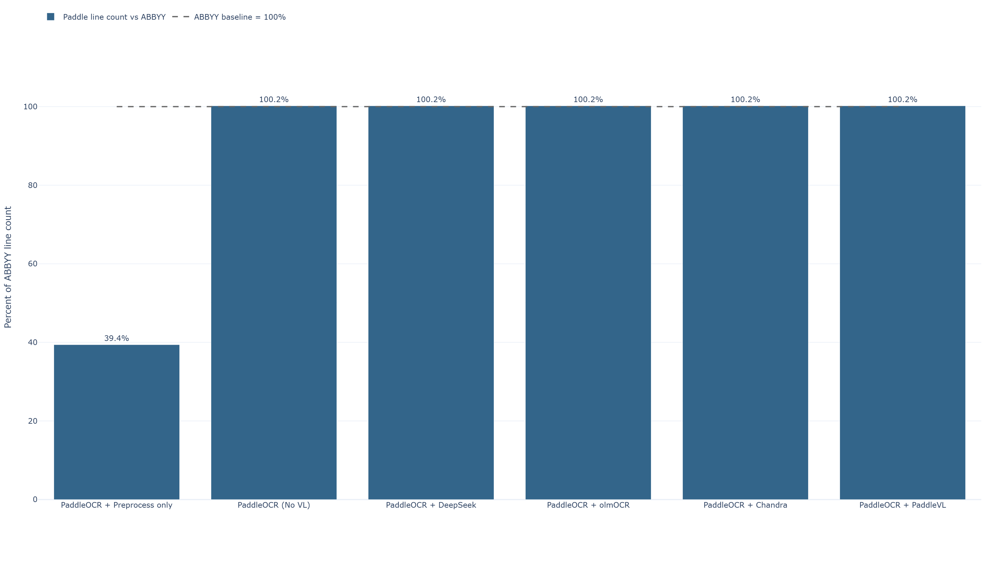
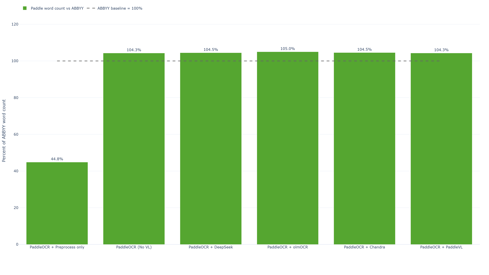
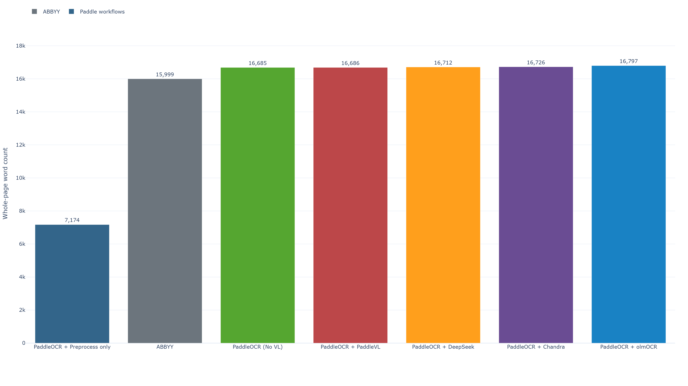
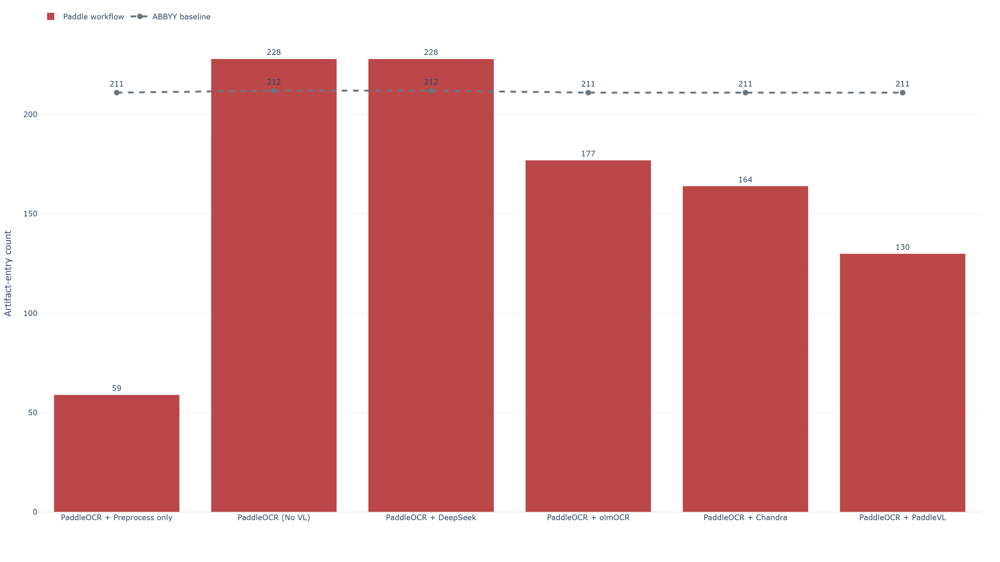
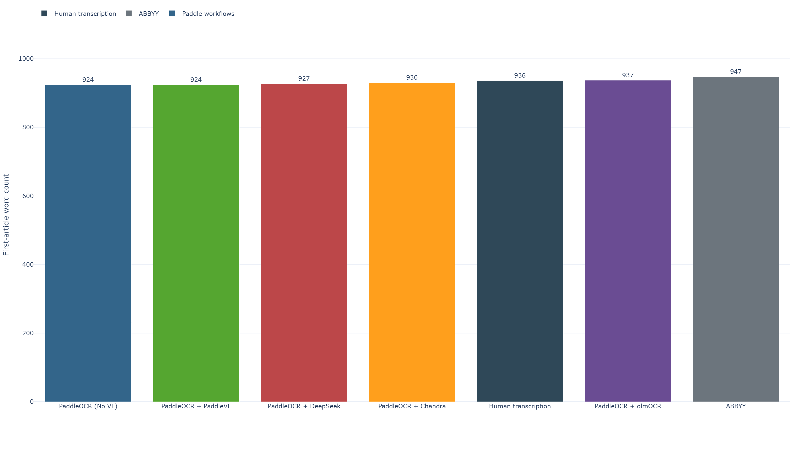
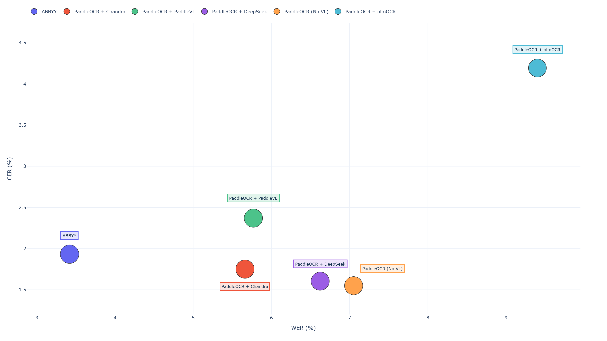

# Assessing AI-Powered OCR Tools
A repo containing data for analyzing the open-source PaddleOCR engine along with PaddleVL, olmOCR, Chandra, or Deepseek VL models for low confidence word correction vs ABBYY FineReader Server 14. 

## How ABBYY OCR/ICR Works

The notes below summarize ABBYY's public product documentation reviewed on
May 26, 2026, with emphasis on the OCR/ICR pipeline that matters when using
ABBYY as a benchmark in this repo.

ABBYY does more than basic text recognition. Its current positioning is
"Document AI" or intelligent document processing (IDP): OCR and ICR are the
core recognition steps inside a larger workflow that also includes image
cleanup, document structure analysis, classification, data extraction,
validation, human review, and export into machine-readable formats.

### 1. Document input and image enhancement

ABBYY first tries to improve the input image before recognition. According to
its product pages, this stage is meant to deal with low-quality scans and
camera photos, including distortion, uneven lighting, noisy backgrounds,
patterned forms, guides, and protection marks. The goal is to separate useful
text from the background and hand a cleaner image to the recognizer, which is
important for difficult business documents such as IDs, certificates, and
forms.

### 2. Layout and document analysis

Before or alongside character recognition, ABBYY analyzes the page structure.
Its OCR SDK documentation describes detecting the logical and visual layout of
the document: text blocks, pictures, tables, table cells, barcodes, separators,
orientation, double pages, vertical text, headers, footers, and other
formatting elements. This step is what lets ABBYY preserve structure instead of
returning only a flat text dump.

### 3. OCR for printed text

ABBYY uses OCR for machine-printed text. On its official pages, ABBYY states
that its OCR supports more than 200 languages and is designed for both full
document conversion and field extraction. The engine is intended to work on
complex documents, not just simple paragraphs, so tables, mixed layouts, and
special fonts are part of the intended use case.

ABBYY OCR should be thought of as a combination of:

- image preprocessing
- page segmentation and layout detection
- character and word recognition
- structural reconstruction for export

That is one reason ABBYY outputs often look more organized than a raw OCR text
stream from simpler pipelines.

### 4. ICR for hand-printed text

ABBYY treats ICR as a specialized extension of OCR for hand-printed characters.
Its support docs distinguish this from cursive handwriting: ICR is intended for
letters or digits written as separate printed characters in fields or zones,
such as form entries, boxed values, or constrained handwriting areas. ABBYY
also notes that ICR is commonly tied to field-level or zonal recognition rather
than unconstrained full-page handwriting transcription.

### 5. Field-level recognition and extraction

ABBYY's own documentation separates full-text recognition from field-level
recognition. Full-text mode is for document conversion or archiving. Field-level
mode is for pulling specific values from forms and business documents.

In field-level extraction, ABBYY can combine several techniques:

- OCR for printed fields
- ICR for hand-printed fields
- barcode recognition
- checkmark/mark recognition
- constraints such as alphabets, dictionaries, regular expressions, and
  expected value patterns

This is a major reason ABBYY often performs well on operational documents. It
is not only "reading text"; it is using document context and field expectations
to reduce ambiguity.

### 6. Classification and routing

On the current ABBYY Document AI pages, OCR/ICR feeds a broader classification
step. ABBYY says it uses AI models that analyze both text and image features to
classify and organize documents, then route each document to the appropriate
extraction model.

So the pipeline is roughly:

1. ingest document
2. enhance image
3. analyze structure and read content
4. classify the document type
5. apply the extraction model suited to that type

This is important because extraction quality depends heavily on identifying what
the document actually is before deciding which fields to pull.

### 7. Validation and quality control

ABBYY's data extraction materials emphasize that recognized data is then checked
against predefined rules and, when needed, external data sources or databases.
This validation layer is part of how ABBYY turns OCR output into something more
usable for business workflows.

Examples of validation logic include:

- expected formats for dates, invoice numbers, or IDs
- allowed character sets
- cross-field consistency checks
- matching against known records or reference systems

For ICR specifically, ABBYY's support guidance also recommends using regular
expressions, dictionaries, or database lookups to improve recognition accuracy.

### 8. Human in the loop and continuous learning

ABBYY describes an optional human review stage for cases where confidence is too
low or business rules require manual confirmation. Reviewers can correct
document classes and extracted values through a validation interface. ABBYY's
current product pages say those corrections feed continuous learning so the
models improve over time.

Operationally, this means ABBYY is designed for high straight-through
processing, but not on the assumption that every page can be handled with zero
review. The system is built to escalate uncertain cases instead of silently
accepting bad data.

Sources:

- https://www.abbyy.com/ai-document-processing/ocr-icr/
- https://www.abbyy.com/ai-document-processing/data-extraction-and-validation/
- https://www.abbyy.com/ocr-sdk/ 
- https://www.abbyy.com/ocr-sdk/how-it-works/document-analysis/
- https://www.abbyy.com/ocr-sdk/features/ocr/
- https://help.abbyy.com/en-us/finereader/15mac/user_guide/preprocess/
- https://intuitionlabs.ai/articles/non-llm-ocr-technologies
- https://help.abbyy.com/assets/en-us/finereader/16/Users_Guide.pdf
- https://support.abbyy.com/hc/en-us/articles/360020669679-Specifications-for-FineReader-PDF-for-Mac
- https://intuitionlabs.ai/articles/non-llm-ocr-technologies

## How Paddle Works

The notes below summarize Paddle's official documentation reviewed on
May 26, 2026, focusing on the parts most relevant to this repo:
PaddleOCR, PP-OCR, PP-Structure, PaddleOCR-VL, the `doc_parser` pipeline, and
PaddleX.

At a high level, Paddle is not one single OCR model. It is a stack:

- `PaddleX` provides the broader pipeline framework, packaging, inference, and
  deployment layer
- `PaddleOCR` provides OCR-focused pipelines and models
- `PP-OCR` is the general OCR pipeline for reading text
- `PP-Structure` is the structured document parsing pipeline for layouts,
  tables, formulas, charts, and reading order
- `PaddleOCR-VL` is the newer vision-language document parsing pipeline exposed
  through `doc_parser`

### 1. PaddleX as the orchestration layer

According to Paddle's official docs, PaddleOCR reuses PaddleX for inference
deployment, pre-processing, post-processing, model composition, and service
deployment. In practical terms, PaddleX is the workflow and infrastructure
layer that helps combine multiple models into a usable pipeline.

That means PaddleX is doing several important jobs under the hood:

- registering named pipelines such as `OCR`, `PP-StructureV3`,
  `doc_preprocessor`, and `PaddleOCR-VL`
- managing model loading and default configuration
- handling multi-model execution and post-processing
- supporting service-oriented deployment and high-performance inference
- keeping pipeline naming and configuration consistent across CLI and Python

### 2. PaddleOCR / PP-OCR: the general OCR pipeline

PaddleOCR's general OCR pipeline is the modular text-reading path. The official pipeline docs describe five stages:

1. optional document image orientation classification
2. optional text image unwarping / rectification
3. optional text-line orientation classification
4. text detection
5. text recognition

The current PaddleOCR 3.x docs say this pipeline supports PP-OCRv3, PP-OCRv4,
and PP-OCRv5, with PP-OCRv5 as the default in current releases.

Conceptually, PP-OCR works like this:

- find where text exists on the page
- crop or normalize those text regions
- recognize each text line or block
- assemble the recognized strings into output text plus coordinates

This modular design is important because the OCR result is influenced by more
than the recognizer itself. Rotation handling, unwarping, text detection, and
line orientation correction can all change final accuracy.

PP-OCR does give word level content boxes.

For our experiment, we used [PP-v5OCR](https://huggingface.co/collections/PaddlePaddle/pp-ocrv5).

#### What PP-OCR is good at

PP-OCR is the right Paddle family component when the main task is:

- reading machine-printed text from images or PDFs
- extracting text with bounding boxes
- building a fast, modular OCR pipeline
- swapping detection or recognition models for speed vs accuracy tradeoffs

It is closer to a classical OCR pipeline than a general-purpose multimodal
model. That usually makes it lighter and easier to reason about, but it also
means document structure has to be handled by additional pipelines when the
page is complex.

### 3. PP-Structure: document layout parsing and structure recovery

PP-Structure is Paddle's structured document analysis pipeline. The current
PP-StructureV3 docs describe it as a layout analysis pipeline that combines OCR,
image processing, and machine learning to convert complex document layouts into
machine-readable structured data.

The official PP-StructureV3 pipeline includes these major modules or
sub-pipelines:

- layout detection
- general OCR
- optional document image preprocessing
- optional table recognition
- optional seal text recognition
- optional formula recognition
- optional chart parsing

Paddle also states that PP-StructureV3 strengthens layout region detection,
table recognition, and formula recognition, while adding multi-column reading
order recovery, chart understanding, and conversion to Markdown.

In practice, PP-Structure is answering questions that plain OCR does not solve
well:

- where are the text blocks, titles, tables, figures, formulas, and seals
- what order should multi-column or mixed-layout content be read in
- how should tables be reconstructed instead of flattened into plain text
- how should the final output preserve hierarchy and structure

For repo comparisons, PP-Structure is the Paddle component most analogous to
the structure-preserving part of ABBYY's document workflow.

PP-Structure does not give word level content boxes.

### 4. Paddle DocParser / PP-DocLayoutV3: the PaddleOCR-VL document parsing pipeline

In current PaddleOCR 3.x docs, `doc_parser` is the CLI/API-facing document
parsing pipeline tied to `PaddleOCR-VL`. It is not just another name for
general OCR. It is the newer VLM-based path for richer page understanding.

The PaddleOCR-VL usage docs explicitly say the full pipeline matters. Paddle
describes the process in two broad stages:

1. layout analysis splits the page into document elements and determines
   reading order
2. VLM-based recognition processes each sub-image or element and produces
   structured output such as Markdown, after which element outputs are merged
   back into a full-page result

The docs also warn that using only the VLM component is not equivalent to using
the full PaddleOCR-VL pipeline. In other words, the quality depends on the
complete system, not just the language-vision model weights.

The `doc_parser` examples in the official docs show that this pipeline can be
configured with options such as:

- document orientation classification
- document unwarping
- layout detection on or off
- pipeline version selection such as `"v1"` and `"v1.5"`

So "Paddle PP-DocLayoutV3r" is best understood as Paddle's structured document
parsing entry point, powered by the PaddleOCR-VL family and surrounding layout
logic.

### 5. PaddleOCR-VL: VLM-based parsing instead of only OCR

([PaddleOCR-VL-1.5-0.9B](https://huggingface.co/PaddlePaddle/PaddleOCR-VL-1.5)) 

PaddleOCR-VL is Paddle's newer vision-language document parsing model family.
The current official introduction describes it as a resource-efficient document
parsing model whose core component is a compact VLM that combines:

- a NaViT-style dynamic-resolution visual encoder
- the ERNIE-4.5-0.3B language model

The docs say PaddleOCR-VL supports 109 languages and is intended for complex
document element recognition, including:

- text
- tables
- formulas
- charts

The current usage docs also frame it as a full parsing system rather than only
a recognizer. Its job is not simply to emit text tokens. It tries to identify
elements, recognize them appropriately, preserve reading order, and produce
structured document output.

This is a meaningful shift from PP-OCR:

- `PP-OCR` is primarily OCR-first and modular
- `PP-Structure` adds explicit document structure parsing around OCR modules
- `PaddleOCR-VL` moves further toward end-to-end vision-language document
  parsing

For difficult pages, that can make PaddleOCR-VL stronger than a plain OCR stack,
but it also means more complexity, heavier inference, and different failure
modes such as hallucinated structured text if the pipeline is misused.

PaddleOCR-VL also does not give word level content boxes.

Sources:

- https://www.paddleocr.ai/main/en/index.html
- https://www.paddleocr.ai/main/en/version3.x/pipeline_usage/OCR.html
- https://www.paddleocr.ai/main/en/version3.x/pipeline_usage/PP-StructureV3.html
- https://www.paddleocr.ai/main/en/version3.x/pipeline_usage/PaddleOCR-VL.html
- https://www.paddleocr.ai/latest/en/version3.x/algorithm/PaddleOCR-VL/PaddleOCR-VL.html
- https://www.paddleocr.ai/main/en/version3.x/paddleocr_and_paddlex.html
- https://www.paddleocr.ai/main/en/version3.x/paddlex/overview.html

## ABBYY vs Paddle

This section compares ABBYY against Paddle as they are most relevant to this repo. "Paddle" here does not mean one thing: it can mean `PP-OCR`, `PP-Structure`, or `doc_parser` / `PaddleOCR-VL`, all orchestrated through `PaddleX`.

### High-level difference

At a high level, ABBYY is a commercial document processing platform with OCR or ICR embedded inside a broader validation and workflow system. Paddle is an open-source model and pipeline stack that gives you several document-reading paths, but generally expects more explicit configuration and evaluation work from the user.

That leads to a practical distinction:

- ABBYY is usually opinionated and workflow-oriented
- Paddle is usually modular and engineering-oriented

### Where ABBYY is stronger

ABBYY tends to be stronger when the document problem is not only "read the text" but "extract reliable business data from messy documents with controls."

Its advantages include:

- strong layout and field-aware extraction behavior
- built-in validation concepts such as rules, dictionaries, expected formats,
  and external record checks
- a more integrated path from ingestion to structured output
- mature commercial OCR and ICR focused on business documents
- optional human review workflows for uncertain cases

In other words, ABBYY often wins by combining recognition with structure, constraints, and workflow-level quality control.

### Where Paddle is stronger

Paddle tends to be stronger when you want openness, flexibility, and control over how the OCR stack is assembled.

Its advantages include:

- open-source access to models and pipelines
- easier experimentation across OCR-first and VLM-based approaches
- direct control over preprocessing, layout analysis, and pipeline selection
- easier integration into custom research or engineering workflows without a
  commercial platform dependency

In this repo specifically, Paddle is useful because it exposes more of the pipeline knobs that can be tuned, swapped, or inspected during benchmarking.

### OCR philosophy: integrated platform vs modular stack

ABBYY and Paddle are solving related problems, but they package the solution very differently.

ABBYY behaves more like an integrated platform:

- image cleanup
- layout understanding
- OCR and ICR
- extraction
- validation
- human review
- export into downstream workflows

Paddle behaves more like a toolkit with multiple tiers:

- `PP-OCR` for modular OCR
- `PP-Structure` for structured document parsing
- `PaddleOCR-VL` for VLM-based parsing
- `PaddleX` for pipeline orchestration and deployment

That means ABBYY usually presents a more unified workflow, while Paddle gives you more freedom to choose which pipeline style to run.

### Structured documents

Both ABBYY and Paddle care about document structure, but they get there differently.

ABBYY's structure handling is part of a business-document platform and is tied closely to extraction and validation. 

Paddle splits the problem into separate pipelines:

- `PP-OCR` for raw text reading
- `PP-Structure` for layout-aware structured parsing
- `PaddleOCR-VL` for richer VLM-based parsing

So if Paddle underperforms ABBYY on a complex page, the reason may simply be that the comparison used `PP-OCR` when the more appropriate Paddle baseline was `PP-Structure` or `PaddleOCR-VL`.

### Handwriting and ICR

ABBYY can support ICR for structured hand-printed text fields. That is important for forms, boxed entries, and constrained handwriting zones.

Paddle 3.x documentation explicitly describes pipelines as improving recognition for multiple text types, including handwriting, and the PaddleOCR model and pipeline family includes handwriting-relevant recognition support in addition to printed-text OCR. 

PaddleOCR-VL also broadens this further by using a document VLM that can recognize and parse more varied document content than a classical printed-text-only OCR stack.

The more accurate distinction is narrower: ABBYY's product framing is still more explicitly tied to structured business-document ICR for constrained hand-printed fields, while Paddle's current public framing is broader handwriting/HTR-aware OCR and document parsing rather than ABBYY-style field-oriented ICR as a first-class product concept. 

So if a benchmark depends heavily on boxed hand-printed field extraction, ABBYY may still have an advantage in product design and workflow assumptions, even though Paddle is not limited to printed-text-only OCR.

### Validation and trust model

One of the biggest differences is what happens after text is recognized.

ABBYY emphasizes:

- field constraints
- validation rules
- reference checks
- reviewer escalation
- continuous learning from corrections

Paddle emphasizes:

- model inference
- pipeline composition
- structured outputs
- developer-controlled post-and-pre-processing

So ABBYY is more likely to ship with business-process guardrails already in
mind, while Paddle is more likely to require custom downstream logic if you
need the same level of validation discipline.

### Failure modes

The two stacks can fail for different reasons.

ABBYY failure modes are often tied to:

- weak scan quality
- unusual layouts outside trained business-document expectations
- hard handwriting cases outside constrained ICR use
- extraction rule mismatches

Paddle failure modes vary by pipeline:

- `PP-OCR` can miss structure because it is fundamentally OCR-first
- `PP-Structure` can still depend heavily on layout detection quality
- `PaddleOCR-VL` can introduce VLM-style errors, including incorrect structured
  reconstruction or over-generated text if the full pipeline is not used well

So a fair comparison should identify not just whether output is wrong, but what kind of system design issue caused the discrepancy.

### Cost and control

ABBYY usually offers more packaged functionality out of the box, but that comes
with commercial product constraints and high licensing costs.

Paddle usually offers:

- lower barriers to experimentation
- source-level visibility
- easier custom deployment paths
- more direct control over the stack

But that flexibility also means the user has to make more decisions about
pipeline selection, preprocessing, evaluation methodology, and post-processing. One might also need development skills.

## PaddleVL vs olmOCR, DeepSeek, and Chandra

During the expirement, we also used the following alternative VL libraries:

- `olmOCR` ([olmocr2:7b-q8](https://ollama.com/richardyoung/olmocr2)) is a PDF-to-text linearization and extraction toolkit
- `Chandra` ([chandra-ocr-2](https://ollama.com/fredrezones55/chandra-ocr-2)) is an OCR-oriented structured document model
- `DeepSeek OCR` ([deepseek-ocr:3b](https://ollama.com/library/deepseek-ocr:3b)) is an end-to-end OCR and document-to-markdown model built
  around visual-text compression

### PaddleVL vs olmOCR

`PaddleVL` and `olmOCR` both go beyond raw text extraction, but they are aimed
at different outcomes.

`olmOCR` is described by Ai2 as an open toolkit for converting
PDFs into clean linearized plain text in natural reading order while preserving
structured content such as sections, tables, lists, and equations. Its paper
describes a fine-tuned 7B VLM trained on a large PDF-derived dataset and
optimized for large-scale batch PDF processing.

- `PaddleVL` is more naturally positioned for multilingual page parsing with
  richer element recognition
- `olmOCR` is more naturally positioned for scalable PDF-to-text extraction and
  reading-order recovery

If the target is structured page understanding across many languages,
`PaddleVL` has the clearer specialization. If the target is high-throughput
PDF linearization into clean text, `olmOCR` has the clearer specialization.

### PaddleVL vs DeepSeek OCR

`PaddleVL` and `DeepSeek OCR` are both VLM-style document systems, but their
technical framing is different.

`DeepSeek-OCR` is framed by DeepSeek as "Contexts Optical Compression." Its
official repo and model card position it as an end-to-end OCR system that can
do plain OCR or convert a document directly to Markdown. The emphasis is on
visual-text compression and token-efficient document understanding before
decoding.

- `PaddleVL` looks more like a compact structured document parser
- `DeepSeek OCR` looks more like a generative OCR system optimized around
  efficient document-to-text or document-to-markdown conversion

That means `DeepSeek OCR` may be especially attractive when long documents,
token efficiency, or direct markdown generation matter. `PaddleVL` may be the
better fit when tighter layout-oriented pipeline control and multilingual
document parsing are more important.


### PaddleVL vs Chandra

`PaddleVL` and `Chandra` are more directly comparable because both are aimed at
structured document output rather than only flat OCR text.

`Chandra OCR 2` emphasizes rich OCR reconstruction. Its official model card
describes output in Markdown, HTML, and JSON with detailed layout information,
strong support for handwriting, forms including checkboxes, tables, math, and
90+ languages. Its positioning is closer to a specialized OCR-native document
reconstruction model.

- `PaddleVL` is more compact and pipeline-centric
- `Chandra` is more explicitly focused on high-fidelity structured OCR output

So this comparison is less about OCR versus VLM, and more about two different
styles of document VLM: one compact and pipeline-oriented, the other more
aggressively optimized for OCR-style structured reconstruction.

Sources:

- https://www.paddleocr.ai/latest/en/version3.x/algorithm/PaddleOCR-VL/PaddleOCR-VL.html
- https://olmocr.allenai.org/
- https://olmocr.allenai.org/papers/olmocr.pdf
- https://huggingface.co/datalab-to/chandra-ocr-2
- https://github.com/deepseek-ai/DeepSeek-OCR
- https://huggingface.co/deepseek-ai/DeepSeek-OCR


## Testing 

### Source image


#### OCR Challenges

This test image is a difficult historical newspaper page rather than a clean
modern scan. The page combines several OCR failure modes at once:

- very small text across many narrow multi-column regions
- large page dimensions that force text to be read at a tiny effective scale
- uneven background and faded paper tone
- black border / dark scanner margin around the page
- vertical scratches, dust, speckling, and film or scan artifacts
- dense layout with poems, article columns, notices, and mixed block widths
- thin separators and narrow gutters that can confuse page segmentation

This is exactly the kind of page where a simple one-pass OCR run often loses
small words, merges adjacent columns, or misreads punctuation. It is also the
kind of page where ABBYY benefits from its surrounding document-analysis stack,
so Paddle needed extra supporting steps to get closer.

### Methodologies

Comparing Paddle OCR with ABBYY on this page required more than switching OCR models. The testing in this repo is built around a Paddle OCR expirement pipeline which includes stages to: improve the page before OCR, reduce page scale problems with tiling, optionally route crops through layout-aware parsing, and then apply targeted cleanup or second-pass correction.

At a high level, the variants in `test-results/paddlecomp` represent this progression:

- baseline PP-OCR with lighter preprocessing
- PP-OCR with heavier segmentation through tiling and DocLayout
- PP-OCR followed by post-OCR VL correction using different backends

The goal was not only to increase raw character accuracy, but also to reduce:

- broken reading order
- dropped or merged words in dense columns
- punctuation artifacts
- OCR mistakes that are locally ambiguous but visually recoverable from crops

#### Pre-processing

Historical pages often benefit from mild cleanup before local OCR.
We looked at a few preprocessing steps such as:

- `light_clean` applies a very light denoising pass to remove small scanner
  grime and speckle without heavily changing the page
- `background_flatten` estimates the page's uneven gray background and evens it
  out so the text stands out more consistently across the sheet
- `contrast` / CLAHE boosts local contrast in small regions, which can make
  faint strokes and thin newspaper type easier for OCR to separate from the
  page
- `deskew` tries to detect whether the whole page is slightly rotated and, if
  so, rotates it back to a more level reading angle
- `sauvola_binary` converts the page into a black-and-white style text image
  using adaptive thresholding, which can help when foreground and background
  are hard to separate but can also throw away useful grayscale detail
- black-border cropping before OCR tries to detect the real page area inside a
  dark scanner border, crop to that region, and then keep track of the offset
  so OCR coordinates can still be mapped back to the original image

For this page, preprocessing matters because the text sits inside a large dark
border and on an uneven gray background. Even when OCR can still "see" the
letters, cleanup can materially improve text detection, reduce false positives
in the margin, and increase the legibility of small print.

After testing, the preprocessing choices that gave the best results on this
page were:

- isolate the real page from the dark outer border
- flatten the background so text stands out more consistently

Other preprocessing options were tested, but on this image they produced worse
results overall than this lighter combination.

#### Tiling

Large broadsheet pages are one of the main reasons tiling was necessary. The rationale is straightforward: when the full page is too large and the text too small, splitting the page into smaller regions gives the recognizer more effective resolution per text line.

For this repo, the important tile variants are:

- `3x1 grid`
  - a simpler fixed split for tall or column-heavy pages
- `3x2 grid`
  - a stronger fixed split for dense newspaper layouts
- `doclayout_v3`
  - feed the full source image into `PP-DocLayoutV3` first, then use the
    detected layout regions as OCR subtiles
- `3x2 grid + PP-DocLayoutV3`
  - fixed tiling first, then layout-guided sub-segmentation inside each large
    tile using DocLayout-style parsing

After testing, `3x2 grid + PP-DocLayoutV3` was the tiling strategy we kept because it
returned the largest amount of text or word content on this page. The simpler
tiling options were still useful as comparison points, but this combination
recovered more of the newspaper content overall.

#### Suspicious Word level VL Correction

The PaddleOCR expirement pipeline also adds a second-pass correction stage for `PP-OCRv5`.
Instead of rerunning the whole page through a larger model, it can:

- inspect OCR output for suspicious or low-confidence words
- crop those words or local line regions
- send the crops to a VL backend
- optionally apply accepted corrections back into the OCR text

That design is useful on pages like this because many errors are local:

- a single blurry short word
- punctuation fused into neighboring letters
- one broken token in an otherwise readable line

The current comparison folders in this repo reflect that idea with several
post-OCR VL backends:

- `large-ppocr-preproccess3x2-PP-DocLayoutV3-paddlevl`
- `large-ppocr-preproccess3x2-PP-DocLayoutV3-olmocr`
- `large-ppocr-preproccess3x2-PP-DocLayoutV3-chandra`
- `large-ppocr-preproccess3x2-PP-DocLayoutV3-deepseek`

These are best understood as PP-OCR-centered workflows that then use a second
vision-language model to review difficult words after the first OCR pass.

A "suspicious" word is not just any low-confidence token. The
post-OCR code assigns each candidate a weirdness score and only sends it for VL
review when that score is high enough. The score is driven by OCR-like warning
signs such as:

- odd glyphs or unusual characters
- repeated punctuation
- repeated letters
- alphabetic words with no vowels
- OCR-confusable starts such as `rn` or `vv`
- odd internal casing
- unusual character patterns relative to the document's own vocabulary
- tokens that are suspiciously close to common document words
- spellcheck misses
- suspicious letter-digit mixtures
- merged or malformed word-box text

Low line confidence can also increase the score, but `suspicious` mode is more
targeted than the broader `low_confidence` mode. In practice, it is trying to
find words that look specifically like OCR errors, not just words that happen
to come from a weaker line.

#### Punctuation Cleaning

The PaddleOCR expirement pipeline also included a punctuation-cleaning stage. This exists
because historical newspaper OCR often produces artifacts that are not full
word-recognition failures but still hurt readability and comparison:

- stray commas or periods
- broken quotes
- repeated punctuation
- punctuation glued to adjacent text incorrectly

### Comparisons

The main comparison artifacts are:

- [test-results/paddle_vs_abbyy_errors_artifacts.xlsx](test-results/paddle_vs_abbyy_errors_artifacts.xlsx)
  - workbook comparing matching Paddle and ABBYY outputs, with one worksheet
    per matched Paddle TXT file
- [test-results/first_article_ocr_comparison.xlsx](test-results/first_article_ocr_comparison.xlsx)
  - workbook comparing a human transcription against ABBYY plus every
    `first-article.txt` found under `test-results/paddlecomp`

The current `paddlecomp` result folders are:

- `large-ppocr-preprocess`
  - baseline local PP-OCR preprocessing run
- `large-ppcor-preproccess-3x2-PP-DocLayoutV3`
  - PP-OCR with heavier segmentation through 3x2 tiling plus DocLayout-style
    parsing
- `large-ppocr-preproccess3x2-PP-DocLayoutV3-paddlevl`
  - same broader PP-OCR pipeline with PaddleVL-based post-OCR correction
- `large-ppocr-preproccess3x2-PP-DocLayoutV3-olmocr`
  - same broader PP-OCR pipeline with olmOCR-based post-OCR correction
- `large-ppocr-preproccess3x2-PP-DocLayoutV3-chandra`
  - same broader PP-OCR pipeline with Chandra-based post-OCR correction
- `large-ppocr-preproccess3x2-PP-DocLayoutV3-deepseek`
  - same broader PP-OCR pipeline with DeepSeek OCR-based post-OCR correction

Taken together, these tests are trying to answer a practical question rather
than only a model-leaderboard question:

- how far can open Paddle-centered workflows be pushed toward ABBYY-quality OCR
  on a genuinely difficult newspaper page
- which extra steps matter most: preprocessing, stronger segmentation, or
  second-pass VL correction

### Results

#### Whole-page recovery vs ABBYY

The workbook
[test-results/paddle_vs_abbyy_errors_artifacts.xlsx](test-results/paddle_vs_abbyy_errors_artifacts.xlsx)
shows that the biggest jump came from tiling plus DocLayout-style parsing.

The `Preprocess only` run was far behind ABBYY in raw coverage:

- Paddle line count: `992`
- ABBYY line count: `2517`
- Paddle word count: `7174`
- ABBYY word count: `15999`

So preprocessing by itself did not recover enough of the newspaper page.
The main failure at that stage was under-extraction: too much page content was
still being missed.

The `3x2 grid + PP-DocLayoutV3 only` run changed that completely:

- Paddle line count: `2522`
- ABBYY line count: `2517`
- Paddle word count: `16685`
- ABBYY word count: `15999`

That is why `3x2 grid + PP-DocLayoutV3` was kept for all subsequent runs. It brought the page back to roughly the same scale of recoverable content as ABBYY. For the remainder of the dicussion it will be labeled as the `PaddleOCR (No VL)` run. 







That shift also changed the error profile. After tiling, the dominant Paddle
problems were no longer missing huge parts of the page, but rather:

- overlap or duplicate tile output
- joined-word or spacing artifacts
- suspicious tokens and line-start garbage
- punctuation noise
- isolated symbols or stray glyphs

So the tradeoff was clear: tiling dramatically improved recall, but it also
increased cleanup work.

#### Post-OCR VL backend comparison

On the same whole-page workbook, the post-OCR VL backends differed mainly in
how much artifact cleanup they achieved after the strong base pipeline.

Artifact-entry totals were:

- `PaddleOCR (No VL)`: `228`
- `Deepseek`: `228`
- `olmOCR`: `177`
- `Chandra`: `164`
- `PaddleVL`: `130`
- `ABBYY`: `211`

The most important pattern here is that `PaddleVL` produced the cleanest
overall Paddle output by this workbook's artifact-counting method. `Chandra`
was the next best cleanup backend, then `olmOCR`. `DeepSeek` did not improve
the artifact total over the raw tiled run in this comparison.



It is also notable that ABBYY was not artifact-free. The workbook still tags
ABBYY with reading-order issues, suspicious glyphs, punctuation artifacts, and
spacing problems. The difference is that ABBYY generally avoided the very large
coverage loss seen in the preprocess-only Paddle run, while also avoiding as
many duplicate or tiled-overlap artifacts as the raw tiled Paddle output.

#### Human-transcription comparison

The workbook
[test-results/first_article_ocr_comparison.xlsx](test-results/first_article_ocr_comparison.xlsx)
shows a slightly different ranking when the target is a normalized human
transcription of the first article rather than whole-page artifact counts.

In this section:

- `Word accuracy` is the share of human-reference words recovered correctly
  after normalization
- `WER` means word error rate: word edit distance divided by the human word
  count, so lower is better
- `CER` means character error rate: character edit distance divided by the
  human character count, so lower is better

These metrics do not tell exactly the same story. `WER` is usually the most
useful measure for readable transcription quality, because it penalizes wrong,
missing, or inserted words directly. `CER` is more fine-grained: it can stay
fairly low even when a model still makes important word-level mistakes such as
splits, joins, or near-miss substitutions. `Word accuracy` is easier to read
quickly, while `WER` is the more standard error metric.

Ranked by normalized word error rate:

1. `ABBYY`
   Word accuracy `96.58%`, WER `3.42%`, CER `1.93%`
2. `Chandra`
   Word accuracy `94.34%`, WER `5.66%`, CER `1.75%`
3. `PaddleVL`
   Word accuracy `94.23%`, WER `5.77%`, CER `2.37%`
4. `DeepSeek`
   Word accuracy `93.38%`, WER `6.62%`, CER `1.60%`
5. `PaddleOCR (No VL)` base run
   Word accuracy `92.95%`, WER `7.05%`, CER `1.55%`
6. `olmOCR`
   Word accuracy `90.60%`, WER `9.40%`, CER `4.19%`

The human first-article reference contains `936` words. Comparing raw output
lengths is not the same as comparing transcription quality, but it is still a
useful quick check for under- or over-production against that target.



This means ABBYY remained the best overall article transcription in the current
tests, but the strongest Paddle-centered results were close enough to be worth
careful comparison rather than dismissal.



`olmOCR` is the visual outlier in this chart because it performs worse on both
axes at once. It has the highest `WER` and also by far the highest `CER`,
which means it is not only making more word-level mistakes, but also making
heavier character-level distortions inside those words and lines. In this
excerpt, `olmOCR` shows more severe substitutions, merged or split words, and
line-level corruption such as `colonies has afforded` becoming `The nies rising
has afforded`, `monarchical system` becoming `chemicals system`, and
`themselves by the departure` becoming `a) 18 1777 by the departure`. So its
position on the chart reflects both higher error volume and more disruptive
error types than the other Paddle-centered runs.

Three details stand out:

- `Chandra` is slightly ahead of `PaddleVL` on both word accuracy and WER,
  and it also has the better CER, so it produced the stronger article-level
  result of the two in this specific excerpt
- `Chandra` and `PaddleVL` remain the strongest Paddle-centered runs by WER,
  but `DeepSeek` and the base `PaddleOCR (No VL)` run now have the lowest CER
  among the Paddle variants
- several Paddle variants still have lower CER than ABBYY while also having worse
  WER, which suggests many remaining Paddle errors are word-level substitutions,
  joins, or segmentation mistakes rather than uniformly bad character reading

#### Conclusions

The results suggest a set of conclusions:

- preprocessing helped, but was nowhere near sufficient by itself
- tiling the source image into a `3x2 grid + PP-DocLayoutV3` tiles was the decisive recall improvement
- post-OCR VL correction mattered mainly as a cleanup stage on top of that
  stronger base pipeline
- `PaddleVL` gave the best whole-page cleanup by artifact counts
- `Chandra` and `PaddleVL` gave the strongest first-article word-accuracy
  results among the Paddle-centered variants
- `ABBYY` still had the best overall transcription quality in the current test

So the main gap between raw Paddle OCR and ABBYY on this page was first a coverage problem, then a cleanup problem. 

Tiling plus layout parsing solved the first problem. The remaining differences were mostly about how well each follow-up backend corrected the noise introduced by tiling strategies and base PaddleOCR model.

The main lesson is that ABBYY vs Paddle is not just a model-vs-model comparison. It is usually a platform-vs-pipeline-stack comparison. If you want Paddle to get closer to ABBYY, the gap to close is usually not only "better OCR." It is a bundle of surrounding capabilities:

- stronger preprocessing
- stronger layout analysis
- better pipeline routing
- more structure-aware extraction
- stricter validation
- safe human-review escalation
- cleaner export normalization

So if ABBYY outperforms a model on a document, the difference may come from any
combination of recognition quality, layout analysis, field constraints,
validation logic, or workflow-level post-processing, not just from better raw
character classification.

#### What ABBYY does around the document that Paddle users would need to recreate

If the goal is to get Paddle closer to ABBYY-quality end-to-end OCR on difficult
documents, it is not enough to compare ABBYY against a Paddle's bare OCR recognizer.
ABBYY's own document-processing pages describe several surrounding stages that
materially affect recognition quality and output quality.

##### Image enhancement before OCR

ABBYY explicitly says it improves document images before recognition. On its
current Document AI pages, this includes correcting distortions from mobile
cameras, handling poor lighting, and separating text from noisy or patterned
backgrounds, field markings, guides, lines, and protection marks. Its OCR SDK
pages also describe traditional preprocessing functions such as rotation,
binarization, and de-skewing.

To make Paddle more comparable, you would want to recreate a preprocessing
layer that can do at least some of the following:

- page rotation and orientation correction
- de-skewing or geometric correction
- perspective correction / unwarping
- contrast normalization
- denoising and background suppression
- border removal and crop cleanup
- binarization or adaptive thresholding where useful
- line / guide / form-mark suppression when those elements hurt OCR

This is one of the biggest reasons a commercial platform can outperform a raw
open OCR run on messy documents: the recognizer may be seeing a much better
image.

##### Full document analysis, not just text detection

ABBYY says it analyzes both the page layout and the logical structure of the
document. Its OCR SDK documentation specifically mentions text blocks, tables,
table cells, pictures, barcodes, separators, page orientation, double pages,
vertical text, and non-relevant areas that should be ignored.

To approximate that in Paddle, you would need more than text detection. You
would also need:

- layout region detection
- non-text region suppression
- table detection and reconstruction
- reading-order recovery
- header / footer / marginalia handling
- region-specific OCR decisions

Without that layer, Paddle may read the right characters locally but still
produce weaker page-level output because the page structure was handled less
well.

##### Document classification and routing

ABBYY's current OCR/ICR and data extraction pages describe classification as a
separate step: the system analyzes both image and text features, determines the
document type, and routes the document to the appropriate extraction model.

To recreate that behavior with Paddle, you would need a routing layer that can
decide questions like:

- is this page better handled by `PP-OCR`, `PP-Structure`, or `PaddleOCR-VL`
- is this document a form, article page, ID, invoice, or something else
- should table parsing or layout-heavy parsing be enabled
- should different preprocessing or decoding settings be applied to this class

Without routing, Paddle is often evaluated as one fixed pipeline against ABBYY's
adaptive workflow, which is not an equal comparison.

##### Field-aware extraction instead of plain text dumping

ABBYY's public materials emphasize that OCR and ICR feed extraction. It is not
only recognizing text; it is recognizing text in the context of expected
document fields, tables, checkmarks, barcodes, signatures, and related business
elements.

To get closer with Paddle, you would need application-level logic that can:

- identify which regions correspond to target fields
- choose the right parser for those regions
- preserve table and form structure
- normalize output into field/value representations instead of only free text

Raw OCR text can look worse than ABBYY even when the characters are similar, simply because ABBYY is reconstructing structured results rather than emitting a flat stream.

##### Validation and constraint checking after recognition

ABBYY explicitly describes a validation stage where extracted data is checked
against predefined rules and external databases, with human review for more
complex cases.

To recreate that quality layer around Paddle, you would need post-processing
such as:

- regex and format validation
- allowed-character or dictionary checks
- cross-field consistency rules
- database or lookup-table verification
- confidence thresholds that trigger review instead of silent acceptance

This does not improve the raw OCR model directly, but it improves practical
output quality by catching bad reads before they become final data.

##### Human review for uncertain cases

ABBYY's pipeline includes human-in-the-loop review and continuous learning from
corrections. That matters because a production-quality result is not only about
high average accuracy. It is also about safely handling the pages the model is
not confident about.

To match that with Paddle, you would likely need:

- confidence scoring or heuristics for escalation
- a review UI or annotation loop
- corrected-output capture
- a feedback path for improving prompts, preprocessing, routing, or training

If ABBYY produces fewer bad final outputs, part of the reason may be that it is
designed to stop and ask for help when confidence is low.

##### Export and reconstruction logic

ABBYY's OCR SDK pages emphasize exact or high-quality reconstruction of the
document's structure and formatting. That means the final output is shaped by
layout recovery and export logic, not only by text recognition.

To reproduce that with Paddle, you may need additional code for:

- reading-order reconstruction
- block merging and region cleanup
- Markdown / JSON / ALTO shaping
- table serialization
- page-level normalization before TXT export
- PDF creation (Including PDF/A - 1a)

This is especially important in this repo because evaluation quality can be ffected by formatting artifacts, not just by recognition mistakes.

## Analysis And Helper Scripts

### Comparison Tool

The repo includes [tools/compare_ocr_errors.py](tools/compare_ocr_errors.py) for
Paddle-vs-ABBYY review.

Single-file CSV mode:

```bash
python tools/compare_ocr_errors.py \
  --paddle path/to/paddle.txt \
  --abbyy path/to/abbyy.txt \
  --output path/to/errors.csv
```

Folder-to-folder Excel mode:

```bash
python tools/compare_ocr_errors.py \
  --paddle-dir test-results/paddlecomp \
  --abbyy-dir "test-results/large - abby" \
  --excel-output test-results/paddle_vs_abbyy_errors_artifacts.xlsx
```

Current Excel behavior:

- one worksheet per matching Paddle TXT file
- if the target workbook already exists, the script reuses the existing sheet names, freeze panes, column widths, and row heights


### Human Comparison Workbook

[tools/compare_ocr_to_human.py](tools/compare_ocr_to_human.py) compares a human transcription against ABBYY plus every `first-article.txt` found under `test-results/paddlecomp`, then writes a shareable Excel workbook.

Example:

```bash
python tools/compare_ocr_to_human.py \
  --human "test-results/large - human/first-article.txt" \
  --abbyy "test-results/large - abby/first-article.txt" \
  --paddlecomp-dir test-results/paddlecomp \
  --output-dir test-results \
  --prefix first_article_ocr_comparison
```

### Plotly visualizations

The comparison workbooks are easier to interpret when graphed. The repo 
includes [tools/generate_ocr_plots.py](tools/generate_ocr_plots.py), which
reads the two Excel workbooks and builds a Plotly HTML dashboard:

- [test-results/plots/ocr_evaluation_dashboard.html](test-results/plots/ocr_evaluation_dashboard.html)
- PNG exports under [test-results/plots/png](test-results/plots/png)

The HTML dashboard renders the full chart set in English first and then again
in French.

Generate or refresh it with:

```bash
python tools/generate_ocr_plots.py
```

The dashboard includes several useful views of the data:

- whole-page line recovery
  shows how closely each workflow matched ABBYY's line-level coverage
- whole-page word recovery
  shows why preprocess-only failed and why `PaddleOCR (No VL)` became the base
  pipeline
- whole-page word counts
  shows the absolute word totals returned by ABBYY and each Paddle-based
  workflow
- first-article word counts
  shows the human-reference word count plus ABBYY and each Paddle-based
  transcription, sorted from low to high
- whole-page artifact totals
  compares cleanup quality across the post-OCR VL backends against the ABBYY
  baseline
- artifact-category vs ABBYY small multiples
  shows each Paddle workflow separately, with every artifact category expressed
  as a percent of ABBYY's count for that same category
- human-transcription WER/CER scatter
  shows article-level quality tradeoffs between word error rate and character
  error rate
- human-transcription edit breakdown
  separates substitutions, insertions, and deletions so backend differences are
  easier to interpret
