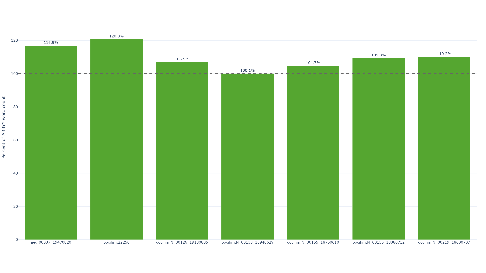
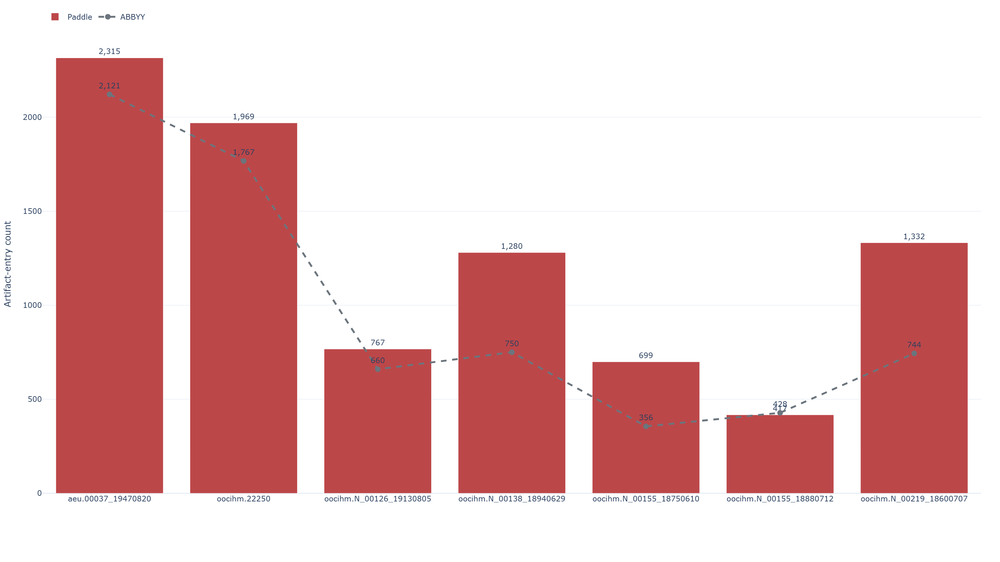
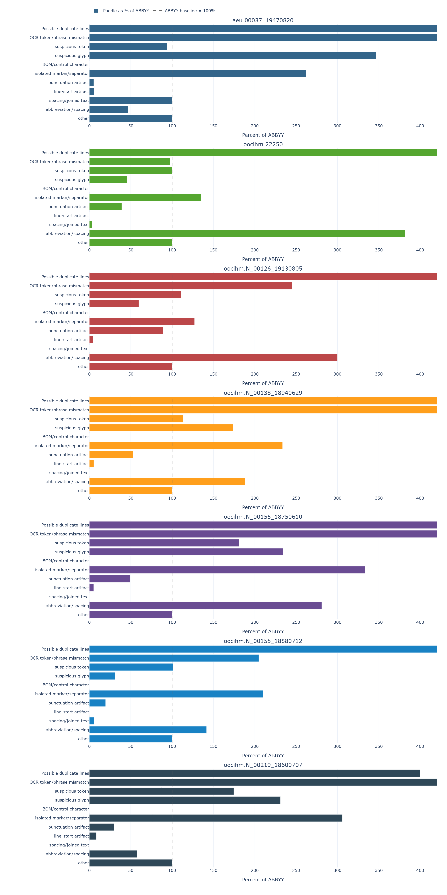
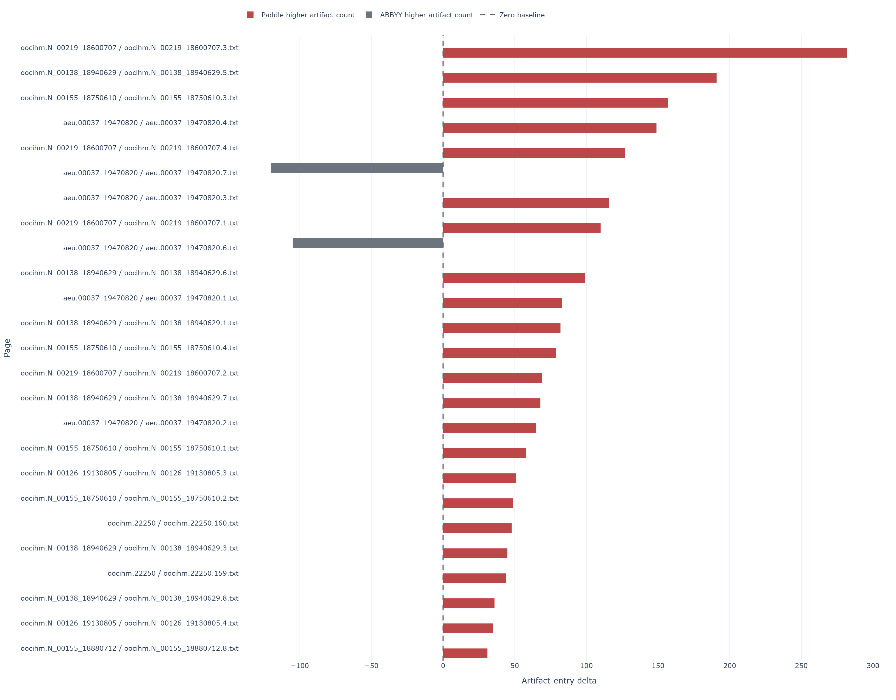
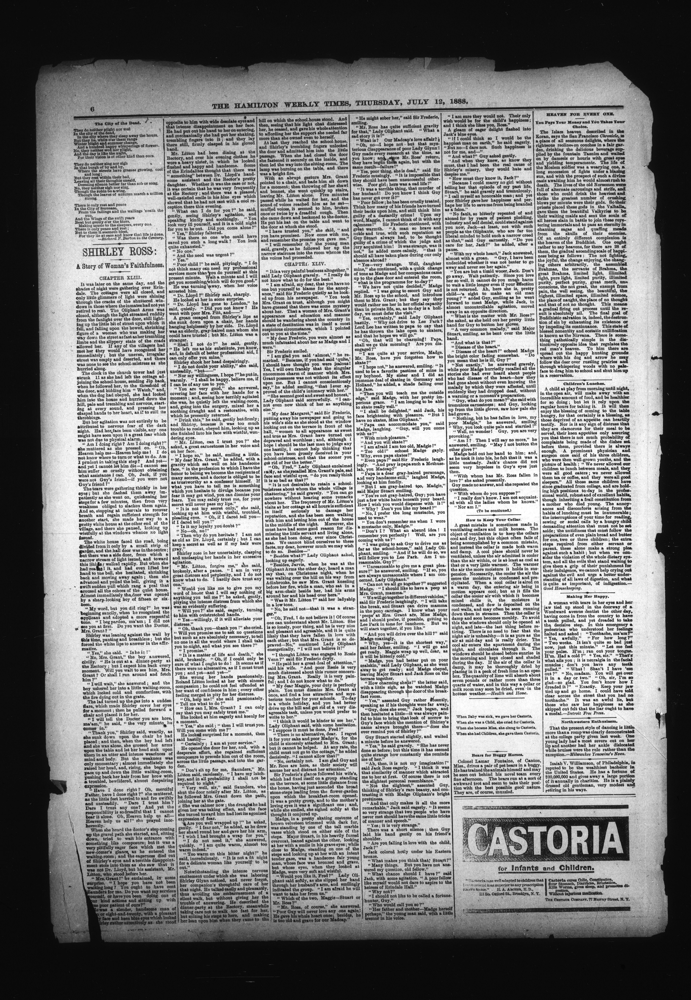
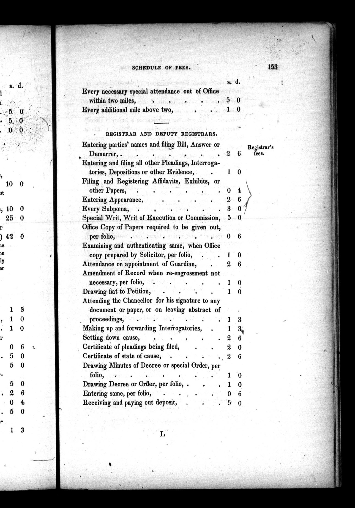

# Multi-Document ABBYY vs Tiled 3x2 + Docparse PaddleOCR + PaddleVL Comparison

This folder contains a multi-document OCR comparison between:

- `ABBYY` outputs under `test-data/abbyy`
- `Paddle` outputs under `test-data/preprocessing-tiling_3x2_dp+paddleocr+vl+clean`

The Paddle side is the same general workflow used in the stress test:

- preprocessing
- `3x2` tiling with docparse layout handling
- PaddleOCR extraction
- low-confidence / suspicious-word review
- spellcheck assistance
- PaddleVL post-check
- cleanup

This folder is the multi-document extension of `1-stress-test`, but limited to one Paddle workflow versus one ABBYY workflow across many pages.

## What Was Compared

The dataset contains `7` document groups and `217` matched page pairs.

Compared document groups:

- `aeu.00037_19470820`
- `oocihm.22250`
- `oocihm.N_00126_19130805`
- `oocihm.N_00138_18940629`
- `oocihm.N_00155_18750610`
- `oocihm.N_00155_18880712`
- `oocihm.N_00219_18600707`

## Output Files

Generated outputs are stored under `test-results`.

- Overall summary workbook: `test-results/multi_document_paddle_vs_abbyy_errors_artifacts.xlsx`
- Page-level workbooks: `test-results/page-level-excels/<document>/<page>.xlsx`
- Plot dashboard: `test-results/plots/multi_document_ocr_dashboard.html`
- Plot PNG exports: `test-results/plots/png/*.png`

Each page-level workbook uses the same wide page-by-page artifact layout as the stress-test comparison script.
The plots compare Paddle against ABBYY only; there is no human-transcribed reference set for this folder yet.

## Headline Findings

Across all `217` page pairs:

- Paddle nonblank line count: `66,567`
- ABBYY nonblank line count: `49,775`
- Paddle word count: `334,312`
- ABBYY word count: `301,984`
- Paddle artifact entries: `10,999`
- ABBYY artifact entries: `11,052`

Coverage ratios from the plots:

- Paddle line recovery vs ABBYY: `100.6%` overall
- Paddle word recovery vs ABBYY: `110.7%` overall

At the highest level, the total artifact-entry counts are very close. By this counting method, Paddle is slightly lower overall, but the error mix is different rather than simply better.

That coverage difference matters. Paddle is usually producing more OCR text than ABBYY, especially at the word level. Sometimes that means better recovery. Sometimes it means extra separators, ad fragments, or short layout leftovers that survive cleanup.

The biggest pattern differences:

- Paddle produces far more `isolated marker/separator` entries: `6,034` vs `2,962`
- Paddle produces all detected `Possible duplicate lines` entries: `107` vs `0`
- ABBYY produces far more `suspicious glyph` entries: `6,017` vs `3,316`
- ABBYY produces far more `punctuation artifact` entries: `2,386` vs `520`
- ABBYY produces more `line-start artifact` entries: `298` vs `15`
- `OCR token/phrase mismatch` and `suspicious token` counts are closer, with Paddle somewhat higher

This means the two systems fail differently:

- Paddle is more likely to leave behind separators, tile/merge leftovers, and some duplication noise
- ABBYY is more likely to produce encoding-looking glyph debris, punctuation debris, and malformed line starts

## Key Charts

These are the charts that best support the interpretation in this README. The full dashboard is still available at `test-results/plots/multi_document_ocr_dashboard.html`.

### 1. Word Recovery

This is the clearest coverage chart. It shows that Paddle usually emits more text than ABBYY, which is a strength on prose pages but can also inflate low-value fragments on dense layouts.



### 2. Total Artifacts By Document

This is the cleanest high-level comparison of which documents lean toward Paddle or ABBYY after cleanup.



### 3. Artifact Mix vs ABBYY

This chart explains why the totals alone are not enough. Paddle and ABBYY are not failing in the same way, and this is where the separator-vs-glyph split becomes obvious.



### 4. Biggest Page-Level Swings

This is the best chart for identifying representative outlier pages.
Red bars mean Paddle had more tagged artifacts on that page, gray bars mean ABBYY had more, and the dashed center line is zero difference.



## Document-Level Findings

Some broad document-level patterns from the aggregate workbook:

- `aeu.00037_19470820` is the noisiest document for both systems by summed artifact entries. Paddle has the lower artifact count on `4` of the `8` pages, and ABBYY has the lower artifact count on the other `4`. The document-wide totals are `4,103` artifact entries for Paddle versus `4,106` artifact entries for ABBYY.
- `oocihm.22250` has many pages but relatively low per-page artifact density; its main problem on both sides is separator/marker noise rather than heavy structural corruption. ABBYY has the lower artifact count on `94` pages, Paddle has the lower artifact count on `70`, and `13` pages are tied. The document-wide totals lean toward ABBYY: `2,204` artifact entries for Paddle versus `1,937` artifact entries for ABBYY. Paddle also runs high on coverage here: `111.2%` of ABBYY line count and `120.8%` of ABBYY word count.
- `oocihm.N_00219_18600707` is notably harder for Paddle than ABBYY by summed artifact entries. ABBYY has the lower artifact count on all `4` pages, and the document-wide totals are `1,334` artifact entries for Paddle versus `942` artifact entries for ABBYY. This document is close to line parity (`99.1%` of ABBYY line count) but still `110.2%` of ABBYY word count, which points to extra extracted fragments rather than obvious under-reading.
- `oocihm.N_00155_18880712` is notably harder for ABBYY than Paddle by summed artifact entries. Paddle has the lower artifact count on all `8` pages, and the document-wide totals are `451` artifact entries for Paddle versus `865` artifact entries for ABBYY. Paddle still emits more text here (`119.2%` of ABBYY line count and `109.3%` of ABBYY word count), but ABBYY accumulates much more glyph and punctuation debris.
- `oocihm.N_00126_19130805` and `oocihm.N_00138_18940629` also lean toward Paddle on total artifact count, but for different reasons. In `oocihm.N_00126_19130805`, Paddle has the lower artifact count on `7` of the `8` pages and the document-wide totals are `808` artifact entries for Paddle versus `896` artifact entries for ABBYY, even while Paddle recovers fewer lines. In `oocihm.N_00138_18940629`, Paddle has the lower artifact count on `5` of the `8` pages and the document-wide totals are `1,302` artifact entries for Paddle versus `1,385` artifact entries for ABBYY, landing near word-count parity while avoiding a large ABBYY glyph penalty.

### Document Matrix: ABBYY Vs 3x2

### Paddle More Words And Less Artifacts

- `aeu.00037_19470820`: `3x2` has `37,460` words versus `32,046` for ABBYY, a gain of `5,414` words. Artifact totals also favor `3x2`: `4,103` artifact entries versus `4,106` for ABBYY.


- `oocihm.N_00155_18880712`: `3x2` has `53,790` words versus `49,224` for ABBYY, a gain of `4,566` words. Artifact totals also favor `3x2`: `451` artifact entries versus `865` for ABBYY.



- `oocihm.N_00155_18750610`: `3x2` has `62,179` words versus `59,391` for ABBYY, a gain of `2,788` words. Artifact totals also favor `3x2`: `797` artifact entries versus `921` for ABBYY.


### Paddle More Words And More Artifacts

- `oocihm.22250`: `3x2` has `91,399` words versus `75,671` for ABBYY, a gain of `15,728` words. Artifact totals cut the other way: `2,204` artifact entries for `3x2` versus `1,937` for ABBYY.



- `oocihm.N_00219_18600707`: `3x2` has `21,460` words versus `19,477` for ABBYY, a gain of `1,983` words. Artifact totals also lean toward ABBYY: `1,334` artifact entries for `3x2` versus `942` for ABBYY.


### Paddle Less Words And Less Artifacts

There are no document-level examples in this dataset.

### Paddle Less Words And More Artifacts

There are no document-level examples in this dataset.

## Regenerating The Results

Run:

```powershell
python tools\compare_multi_document_ocr_errors.py
```

Default outputs:

- `test-results/multi_document_paddle_vs_abbyy_errors_artifacts.xlsx`
- `test-results/page-level-excels/`

To regenerate the plots, run:

```powershell
python tools\generate_multi_document_ocr_plots.py
```

Plot outputs:

- `test-results/plots/multi_document_ocr_dashboard.html`
- `test-results/plots/png/`
