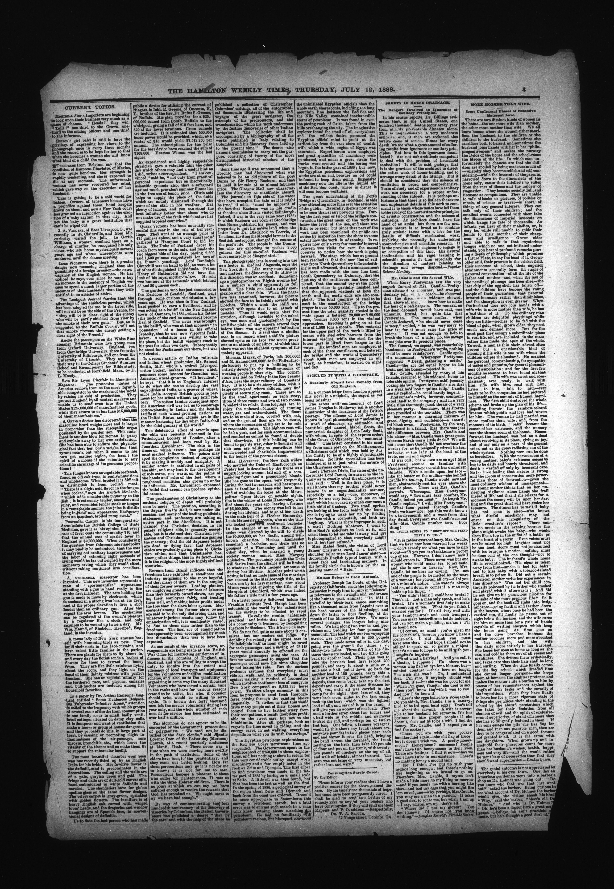
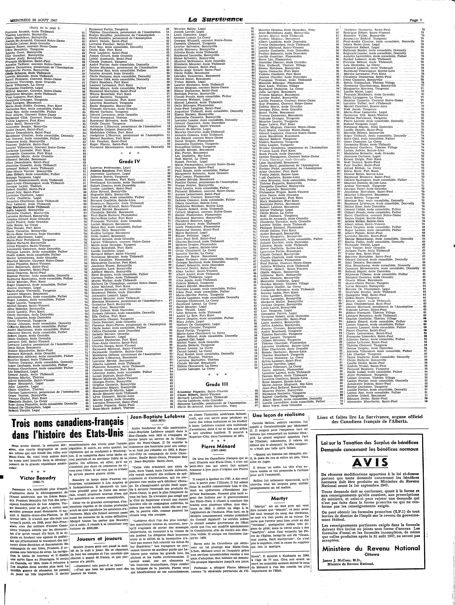
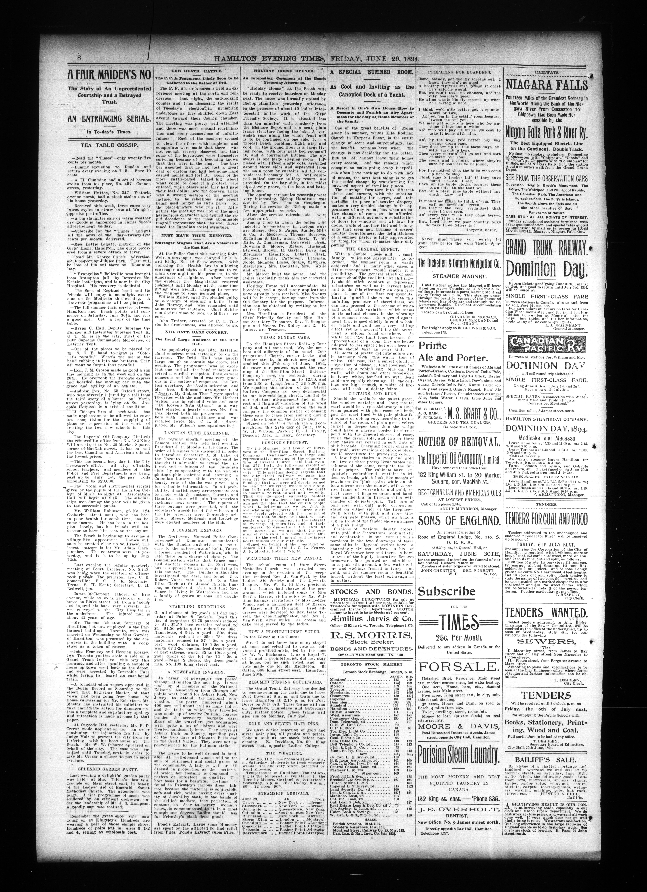
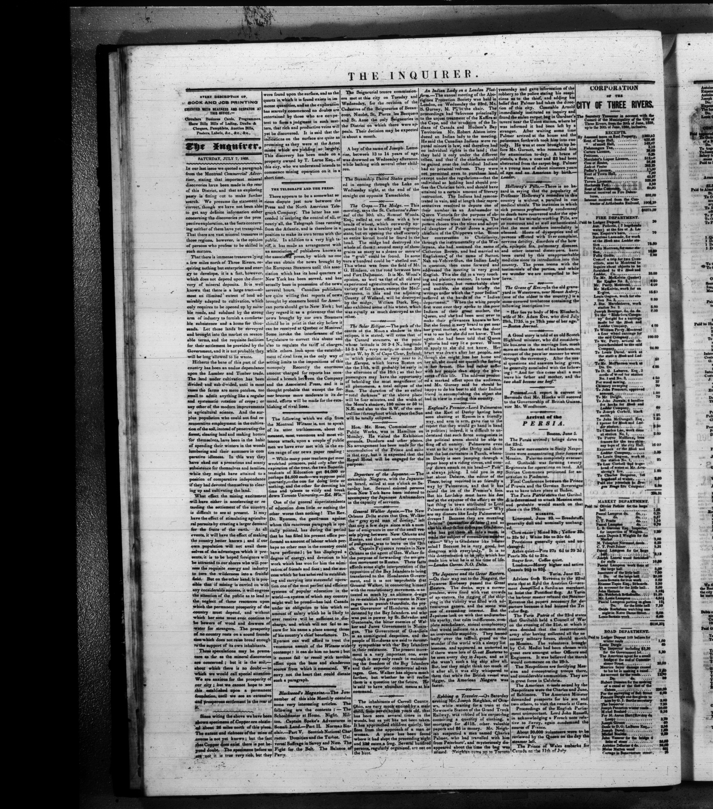

# Multi-Document ABBYY vs Tiled 3x2 + Docparse PaddleOCR + PaddleVL Comparison

This folder contains a multi-document OCR comparison between:

- `ABBYY` outputs under `test-data/abbyy`
- `Paddle` outputs under `test-data/preprocessing-tiling_3x2_dp+paddleocr+vl+clean`

The Paddle side is the same general workflow used in the stress test:

- preprocessing
- `3x2` tiling with docparse layout handling
- PaddleOCR extraction
- low-confidence / suspicious-word review
- spellcheck assistance
- PaddleVL post-check
- cleanup

This folder is the multi-document extension of `1-stress-test`, but limited to one Paddle workflow versus one ABBYY workflow across many pages.

## What Was Compared

The dataset contains `7` document groups and `217` matched page pairs.

Compared document groups:

- `aeu.00037_19470820`
- `oocihm.22250`
- `oocihm.N_00126_19130805`
- `oocihm.N_00138_18940629`
- `oocihm.N_00155_18750610`
- `oocihm.N_00155_18880712`
- `oocihm.N_00219_18600707`

## Output Files

Generated outputs are stored under `test-results`.

- Overall summary workbook: `test-results/multi_document_paddle_vs_abbyy_errors_artifacts.xlsx`
- Page-level workbooks: `test-results/page-level-excels/<document>/<page>.xlsx`
- Plot dashboard: `test-results/plots/multi_document_ocr_dashboard.html`
- Plot PNG exports: `test-results/plots/png/*.png`

Each page-level workbook uses the same wide page-by-page artifact layout as the stress-test comparison script.
The plots compare Paddle against ABBYY only; there is no human-transcribed reference set for this folder yet.

## Headline Findings

Across all `217` page pairs:

- Paddle line count: `66,567`
- ABBYY line count: `66,166`
- Paddle word count: `334,315`
- ABBYY word count: `302,004`
- Paddle artifact entries: `10,999`
- ABBYY artifact entries: `11,052`

Coverage ratios from the plots:

- Paddle line recovery vs ABBYY: `100.6%` overall
- Paddle word recovery vs ABBYY: `110.7%` overall

At the highest level, the total artifact-entry counts are very close. By this counting method, Paddle is slightly lower overall, but the error mix is different rather than simply better.

That coverage difference matters. Paddle is usually producing more OCR text than ABBYY, especially at the word level. Sometimes that means better recovery. Sometimes it means extra separators, ad fragments, or short layout leftovers that survive cleanup.

The biggest pattern differences:

- Paddle produces far more `isolated marker/separator` entries: `6,034` vs `2,962`
- Paddle produces all detected `duplicate/tile overlap` entries: `107` vs `0`
- ABBYY produces far more `suspicious glyph` entries: `6,017` vs `3,316`
- ABBYY produces far more `punctuation artifact` entries: `2,386` vs `520`
- ABBYY produces more `line-start artifact` entries: `298` vs `15`
- `OCR token/phrase mismatch` and `suspicious token` counts are closer, with Paddle somewhat higher

This means the two systems fail differently:

- Paddle is more likely to leave behind separators, tile/merge leftovers, and some duplication noise
- ABBYY is more likely to produce encoding-looking glyph debris, punctuation debris, and malformed line starts

## Key Charts

These are the charts that best support the interpretation in this README. The full dashboard is still available at `test-results/plots/multi_document_ocr_dashboard.html`.

### 1. Word Recovery

This is the clearest coverage chart. It shows that Paddle usually emits more text than ABBYY, which is a strength on prose pages but can also inflate low-value fragments on dense layouts.


### 2. Total Artifacts By Document

This is the cleanest high-level comparison of which documents lean toward Paddle or ABBYY after cleanup.


### 3. Artifact Mix vs ABBYY

This chart explains why the totals alone are not enough. Paddle and ABBYY are not failing in the same way, and this is where the separator-vs-glyph split becomes obvious.


### 4. Biggest Page-Level Swings

This is the best chart for identifying representative outlier pages.
Red bars mean Paddle had more tagged artifacts on that page, gray bars mean ABBYY had more, and the dashed center line is zero difference.


## Document-Level Findings

Some broad document-level patterns from the aggregate workbook:

- `aeu.00037_19470820` is the noisiest document for both systems by summed artifact entries. Paddle has the lower artifact count on `4` of the `8` pages, and ABBYY has the lower artifact count on the other `4`. The document-wide totals are `4,103` artifact entries for Paddle versus `4,106` artifact entries for ABBYY.
- `oocihm.22250` has many pages but relatively low per-page artifact density; its main problem on both sides is separator/marker noise rather than heavy structural corruption. ABBYY has the lower artifact count on `94` pages, Paddle has the lower artifact count on `70`, and `13` pages are tied. The document-wide totals lean toward ABBYY: `2,204` artifact entries for Paddle versus `1,937` artifact entries for ABBYY. Paddle also runs high on coverage here: `111.2%` of ABBYY line count and `120.8%` of ABBYY word count.
- `oocihm.N_00219_18600707` is notably harder for Paddle than ABBYY by summed artifact entries. ABBYY has the lower artifact count on all `4` pages, and the document-wide totals are `1,334` artifact entries for Paddle versus `942` artifact entries for ABBYY. This document is close to line parity (`99.1%` of ABBYY line count) but still `110.2%` of ABBYY word count, which points to extra extracted fragments rather than obvious under-reading.
- `oocihm.N_00155_18880712` is notably harder for ABBYY than Paddle by summed artifact entries. Paddle has the lower artifact count on all `8` pages, and the document-wide totals are `451` artifact entries for Paddle versus `865` artifact entries for ABBYY. Paddle still emits more text here (`119.2%` of ABBYY line count and `109.3%` of ABBYY word count), but ABBYY accumulates much more glyph and punctuation debris.
- `oocihm.N_00126_19130805` and `oocihm.N_00138_18940629` also lean toward Paddle on total artifact count, but for different reasons. In `oocihm.N_00126_19130805`, Paddle has the lower artifact count on `7` of the `8` pages and the document-wide totals are `808` artifact entries for Paddle versus `896` artifact entries for ABBYY, even while Paddle recovers fewer lines. In `oocihm.N_00138_18940629`, Paddle has the lower artifact count on `5` of the `8` pages and the document-wide totals are `1,302` artifact entries for Paddle versus `1,385` artifact entries for ABBYY, landing near word-count parity while avoiding a large ABBYY glyph penalty.

## Which Is Better?

There is no clean single winner without human-transcribed ground truth. The safest conclusion is:

- If `better` means `fewer tagged artifacts after OCR + cleanup`, Paddle has a narrow overall edge: `10,999` artifact entries for Paddle versus `11,052` artifact entries for ABBYY.
- If `better` means `more aggressive text recovery`, Paddle is clearly ahead, producing `110.7%` of ABBYY's word count overall
- If `better` means `total unique words captured`, `3x2` is the strongest Paddle variant in this dataset series. In the three-way comparison workbook anchored in the `4-...` dataset, `3x2` reaches `90.61%` ABBYY unique-token coverage, ahead of `3x1` at `90.19%` and no tiling at `82.15%`.
- If `better` means `cleaner output on dense classified / notice pages full of separators and short ad fragments`, ABBYY often looks better
- If `better` means `cleaner output on regular prose-heavy newspaper pages`, Paddle often looks better

So the practical answer is conditional:

- Paddle looks better as a coverage-oriented workflow when you are willing to post-clean extra debris
- If the deciding metric is `maximum unique-word capture`, choose `3x2`
- If the deciding metric is `best overall balance across the Paddle variants`, choose `3x1` instead
- ABBYY looks safer on pages where the printed layout itself can fool tiling into preserving non-content fragments as text

### Where Paddle Looks Better

`oocihm.N_00155_18880712` is the clearest document-level example. Paddle ends with `451` artifact entries for the document versus `865` artifact entries for ABBYY. On page `oocihm.N_00155_18880712.6`, Paddle has `41` artifact entries versus `130` artifact entries for ABBYY. Paddle word count is higher on that page too: `7,004` words for Paddle versus `6,358` words for ABBYY.


Matching page-level workbook: [oocihm.N_00155_18880712.6.xlsx](c:\Users\BrittnyLapierre\Documents\OCR-Evaluations\2-multi-document-abbyy-vs-tiled3x2+docparse-paddleocr-paddlevl\test-results\page-level-excels\oocihm.N_00155_18880712\oocihm.N_00155_18880712.6.xlsx)

The source image for that page is visually straightforward: long prose columns, stable reading flow, and limited ornament. On that kind of page, the Paddle workflow seems to benefit from cleanup and post-checking, while ABBYY accumulates exactly the categories that dominate its losses in this dataset:

- `suspicious glyph`: Paddle `14`, ABBYY `87`
- `punctuation artifact`: Paddle `1`, ABBYY `17`
- `line-start artifact`: Paddle `0`, ABBYY `10`

That is a good sign for Paddle when the goal is readable running text rather than conservative preservation of every printed fragment.

Additional examples from this dataset:

`oocihm.N_00155_18750610.4`: Paddle has `130` artifact entries on this page versus `209` artifact entries for ABBYY. Paddle word count is higher: `16,746` words for Paddle versus `15,999` words for ABBYY. This is another text-heavy multi-column page with little display ornament. Paddle still has more separator noise (`66` vs `18`), but ABBYY is much worse on `suspicious glyph` (`176` vs `33`). Workbook: [oocihm.N_00155_18750610.4.xlsx](test-results/page-level-excels/oocihm.N_00155_18750610/oocihm.N_00155_18750610.4.xlsx)


`oocihm.N_00155_18880712.3`: Paddle has `35` artifact entries on this page versus `94` artifact entries for ABBYY. Paddle word count is much higher: `7,659` words for Paddle versus `5,692` words for ABBYY. This is another prose-leaning page where ABBYY's glyph and punctuation debris dominate: `suspicious glyph` `67` vs `7`, `punctuation artifact` `14` vs `2`. Workbook: [oocihm.N_00155_18880712.3.xlsx](test-results/page-level-excels/oocihm.N_00155_18880712/oocihm.N_00155_18880712.3.xlsx)



`aeu.00037_19470820.7`: Paddle has `912` artifact entries on this page versus `1,033` artifact entries for ABBYY. Paddle word count is also slightly higher: `4,843` words for Paddle versus `4,534` words for ABBYY. Visually this is a grade-list page with tightly packed names plus article text at the bottom. It is noisy for both systems, but ABBYY's `punctuation artifact` count explodes (`575` vs `7`) and its glyph corruption is also higher (`430` vs `245`). Workbook: [aeu.00037_19470820.7.xlsx](test-results/page-level-excels/aeu.00037_19470820/aeu.00037_19470820.7.xlsx)



### Where ABBYY Looks Better

`oocihm.N_00219_18600707` is the clearest case against Paddle. The worst page is `oocihm.N_00219_18600707.3`, where Paddle has `643` artifact entries on this page versus `408` artifact entries for ABBYY. Paddle word count is higher there too: `5,241` words for Paddle versus `4,621` words for ABBYY.


Matching page-level workbook: [oocihm.N_00219_18600707.3.xlsx](c:\Users\BrittnyLapierre\Documents\OCR-Evaluations\2-multi-document-abbyy-vs-tiled3x2+docparse-paddleocr-paddlevl\test-results\page-level-excels\oocihm.N_00219_18600707\oocihm.N_00219_18600707.3.xlsx)

The source image is a very dense classified-style page with many narrow columns, short notices, prices, boxed ads, and separator-heavy structure. That is exactly the layout where tiled extraction is most vulnerable to preserving extra fragments. The error mix confirms it:

- `isolated marker/separator`: Paddle `496`, ABBYY `164`
- `OCR token/phrase mismatch`: Paddle `15`, ABBYY `3`
- `suspicious token`: Paddle `40`, ABBYY `27`

ABBYY is not clean on that page either, but Paddle's extra recovery turns into a large amount of low-value text debris.

Additional examples from this dataset:

`oocihm.N_00138_18940629.5`: Paddle has `313` artifact entries on this page versus `159` artifact entries for ABBYY. Paddle word count is also higher: `5,147` words for Paddle versus `4,921` words for ABBYY. Visually this is a mixed page with article columns and large display ads. The main difference in the counts is separator-heavy extraction: `isolated marker/separator` `243` vs `86`. Workbook: [oocihm.N_00138_18940629.5.xlsx](test-results/page-level-excels/oocihm.N_00138_18940629/oocihm.N_00138_18940629.5.xlsx)


`oocihm.N_00219_18600707.4`: Paddle has `249` artifact entries on this page versus `171` artifact entries for ABBYY. Paddle word count is higher: `5,869` words for Paddle versus `5,486` words for ABBYY. This is another mixed notice-and-ad page rather than a plain prose page. ABBYY is worse on glyphs and punctuation, but Paddle still loses overall because of much higher `isolated marker/separator` (`136` vs `37`) plus more token mismatches and suspicious tokens. Workbook: [oocihm.N_00219_18600707.4.xlsx](test-results/page-level-excels/oocihm.N_00219_18600707/oocihm.N_00219_18600707.4.xlsx)


`oocihm.22250.160`: Paddle has `90` artifact entries on this page versus `40` artifact entries for ABBYY. Paddle word count is higher here too: `318` words for Paddle versus `277` words for ABBYY. This is not a classified page. It is a fee-schedule / tabular text page with many dot leaders and aligned amounts, and almost the entire gap is separator-like debris (`87` vs `34`) rather than glyph corruption. Workbook: [oocihm.22250.160.xlsx](test-results/page-level-excels/oocihm.22250/oocihm.22250.160.xlsx)


### Mixed Case: Name Lists, Fine Print, and Ads

`oocihm.N_00138_18940629.7` is a useful mixed example. The page combines dense name lists, small print, and boxed advertisements. Paddle finishes with `140` artifact entries on this page versus `301` artifact entries for ABBYY, even though Paddle still has more separator noise. Paddle word count is slightly lower: `4,041` words for Paddle versus `4,217` words for ABBYY.


Matching page-level workbook: [oocihm.N_00138_18940629.7.xlsx](c:\Users\BrittnyLapierre\Documents\OCR-Evaluations\2-multi-document-abbyy-vs-tiled3x2+docparse-paddleocr-paddlevl\test-results\page-level-excels\oocihm.N_00138_18940629\oocihm.N_00138_18940629.7.xlsx)

The main reason is that ABBYY's output degrades sharply into glyph-like corruption on this page:

- `suspicious glyph`: Paddle `38`, ABBYY `259`
- `isolated marker/separator`: Paddle `65`, ABBYY `21`

This shows the systems are not trading off the same failure type. Paddle often preserves too many printable fragments; ABBYY more often collapses into garbled character output.

Additional examples from this dataset:

`oocihm.N_00138_18940629.8`: Paddle has `217` artifact entries on this page versus `248` artifact entries for ABBYY. Word count is essentially identical: `5,889` words for Paddle versus `5,878` words for ABBYY. Paddle is still ahead overall, but not cleanly: it has more `isolated marker/separator` (`123` vs `78`), while ABBYY is worse on `suspicious glyph` (`97` vs `32`) and `punctuation artifact` (`57` vs `24`). Workbook: [oocihm.N_00138_18940629.8.xlsx](test-results/page-level-excels/oocihm.N_00138_18940629/oocihm.N_00138_18940629.8.xlsx)



`oocihm.N_00219_18600707.2`: Paddle has `241` artifact entries on this page versus `208` artifact entries for ABBYY. Paddle word count is higher: `5,102` words for Paddle versus `4,552` words for ABBYY. ABBYY is worse on glyphs and punctuation, but Paddle still loses overall because its separator count is much higher (`180` vs `80`) and it introduces more OCR token mismatches (`14` vs `1`). Workbook: [oocihm.N_00219_18600707.2.xlsx](test-results/page-level-excels/oocihm.N_00219_18600707/oocihm.N_00219_18600707.2.xlsx)



`aeu.00037_19470820.7`: Paddle has `912` artifact entries on this page versus `1,033` artifact entries for ABBYY. Paddle word count is also slightly higher: `4,843` words for Paddle versus `4,534` words for ABBYY. This is a good hybrid example because Paddle is much worse on separators (`643` vs `359`), but ABBYY is dramatically worse on punctuation (`575` vs `7`) and still worse on glyph corruption (`430` vs `245`). Workbook: [aeu.00037_19470820.7.xlsx](test-results/page-level-excels/aeu.00037_19470820/aeu.00037_19470820.7.xlsx)


## How To Read The Counts

The workbook counts `artifact entries`, not just raw bad lines.

One line can receive more than one error tag. For example, a line might be counted as both:

- `suspicious glyph`
- `OCR token/phrase mismatch`

Because of that, per-type totals can add up to more than the total number of artifact entries.

## Error Type Guide

Below, each type is described in terms of what it means in this project, how the script recognizes it, and one representative example.

### 1. Duplicate / Tile Overlap

Meaning:
Content was repeated because tiled OCR regions overlapped or because adjacent lines were merged with partial duplication.

How it is detected:
The script compares each line to the previous normalized line. If similarity is high enough and enough words overlap, it marks the later line as a possible overlap duplication.

Example from this dataset:
`L406: possible duplicated/overlap line with previous line (similarity 67%) :: de Legal, et comme sous-diacre le R.`

Interpretation:
This is a Paddle-specific artifact in this run and is the clearest signature of the tiling workflow.

### 2. OCR Token / Phrase Mismatch

Meaning:
The two OCR systems disagree on a token or short phrase in a way that looks plausibly like an OCR mistake rather than a harmless spelling variant.

How it is detected:
The script aligns Paddle and ABBYY token streams and flags close but suspicious divergences, especially when one token looks less plausible or obviously malformed.

Example from this dataset:
`candidate OCR token mismatch vs other OCR: "ecueil" vs "cueil"`

Interpretation:
This category is useful when both outputs are readable but one looks like the less credible OCR rendering.

### 3. Suspicious Token

Meaning:
A token looks intrinsically wrong even before comparing against the other OCR.

How it is detected:
The script flags things like:

- odd internal casing
- letter/digit mixtures
- very long joined tokens
- word-join patterns inside one token

Example from this dataset:
`MauriCe (odd internal casing)`

Interpretation:
This category tries to catch tokens that look OCR-generated or structurally implausible.

### 4. Suspicious Glyph

Meaning:
The line contains non-ASCII characters that look like encoding debris, fullwidth/CJK symbol leakage, or other obviously wrong glyphs for the surrounding text.

How it is detected:
The script normalizes the line and flags characters that are neither allowed punctuation/accents nor likely valid text in context.

Example from this dataset:
`stray/suspicious non-ASCII glyph(s): U+02DC SMALL TILDE`

Interpretation:
ABBYY accumulated many more of these in this dataset, which suggests more encoding-style output debris in its exported text.

### 5. BOM / Control Character

Meaning:
A line begins with a byte-order mark or similar control artifact.

How it is detected:
If a line starts with `U+FEFF`, the script records a BOM/control issue.

Observed here:
No `BOM/control character` entries were recorded in this multi-document run.

Representative example form:
A first line beginning with hidden BOM text that then leaks into downstream processing.

### 6. Isolated Marker / Separator

Meaning:
The OCR emitted a line that is mostly punctuation, symbols, bullets, stars, divider fragments, or very short marker-like debris rather than meaningful text.

How it is detected:
The script flags:

- very short low-information lines
- symbol-only lines
- short marker-style lines

Example from this dataset:
`L1: symbol-only separator/garbage line :: *********`

Interpretation:
This is the dominant Paddle error type in the aggregate results. It often reflects page furniture, separators, ornament lines, or tile boundary leftovers that were preserved as text.

### 7. Punctuation Artifact

Meaning:
The line contains punctuation debris such as repeated punctuation, malformed quote/punctuation combinations, or repeated hyphens.

How it is detected:
The script checks for repeated punctuation patterns and punctuation constructions that look machine-generated rather than intentional typography.

Example from this dataset:
`L11: punctuation artifact: double/multiple hyphen :: EDMONTON, ALBERTA --`

Interpretation:
ABBYY has many more of these overall in this dataset.

### 8. Line-Start Artifact

Meaning:
The beginning of the line looks corrupted, often with punctuation glued directly to text or digit/letter garbage at the start.

How it is detected:
The script flags line starts that match patterns like:

- punctuation glued to a word
- digit-plus-letter garbage at the beginning
- lowercase prefix glued to a capitalized word

Example from this dataset:
`L237: ... line starts with digit/letter garbage token ... :: 1Canada. cernée à`

Interpretation:
This often indicates a segmentation or encoding failure at the start of a recognized line.

### 9. Spacing / Joined Text

Meaning:
Words or clauses that should be separated are fused together, or punctuation spacing is missing badly enough to change readability.

How it is detected:
The script flags patterns like:

- missing space after a period
- missing space around punctuation
- known joined-word patterns

Example from this dataset:
`L88: missing space around punctuation :: And it may be pretty safely stated,that the same rules`

Interpretation:
This was relatively uncommon in the aggregate results, especially on the Paddle side.

### 10. Abbreviation / Spacing

Meaning:
Abbreviation punctuation appears garbled, duplicated, or badly spaced.

How it is detected:
The script looks for repeated abbreviation punctuation patterns that often come from noisy OCR around initials or abbreviations.

Example from this dataset:
`L28: abbreviation/spacing may be garbled :: Il y a un peu moins de vingt ans, l'A.C.F.A.,.,`

Interpretation:
This category is distinct from general punctuation debris because it focuses on abbreviation-like constructions.

### 11. Other

Meaning:
A fallback category for any tagged reason that does not map to one of the named groups.

Observed here:
No `other` entries were recorded in this run.

## Practical Interpretation

If the question is "which output is cleaner overall?", this run does not support a simple one-word answer.

- By total artifact entries, the two systems are nearly tied.
- Paddle's main weaknesses are separator noise and tile-overlap duplication.
- ABBYY's main weaknesses are suspicious glyphs, punctuation debris, and malformed line starts.

If the question is "which system fails in ways that are easier to clean up automatically?", the answer likely depends on the downstream use case:

- Separator-only debris is often easy to delete automatically.
- Encoding-like glyph corruption and punctuation corruption can be harder to repair reliably.
- Tile-overlap duplication is very specific and may be fixable with workflow-level post-processing.

The current evidence favors a conditional recommendation rather than a blanket one:

- If your priority is `maximum vocabulary capture`, prefer the tiled `3x2 + docparse + PaddleOCR + PaddleVL` workflow
- If your priority is the `best-balanced default across the Paddle variants in this dataset series`, prefer `3x1 + docparse + PaddleOCR + PaddleVL` instead
- For dense classifieds, notices, and pages where a lot of printed structure is not real body text, ABBYY still looks safer
- If the Paddle workflow remains the default, the most valuable next cleanup target is separator/fragment suppression on classified-style pages

## Regenerating The Results

Run:

```powershell
python tools\compare_multi_document_ocr_errors.py
```

Default outputs:

- `test-results/multi_document_paddle_vs_abbyy_errors_artifacts.xlsx`
- `test-results/page-level-excels/`

To regenerate the plots, run:

```powershell
python tools\generate_multi_document_ocr_plots.py
```

Plot outputs:

- `test-results/plots/multi_document_ocr_dashboard.html`
- `test-results/plots/png/`
