# Multi-Document ABBYY vs Tiled 3x1 + Docparse PaddleOCR + PaddleVL Comparison

This folder contains a multi-document OCR comparison between:

- `ABBYY` outputs under `test-data/abbyy`
- `Paddle` outputs under `test-data/preprocessing-tiling_3x1_dp+paddleocr+vl+clean`

The Paddle side is the same general workflow used in the stress test:

- preprocessing
- intended `3x1` tiling with docparse layout handling
- PaddleOCR extraction
- low-confidence / suspicious-word review
- spellcheck assistance
- PaddleVL post-check
- cleanup

## What Was Compared

The dataset contains `7` document groups and `217` matched page pairs.

Compared document groups:

- `aeu.00037_19470820`
- `oocihm.22250`
- `oocihm.N_00126_19130805`
- `oocihm.N_00138_18940629`
- `oocihm.N_00155_18750610`
- `oocihm.N_00155_18880712`
- `oocihm.N_00219_18600707`

## Output Files

Generated outputs are stored under `test-results`.

- Overall summary workbook: `test-results/multi_document_paddle_vs_abbyy_errors_artifacts.xlsx`
- Page-level workbooks: `test-results/page-level-excels/<document>/<page>.xlsx`
- Plot dashboard: `test-results/plots/multi_document_ocr_dashboard.html`
- Plot PNG exports: `test-results/plots/png/*.png`

Each page-level workbook uses the same wide page-by-page artifact layout as the stress-test comparison script.
The plots compare Paddle against ABBYY only; there is no human-transcribed reference set for this folder yet.

## Headline Findings

Across all `217` page pairs:

- Paddle line count: `58,580`
- ABBYY line count: `66,166`
- Paddle word count: `308,804`
- ABBYY word count: `302,004`
- Paddle artifact entries: `10,614`
- ABBYY artifact entries: `11,056`

Coverage ratios from the plots:

- Paddle line recovery vs ABBYY: `88.5%` overall
- Paddle word recovery vs ABBYY: `102.3%` overall

Page-level split:

- Paddle lower on `111` pages
- ABBYY lower on `91` pages
- Tied on `15` pages

This is the real `3x1` result, and it is meaningfully different from the earlier duplicated `3x2` placeholder. Paddle now has both the lower total artifact count and the page-win edge, but the margin is coming from a very specific tradeoff:

- Paddle recovers `6,800` more words than ABBYY
- Paddle emits `7,586` fewer lines than ABBYY
- Paddle still carries the much larger separator burden
- ABBYY still carries the much larger glyph and punctuation burden

So this `3x1` run no longer looks like a simple over-extraction pass. It looks more like a tighter extraction pass that often keeps usable text while collapsing some line structure and still over-preserving separators on hard layouts.

The biggest pattern differences in `3x1` are still structural rather than cosmetic:

- Paddle produces far more `isolated marker/separator` entries: `5,922` vs `2,962`
- Paddle produces all detected `duplicate/tile overlap` entries: `102` vs `0`
- ABBYY produces far more `suspicious glyph` entries: `6,017` vs `3,063`
- ABBYY produces far more `punctuation artifact` entries: `2,386` vs `465`
- ABBYY produces more `line-start artifact` entries: `298` vs `9`
- `OCR token/phrase mismatch` and `suspicious token` counts are closer, with Paddle somewhat higher

So the `3x1` workflow is not simply cleaner or dirtier. It fails differently:

- Paddle is more likely to over-preserve separators, short layout fragments, and some duplication noise
- ABBYY is more likely to collapse into glyph debris, punctuation debris, and malformed line starts
- Paddle's aggregate edge comes mostly from avoiding ABBYY's character-level breakdown often enough to offset its own separator-heavy failures

## Key Charts

These are the charts that best support the interpretation in this README. The full dashboard is still available at `test-results/plots/multi_document_ocr_dashboard.html`.

### 1. Word Recovery

This is the clearest coverage chart. It shows that Paddle usually emits more text than ABBYY, which is a strength on prose pages but can also inflate low-value fragments on dense layouts.

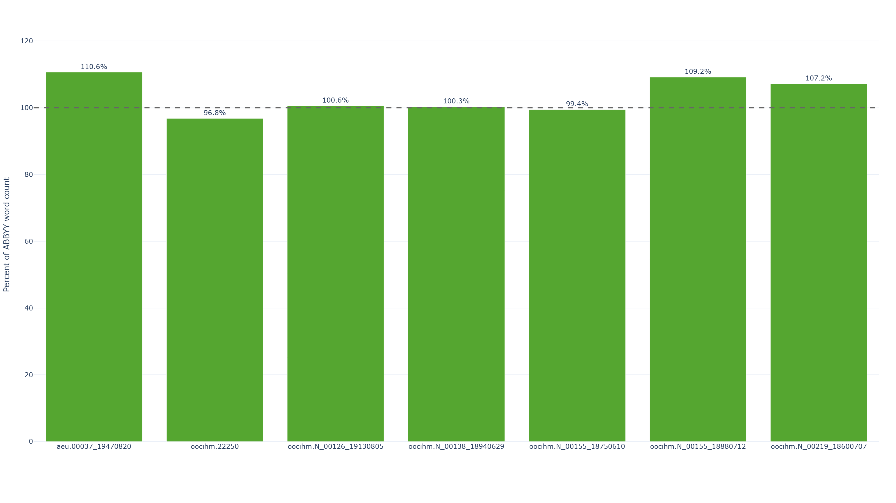

### 2. Total Artifacts By Document

This is the cleanest high-level comparison of which documents lean toward Paddle or ABBYY after cleanup.

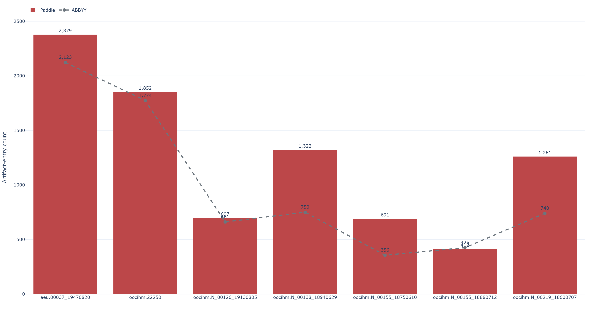

### 3. Artifact Mix vs ABBYY

This chart explains why the totals alone are not enough. Paddle and ABBYY are not failing in the same way, and this is where the separator-vs-glyph split becomes obvious.

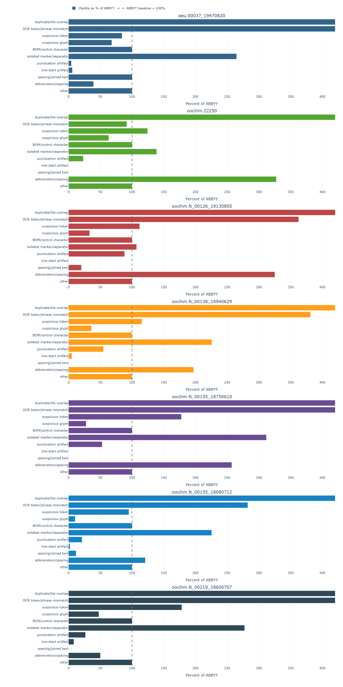

### 4. Biggest Page-Level Swings

This is the best chart for identifying representative outlier pages.
Red bars mean Paddle had more tagged artifacts on that page, gray bars mean ABBYY had more, and the dashed center line is zero difference.

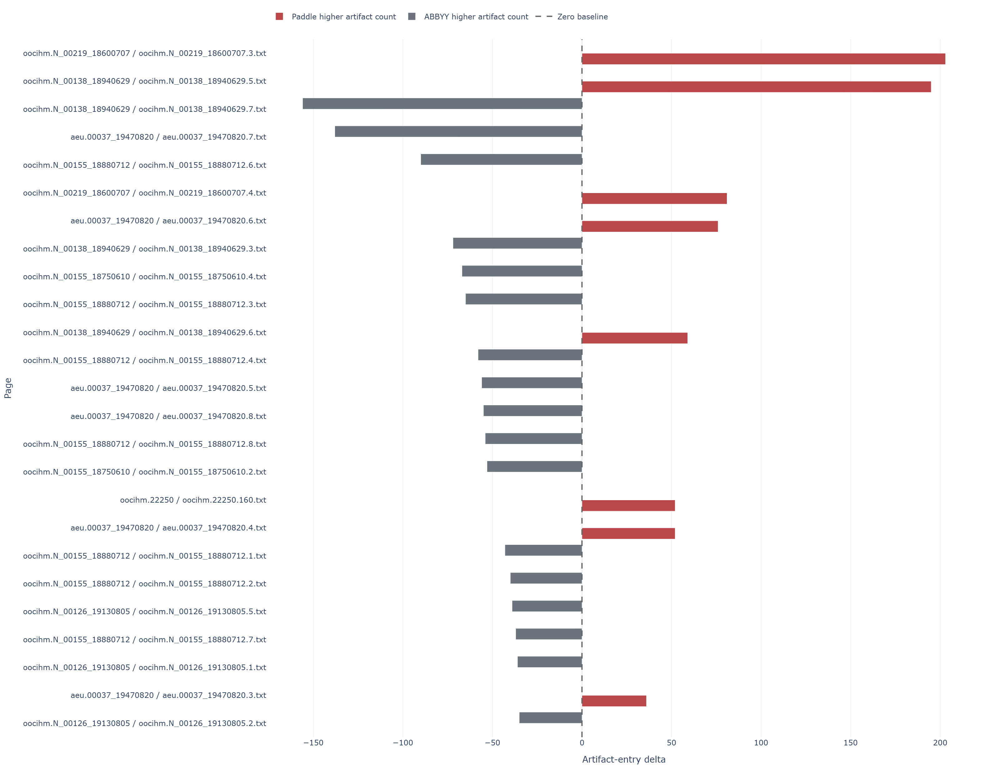

## Document-Level Findings

Some broad document-level patterns from the aggregate workbook and refreshed plots:

- `aeu.00037_19470820` is still the noisiest document on both sides and remains close overall. Paddle has the lower artifact count on `4` of the `8` pages, and ABBYY has the lower artifact count on the other `4`. The document-wide totals are `4,022` artifact entries for Paddle versus `4,107` artifact entries for ABBYY. It is still the best example of the separator-vs-punctuation tradeoff.
- `oocihm.22250` is the biggest volume test in the set and stays genuinely mixed. Paddle has the lower artifact count on `83` pages, ABBYY has the lower artifact count on `79`, and `15` pages are tied. Even so, the document-wide totals still lean slightly toward ABBYY: `2,040` artifact entries for Paddle versus `1,943` artifact entries for ABBYY. Coverage is below ABBYY here at `81.0%` of ABBYY line count and `96.8%` of ABBYY word count, which suggests `3x1` is often suppressing short fragments but not clearly beating ABBYY on this whole volume.
- `oocihm.N_00219_18600707` is still the strongest document-level ABBYY win by summed artifact entries. ABBYY has the lower artifact count on all `4` pages, and the document-wide totals are `1,266` artifact entries for Paddle versus `939` artifact entries for ABBYY. Paddle word recovery is still above ABBYY (`107.2%` of ABBYY word count) even though Paddle line recovery is below (`94.2%` of ABBYY line count), which points to extra fragment extraction on the hardest ad-heavy pages.
- `oocihm.N_00155_18880712` remains the strongest Paddle win. Paddle has the lower artifact count on all `8` pages, and the document-wide totals are `443` artifact entries for Paddle versus `863` artifact entries for ABBYY. This is the clearest prose-led case where ABBYY's glyph and punctuation corruption outweigh Paddle's separator noise.
- `oocihm.N_00126_19130805` is one of the strongest clean Paddle wins. Paddle has the lower artifact count on `7` of the `8` pages, while ABBYY is lower on `1`. The document-wide totals are `731` artifact entries for Paddle versus `897` artifact entries for ABBYY. Paddle reaches only `76.4%` of ABBYY line count here but still slightly exceeds ABBYY on words (`100.6%` of ABBYY word count), which suggests fewer short stray lines rather than obvious text loss.
- `oocihm.N_00138_18940629` remains the best mixed-layout stress case in the set. Paddle has the lower artifact count on `5` of the `8` pages, and ABBYY is lower on `3`. The document-wide totals are nearly even: `1,354` artifact entries for Paddle versus `1,386` artifact entries for ABBYY. It still contains both the biggest single-page Paddle win and one of the biggest ABBYY wins.
- `oocihm.N_00155_18750610` is now a clean Paddle sweep by page count. Paddle has the lower artifact count on all `4` pages, and the document-wide totals are `758` artifact entries for Paddle versus `921` artifact entries for ABBYY. That is a strong result because it is driven by dense article pages, not just the easiest prose pages.

## Which Is Better?

There is still no clean single winner without human-transcribed ground truth, but the `3x1` run is more clearly characterized than the inherited README suggested:

- If `better` means `fewer tagged artifacts after OCR + cleanup`, Paddle has the edge: `10,614` artifact entries for Paddle versus `11,056` artifact entries for ABBYY.
- If `better` means `winning more individual pages`, Paddle also has the edge: Paddle has the lower artifact count on `111` pages, ABBYY has the lower artifact count on `91` pages, and `15` pages are tied.
- If `better` means `more aggressive text recovery`, Paddle is only modestly ahead on words: `102.3%` of ABBYY's word count overall
- If `better` means `line-by-line structural coverage`, ABBYY is still ahead: Paddle is only `88.5%` of ABBYY's line count overall
- If `better` means `conservative behavior on separator-heavy classifieds, schedules, and notice pages`, ABBYY is usually safer
- If `better` means `avoiding ABBYY-style glyph and punctuation collapse`, Paddle often looks better

So the practical answer is conditional:

- Paddle `3x1` now looks better overall by the artifact metric used in this dataset
- Paddle `3x1` looks better when the downstream use case values readable extracted text and can tolerate post-cleaning separator junk
- ABBYY looks safer when the page layout itself is likely to trick tiling into treating rules, dot leaders, short ad fragments, or narrow notices as real text
- The `3x1` workflow is therefore viable and competitive, but it is still not the conservative choice on the hardest structure-heavy pages

### Where Paddle Looks Better

At the document level, `oocihm.N_00155_18880712` is still the clearest Paddle win. The biggest single-page Paddle advantage in the real `3x1` run is `oocihm.N_00138_18940629.7`: Paddle has `145` artifact entries on this page versus `301` artifact entries for ABBYY. Paddle word count is slightly lower there, at `4,061` words versus `4,217` for ABBYY, so this is an artifact-quality win more than a maximum-word-capture win.

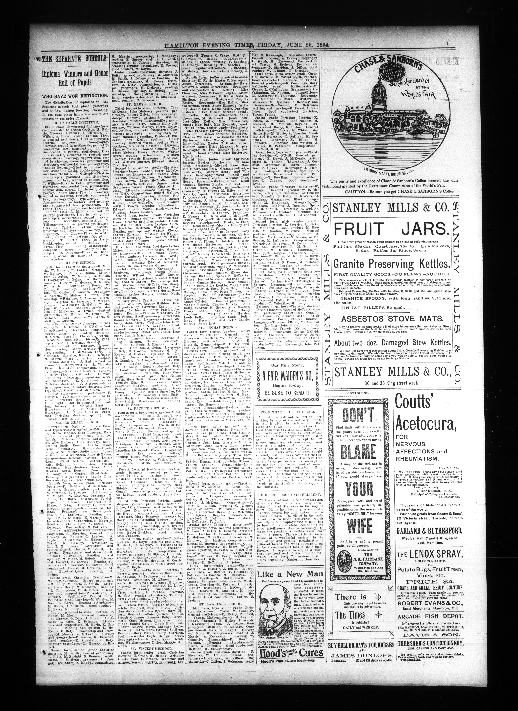

Matching page-level workbook: [oocihm.N_00138_18940629.7.xlsx](test-results/page-level-excels/oocihm.N_00138_18940629/oocihm.N_00138_18940629.7.xlsx)

That page is not a simple prose page. It is a dense diploma-results page with long name lists, thin score columns, and stacked right-side display ads. Even there, Paddle wins decisively because ABBYY collapses into glyph debris far faster than Paddle does:

- `suspicious glyph`: Paddle `35`, ABBYY `259`
- `isolated marker/separator`: Paddle `71`, ABBYY `21`
- `line-start artifact`: Paddle `0`, ABBYY `6`

That page matters because it shows `3x1` can beat ABBYY even on mixed layouts, as long as ABBYY's output quality falls apart at the character level.

Additional `3x1` examples from this dataset:

`oocihm.N_00155_18880712.6`: Paddle has `40` artifact entries on this page versus `130` artifact entries for ABBYY. Paddle word count is higher here too: `7,025` words for Paddle versus `6,358` words for ABBYY. This is one of the cleanest prose-led pages in the set: mostly long narrative columns with only a small ad block. Paddle has more separator noise (`20` vs `10`), but ABBYY is far worse on `suspicious glyph` (Paddle `9`, ABBYY `87`), `suspicious token` (Paddle `0`, ABBYY `28`), `punctuation artifact` (Paddle `1`, ABBYY `17`), and `line-start artifact` (Paddle `0`, ABBYY `10`). Workbook: [oocihm.N_00155_18880712.6.xlsx](test-results/page-level-excels/oocihm.N_00155_18880712/oocihm.N_00155_18880712.6.xlsx)


`oocihm.N_00155_18750610.4`: Paddle has `142` artifact entries on this page versus `209` artifact entries for ABBYY. Word count is almost at parity: `15,929` words for Paddle versus `15,999` words for ABBYY. This is a dense broadsheet text page with long article columns, small verse blocks, and very little display furniture. Paddle still pays a separator cost (`71` vs `18`), but ABBYY's `suspicious glyph` count dominates (Paddle `39`, ABBYY `176`) and ABBYY also carries more `line-start artifact` noise (Paddle `0`, ABBYY `9`). Workbook: [oocihm.N_00155_18750610.4.xlsx](test-results/page-level-excels/oocihm.N_00155_18750610/oocihm.N_00155_18750610.4.xlsx)


`oocihm.N_00138_18940629.3`: Paddle has `108` artifact entries on this page versus `180` artifact entries for ABBYY. Word count is also nearly even: `4,020` words for Paddle versus `4,034` words for ABBYY. This is another mixed list-and-ad page rather than an easy article page. Paddle is a little worse on `isolated marker/separator` (`32` vs `21`) and `OCR token/phrase mismatch` (`14` vs `2`), but ABBYY's `suspicious glyph` count jumps to `121` versus Paddle's `17`, which is enough to make Paddle clearly better overall. Workbook: [oocihm.N_00138_18940629.3.xlsx](test-results/page-level-excels/oocihm.N_00138_18940629/oocihm.N_00138_18940629.3.xlsx)

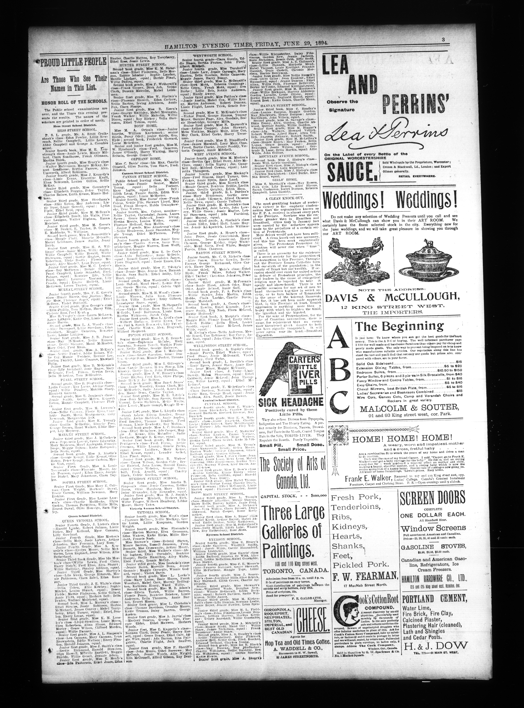

### Where ABBYY Looks Better

`oocihm.N_00219_18600707` is still the clearest case against Paddle. The worst page is `oocihm.N_00219_18600707.3`, where Paddle has `611` artifact entries on the page versus `408` artifact entries for ABBYY. Paddle word count is higher there too: `5,016` words for Paddle versus `4,621` words for ABBYY.


Matching page-level workbook: [oocihm.N_00219_18600707.3.xlsx](test-results/page-level-excels/oocihm.N_00219_18600707/oocihm.N_00219_18600707.3.xlsx)

The source image is a very dense ad-and-notice page with many narrow columns, short promotional blocks, and separator-heavy structure. That is exactly the layout where tiled extraction is most vulnerable to preserving extra fragments. The error mix confirms it:

- `isolated marker/separator`: Paddle `464`, ABBYY `164`
- `punctuation artifact`: Paddle `49`, ABBYY `162`
- `OCR token/phrase mismatch`: Paddle `16`, ABBYY `2`

ABBYY is not clean on that page either, but Paddle's extra recovery turns into a much larger amount of low-value text debris.

Additional `3x1` examples from this dataset:

`oocihm.N_00138_18940629.5`: Paddle has `353` artifact entries on this page versus `158` artifact entries for ABBYY. Paddle word count is also higher: `5,208` words for Paddle versus `4,921` words for ABBYY. This page mixes article columns with large right-hand display ads. So on raw word count, Paddle is ahead; ABBYY still looks better here only because the `3x1` workflow preserves those ad structures so aggressively that the artifact burden stays much higher: `isolated marker/separator` `273` vs `86`, and Paddle also runs higher on `suspicious glyph` (`114` vs `39`). ABBYY is still worse on punctuation (`42` vs `14`), but that does not offset Paddle's separator load. Workbook: [oocihm.N_00138_18940629.5.xlsx](test-results/page-level-excels/oocihm.N_00138_18940629/oocihm.N_00138_18940629.5.xlsx)


`oocihm.N_00219_18600707.4`: Paddle has `251` artifact entries on this page versus `170` artifact entries for ABBYY. Paddle word count is also higher: `5,833` words for Paddle versus `5,486` words for ABBYY. This is another dense notice-and-ad page full of narrow display blocks. ABBYY is worse on glyphs and punctuation, but Paddle still loses overall because it is much higher on `isolated marker/separator` (`127` vs `37`), `OCR token/phrase mismatch` (`32` vs `5`), and `suspicious token` (`72` vs `35`). Workbook: [oocihm.N_00219_18600707.4.xlsx](test-results/page-level-excels/oocihm.N_00219_18600707/oocihm.N_00219_18600707.4.xlsx)

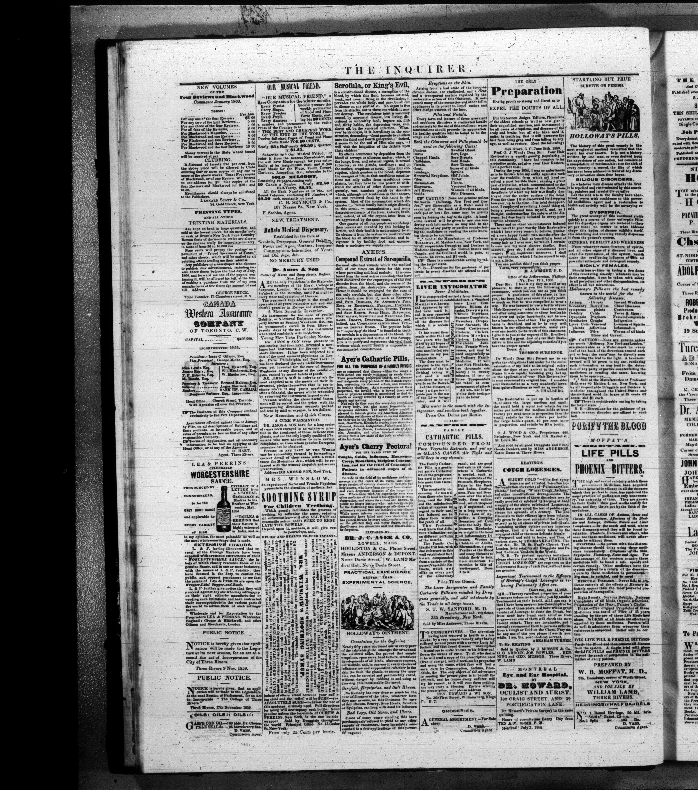

`oocihm.22250.160`: Paddle has `92` artifact entries on this page versus `40` artifact entries for ABBYY. Paddle word count is slightly lower here: `269` words for Paddle versus `277` words for ABBYY. This is not a classified page at all. It is a fee schedule with dot leaders and aligned amounts, and almost the entire gap is separator-style debris (`90` vs `34`) rather than glyph corruption. Workbook: [oocihm.22250.160.xlsx](test-results/page-level-excels/oocihm.22250/oocihm.22250.160.xlsx)


### Mixed Case: Name Lists, Fine Print, and Ads

`aeu.00037_19470820.6` is still the best mixed example in the `3x1` run. ABBYY wins on total artifact entries, but the reason is not straightforward. Paddle finishes with `1,101` artifact entries on this page versus `1,025` artifact entries for ABBYY. Paddle word count is slightly higher: `4,624` words for Paddle versus `4,458` words for ABBYY.

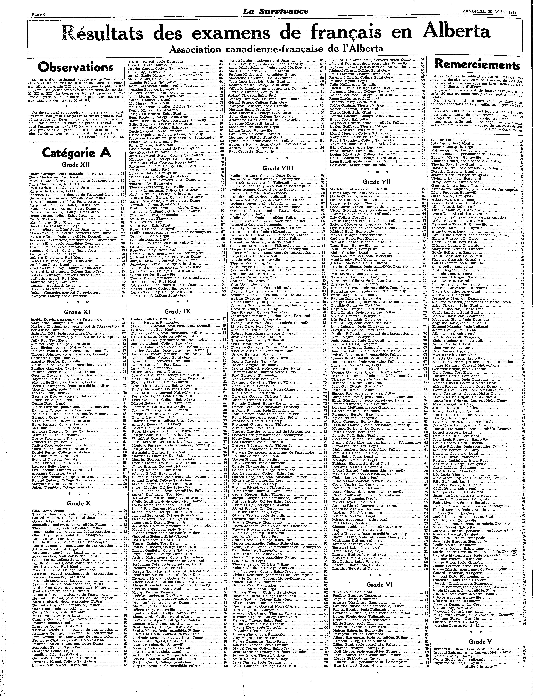

Matching page-level workbook: [aeu.00037_19470820.6.xlsx](test-results/page-level-excels/aeu.00037_19470820/aeu.00037_19470820.6.xlsx)

The result depends entirely on which failure type you care about:

- `isolated marker/separator`: Paddle `850`, ABBYY `260`
- `suspicious glyph`: Paddle `233`, ABBYY `478`
- `punctuation artifact`: Paddle `4`, ABBYY `780`

So ABBYY is lower overall on that page, but ABBYY is also dramatically worse in exactly the categories that are hardest to repair semantically. This is the clearest `3x1` example of the same page looking better or worse depending on whether separators or corrupted characters matter more downstream.

Additional `3x1` examples from this dataset:

`aeu.00037_19470820.7`: Paddle has `895` artifact entries on this page versus `1,033` artifact entries for ABBYY. Paddle word count is also slightly higher: `4,669` words for Paddle versus `4,534` words for ABBYY. This continuation page keeps the same exam-results columns but adds a lower feature block and a boxed government notice. Paddle still loses badly on separators (`637` vs `359`), but ABBYY is vastly worse on `suspicious glyph` (`430` vs `218`) and `punctuation artifact` (`575` vs `7`). Workbook: [aeu.00037_19470820.7.xlsx](test-results/page-level-excels/aeu.00037_19470820/aeu.00037_19470820.7.xlsx)


`oocihm.N_00138_18940629.8`: Paddle has `214` artifact entries on this page versus `248` artifact entries for ABBYY. Word count is essentially identical: `5,877` words for Paddle versus `5,878` words for ABBYY. This page blends dense article columns, market-style tabular blocks, and a narrow rail-ad strip down the right edge. Paddle is ahead overall, but not cleanly: it has more `isolated marker/separator` (`119` vs `78`) and more `suspicious token` entries (`29` vs `22`), while ABBYY is much worse on `suspicious glyph` (`97` vs `29`) and `punctuation artifact` (`57` vs `25`). Workbook: [oocihm.N_00138_18940629.8.xlsx](test-results/page-level-excels/oocihm.N_00138_18940629/oocihm.N_00138_18940629.8.xlsx)


## Bottom Line

If you are reading this README straight through for the argument rather than for reference, the practical conclusion is now clear:

- Against ABBYY, the `3x1 + docparse + PaddleOCR + PaddleVL` run is the better overall tiled candidate in this dataset on the artifact metric used here
- Against `3x2`, the `3x1` run is the better-balanced workflow: it gives up a little raw coverage, but it avoids much of the over-expansion that made `3x2` noisier
- ABBYY is still the safer fallback on the hardest structure-heavy pages, especially classifieds, fee schedules, narrow notices, and ad-dense layouts

The reading pattern behind that conclusion is consistent across the sections above:

- the aggregate counts favor `3x1`
- the document-level picture shows where that edge holds and where it breaks
- the example pages show the actual tradeoff: Paddle usually loses on separators and structural fragments, while ABBYY more often loses on glyph corruption, punctuation corruption, and malformed line starts

The next two sections are lookup material, not the main narrative. They explain how the counts work and what each error type means. If you are skimming for the decision path, continue next at `Detailed Interpretation` and then `3x2 vs 3x1`.

## Reference: How To Read The Counts

The workbook counts `artifact entries`, not just raw bad lines.

One line can receive more than one error tag. For example, a line might be counted as both:

- `suspicious glyph`
- `OCR token/phrase mismatch`

Because of that, per-type totals can add up to more than the total number of artifact entries.

## Reference: Error Type Guide

Below, each type is described in terms of what it means in this project, how the script recognizes it, and one representative example.

### 1. Duplicate / Tile Overlap

Meaning:
Content was repeated because tiled OCR regions overlapped or because adjacent lines were merged with partial duplication.

How it is detected:
The script compares each line to the previous normalized line. If similarity is high enough and enough words overlap, it marks the later line as a possible overlap duplication.

Example from this dataset:
`L406: possible duplicated/overlap line with previous line (similarity 67%) :: de Legal, et comme sous-diacre le R.`

Interpretation:
This is a Paddle-specific artifact in this run and is the clearest signature of the tiling workflow.

### 2. OCR Token / Phrase Mismatch

Meaning:
The two OCR systems disagree on a token or short phrase in a way that looks plausibly like an OCR mistake rather than a harmless spelling variant.

How it is detected:
The script aligns Paddle and ABBYY token streams and flags close but suspicious divergences, especially when one token looks less plausible or obviously malformed.

Example from this dataset:
`candidate OCR token mismatch vs other OCR: "ecueil" vs "cueil"`

Interpretation:
This category is useful when both outputs are readable but one looks like the less credible OCR rendering.

### 3. Suspicious Token

Meaning:
A token looks intrinsically wrong even before comparing against the other OCR.

How it is detected:
The script flags things like:

- odd internal casing
- letter/digit mixtures
- very long joined tokens
- word-join patterns inside one token

Example from this dataset:
`MauriCe (odd internal casing)`

Interpretation:
This category tries to catch tokens that look OCR-generated or structurally implausible.

### 4. Suspicious Glyph

Meaning:
The line contains non-ASCII characters that look like encoding debris, fullwidth/CJK symbol leakage, or other obviously wrong glyphs for the surrounding text.

How it is detected:
The script normalizes the line and flags characters that are neither allowed punctuation/accents nor likely valid text in context.

Example from this dataset:
`stray/suspicious non-ASCII glyph(s): U+02DC SMALL TILDE`

Interpretation:
ABBYY accumulated many more of these in this dataset, which suggests more encoding-style output debris in its exported text.

### 5. BOM / Control Character

Meaning:
A line begins with a byte-order mark or similar control artifact.

How it is detected:
If a line starts with `U+FEFF`, the script records a BOM/control issue.

Observed here:
No `BOM/control character` entries were recorded in this multi-document run.

Representative example form:
A first line beginning with hidden BOM text that then leaks into downstream processing.

### 6. Isolated Marker / Separator

Meaning:
The OCR emitted a line that is mostly punctuation, symbols, bullets, stars, divider fragments, or very short marker-like debris rather than meaningful text.

How it is detected:
The script flags:

- very short low-information lines
- symbol-only lines
- short marker-style lines

Example from this dataset:
`L1: symbol-only separator/garbage line :: *********`

Interpretation:
This is the dominant Paddle error type in the aggregate results. It often reflects page furniture, separators, ornament lines, or tile boundary leftovers that were preserved as text.

### 7. Punctuation Artifact

Meaning:
The line contains punctuation debris such as repeated punctuation, malformed quote/punctuation combinations, or repeated hyphens.

How it is detected:
The script checks for repeated punctuation patterns and punctuation constructions that look machine-generated rather than intentional typography.

Example from this dataset:
`L11: punctuation artifact: double/multiple hyphen :: EDMONTON, ALBERTA --`

Interpretation:
ABBYY has many more of these overall in this dataset.

### 8. Line-Start Artifact

Meaning:
The beginning of the line looks corrupted, often with punctuation glued directly to text or digit/letter garbage at the start.

How it is detected:
The script flags line starts that match patterns like:

- punctuation glued to a word
- digit-plus-letter garbage at the beginning
- lowercase prefix glued to a capitalized word

Example from this dataset:
`L237: ... line starts with digit/letter garbage token ... :: 1Canada. cernée à`

Interpretation:
This often indicates a segmentation or encoding failure at the start of a recognized line.

### 9. Spacing / Joined Text

Meaning:
Words or clauses that should be separated are fused together, or punctuation spacing is missing badly enough to change readability.

How it is detected:
The script flags patterns like:

- missing space after a period
- missing space around punctuation
- known joined-word patterns

Example from this dataset:
`L88: missing space around punctuation :: And it may be pretty safely stated,that the same rules`

Interpretation:
This was relatively uncommon in the aggregate results, especially on the Paddle side.

### 10. Abbreviation / Spacing

Meaning:
Abbreviation punctuation appears garbled, duplicated, or badly spaced.

How it is detected:
The script looks for repeated abbreviation punctuation patterns that often come from noisy OCR around initials or abbreviations.

Example from this dataset:
`L28: abbreviation/spacing may be garbled :: Il y a un peu moins de vingt ans, l'A.C.F.A.,.,`

Interpretation:
This category is distinct from general punctuation debris because it focuses on abbreviation-like constructions.

### 11. Other

Meaning:
A fallback category for any tagged reason that does not map to one of the named groups.

Observed here:
No `other` entries were recorded in this run.

## Detailed Interpretation

If the question is "which output is cleaner overall?", this run does not support a simple one-word answer.

- By total artifact entries, Paddle has the edge: `10,614` vs `11,056`.
- By page wins, Paddle also has the edge: `111` pages vs `91`, with `15` ties.
- Paddle's main weaknesses are separator noise and tile-overlap duplication.
- ABBYY's main weaknesses are suspicious glyphs, punctuation debris, and malformed line starts.

If the question is "which system fails in ways that are easier to clean up automatically?", the answer likely depends on the downstream use case:

- Separator-only debris is often easy to delete automatically.
- Encoding-like glyph corruption and punctuation corruption can be harder to repair reliably.
- Tile-overlap duplication is very specific to the tiled workflow and may be fixable with workflow-level post-processing.

The current evidence favors a conditional recommendation rather than a blanket one:

- For article pages, cleaner prose pages, and pages where ABBYY's glyph corruption is the bigger risk, prefer the tiled `3x1 + docparse + PaddleOCR + PaddleVL` workflow
- For dense classifieds, schedules, fee tables, notices, and pages where printed structure is easily mistaken for text, ABBYY still looks safer
- If the Paddle workflow remains the default, the most valuable next cleanup target is separator/fragment suppression, especially in `aeu.00037_19470820`, `oocihm.N_00219_18600707`, and the display-ad-heavy `oocihm.N_00138_18940629` pages

## 3x2 vs 3x1

The `3x1` run looks better than the `3x2` run on the artifact metric used in this dataset.

Side-by-side, the main aggregate differences are:

- `3x2` Paddle artifact entries: `10,999`
- `3x1` Paddle artifact entries: `10,614`
- `3x2` page wins vs ABBYY: Paddle `97`, ABBYY `107`, ties `13`
- `3x1` page wins vs ABBYY: Paddle `111`, ABBYY `91`, ties `15`
- `3x2` line recovery vs ABBYY: `100.6%`
- `3x1` line recovery vs ABBYY: `88.5%`
- `3x2` word recovery vs ABBYY: `110.7%`
- `3x1` word recovery vs ABBYY: `102.3%`

The high-level artifact and recovery picture still points the same way as the ABBYY comparison workbook: `3x1` is the better-balanced workflow, while `3x2` is the more expansive one.


That means the `3x2` workflow is the more aggressive extractor, while `3x1` is the tighter one:

- `3x2` emits about `25,511` more words than ABBYY
- `3x1` emits about `6,800` more words than ABBYY
- `3x2` stays near ABBYY on line count
- `3x1` emits far fewer lines than ABBYY

The artifact mix also moved in the right direction with `3x1`:

- `isolated marker/separator`: `6,034` in `3x2` down to `5,922` in `3x1`
- `suspicious glyph`: `3,316` down to `3,063`
- `punctuation artifact`: `520` down to `465`
- `line-start artifact`: `15` down to `9`
- `abbreviation/spacing`: `261` down to `241`

Not every category improved:

- `OCR token/phrase mismatch`: `345` in `3x2` up to `385` in `3x1`
- `suspicious token`: `1,077` up to `1,086`

But those increases are smaller than the gains in the categories that most often made the `3x2` run look over-extracted.

The biggest practical shift is in `oocihm.22250`, where `3x2` lost to ABBYY by page count (`70` Paddle wins vs `94` ABBYY wins) but `3x1` flips that to a narrow Paddle edge (`83` vs `79`, with `15` ties). `oocihm.N_00155_18750610` also improves from a `3` to `1` page split in `3x2` to a clean `4` to `0` Paddle sweep in `3x1`. The main hard case does not change: `oocihm.N_00219_18600707` is still an ABBYY sweep in both tiling variants.

There is now also a direct ABBYY word-coverage workbook in this folder:

- workbook: `test-results/tiling_3x2_vs_3x1_abbyy_word_coverage.xlsx`
- dashboard: `test-results/plots/tiling_3x2_vs_3x1_abbyy_word_coverage_dashboard.html`

That workbook asks a different question than the artifact analysis: how much of ABBYY's page vocabulary each tiling run actually captures, and how far above or below ABBYY each run lands on raw page size.

The coverage result is narrow but consistent in favor of `3x2`:

- overall ABBYY token-occurrence coverage: `3x2 = 93.80%`, `3x1 = 92.98%`
- overall ABBYY unique-token coverage: `3x2 = 90.61%`, `3x1 = 90.19%`
- pages with better ABBYY token coverage: `3x2 = 156`, `3x1 = 14`, ties `24`

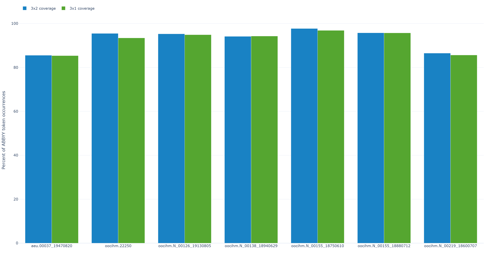

But the precision result cuts the other way and explains why `3x1` can still look cleaner overall on the artifact metric, even though `3x2` captures more words:

- token precision vs ABBYY: `3x2 = 84.45%`, `3x1 = 90.56%`
- pages closest to ABBYY word count: `3x2 = 24`, `3x1 = 165`, ties `7`

So `3x2` captures slightly more of ABBYY's tokens, while `3x1` stays much closer to ABBYY's page size. If your priority is maximum word capture, that still favors `3x2`.

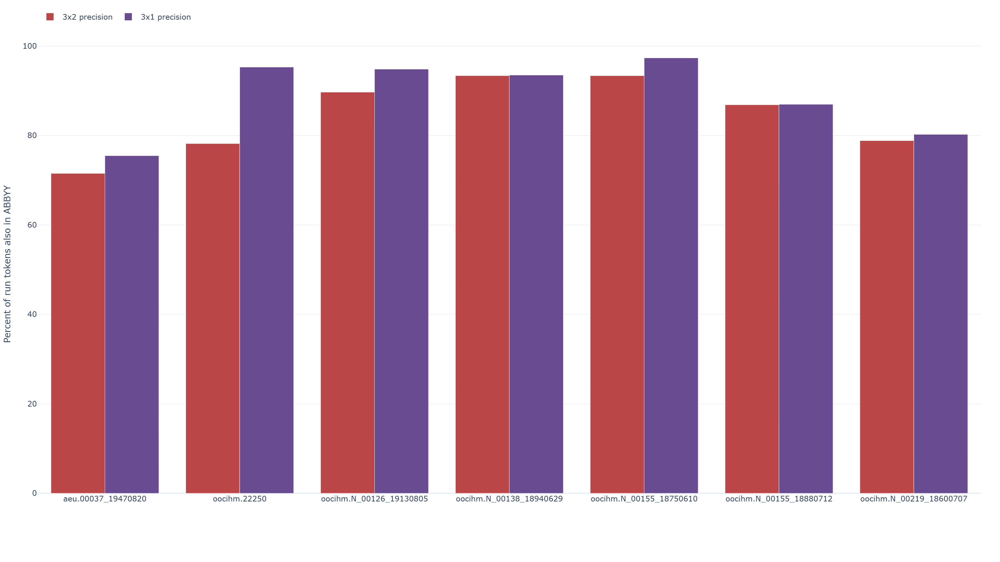

There is now also a direct `3x2` vs `3x1` line-diff analysis in this folder:

- workbook: `test-results/tiling_3x2_vs_3x1_extra_lines.xlsx`
- dashboard: `test-results/plots/tiling_3x2_vs_3x1_extra_lines_dashboard.html`

That comparison does not use ABBYY at all. It simply asks which lines are unique to one tiling run versus the other on the same page.

The headline result is decisive:

- shared matched nonblank lines: `39,507`
- `3x2`-only lines: `27,060`
- `3x1`-only lines: `19,073`
- pages where `3x2` has more unique-only lines: `200`
- pages where `3x1` has more unique-only lines: `11`
- tied pages: `6`

So `3x2` is not just slightly more expansive than `3x1`. It is substantially more expansive on almost the entire dataset.

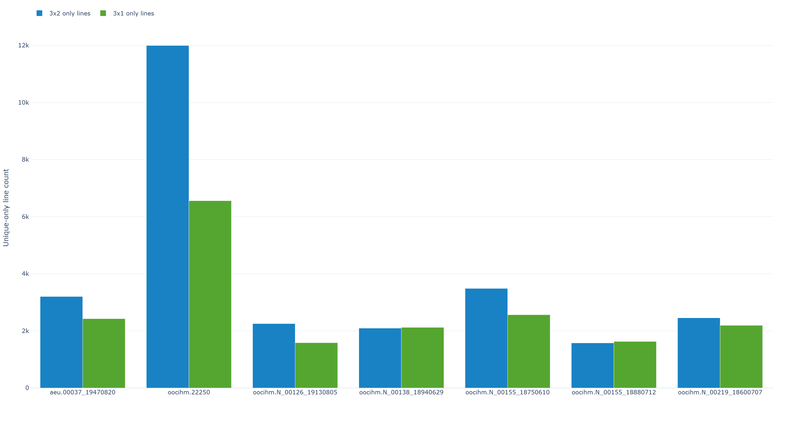

The type mix matters too:

- `3x2`-only separator/symbol lines: `371`
- `3x1`-only separator/symbol lines: `398`
- `3x2`-only short fragments: `4,949`
- `3x1`-only short fragments: `3,652`
- `3x2`-only text lines: `21,740`
- `3x1`-only text lines: `15,023`

That means the `3x2` expansion is not just extra separator junk. It is adding many more full text lines as well. But without human ground truth, those extra text lines still cannot be assumed to be correct text recovery rather than duplicated, over-split, or layout-driven spillover.

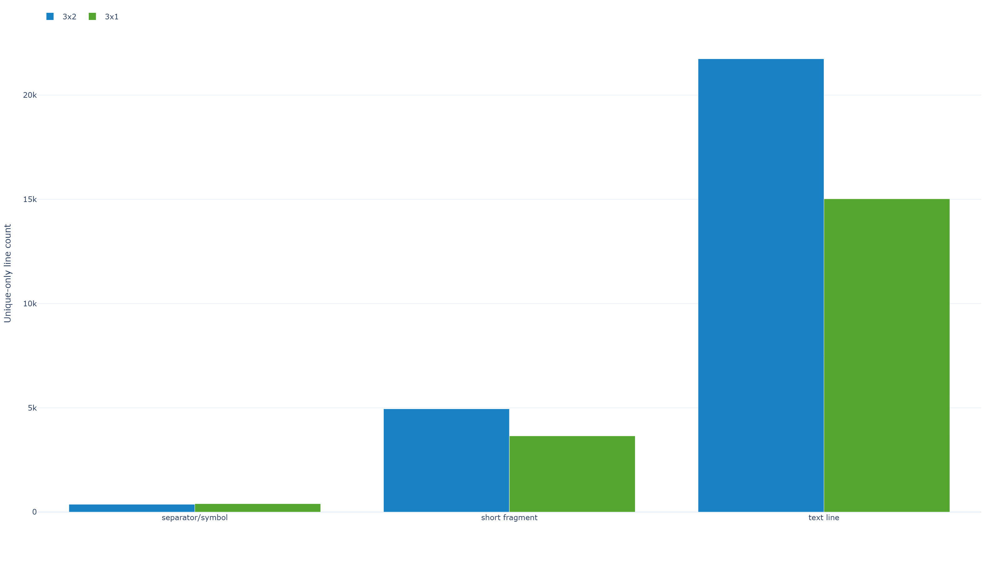

At the document level, the biggest extra-line gap is in `oocihm.22250`, where `3x2` has `11,994` unique-only lines and `3x1` has `6,557`. `oocihm.N_00155_18750610` is another strong example: `3,485` vs `2,564`. The largest page-level surges are all `3x2` pages from `oocihm.N_00155_18750610`, especially pages `.1` through `.4`.

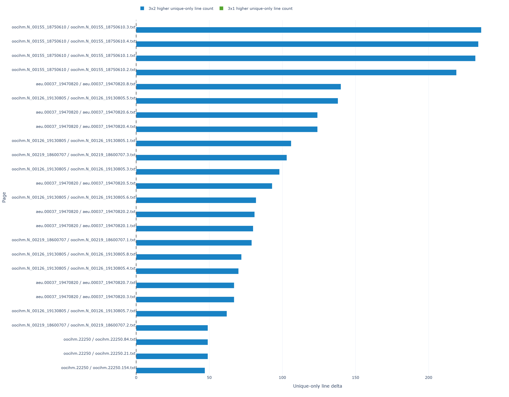


### Document Matrix

### Paddle More Words And Less Artifacts

- `oocihm.N_00155_18880712`: `3x1` has `53,735` words versus `49,224` for ABBYY, a gain of `4,511` words. Artifact totals also favor `3x1`: `443` artifact entries versus `863` for ABBYY.


- `aeu.00037_19470820`: `3x1` has `35,459` words versus `32,046` for ABBYY, a gain of `3,413` words. Artifact totals also favor `3x1`: `4,022` artifact entries versus `4,107` for ABBYY.


- `oocihm.N_00126_19130805`: `3x1` has `26,681` words versus `26,523` for ABBYY, a gain of `158` words. Artifact totals also favor `3x1`: `731` artifact entries versus `897` for ABBYY.

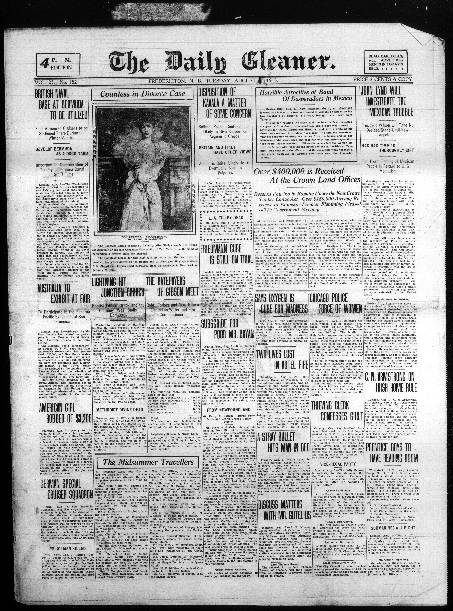

### Paddle More Words And More Artifacts

- `oocihm.N_00219_18600707`: `3x1` has `20,878` words versus `19,477` for ABBYY, a gain of `1,401` words. Artifact totals cut the other way: `1,266` artifact entries for `3x1` versus `939` for ABBYY.


### Paddle Less Words And Less Artifacts

- `oocihm.N_00155_18750610`: `3x1` has `59,063` words versus `59,391` for ABBYY, a loss of `328` words. Artifact totals still favor `3x1`: `758` artifact entries versus `921` for ABBYY.


### Paddle Less Words And More Artifacts

- `oocihm.22250`: `3x1` has `73,254` words versus `75,671` for ABBYY, a loss of `2,417` words. Artifact totals also lean toward ABBYY: `2,040` artifact entries for `3x1` versus `1,943` for ABBYY.


Cross-run recommendation is consolidated in [4-multi-document-abbyy-vs-notiles-paddleocr-paddlevl/README.md](c:\Users\BrittnyLapierre\Documents\OCR-Evaluations\4-multi-document-abbyy-vs-notiles-paddleocr-paddlevl\README.md). This section keeps the `3x1` vs ABBYY analysis and the direct `3x2` vs `3x1` comparison data, but the final workflow recommendation now lives in the no-tiling README so the dataset-series guidance stays in one place.

## Regenerating The Results

Run:

```powershell
python tools\compare_multi_document_ocr_errors.py
```

Default outputs:

- `test-results/multi_document_paddle_vs_abbyy_errors_artifacts.xlsx`
- `test-results/page-level-excels/`

To regenerate the plots, run:

```powershell
python tools\generate_multi_document_ocr_plots.py
```

Plot outputs:

- `test-results/plots/multi_document_ocr_dashboard.html`
- `test-results/plots/png/`
