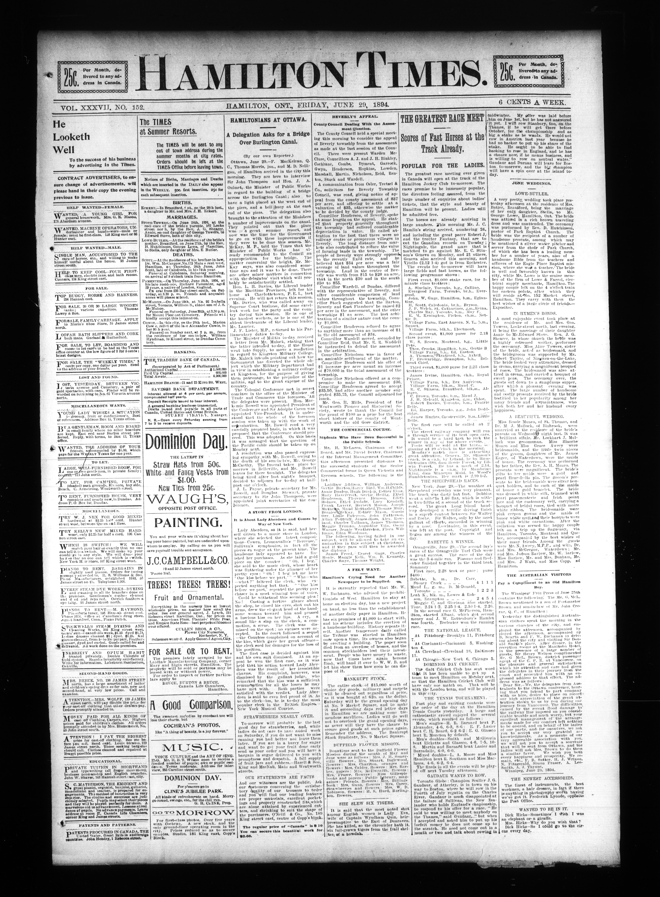

# Multi-Document ABBYY vs Tiled 3x1 + Docparse PaddleOCR + PaddleVL Comparison

This folder contains a multi-document OCR comparison between:

- `ABBYY` outputs under `test-data/abbyy`
- `Paddle` outputs under `test-data/preprocessing-tiling_3x1_dp+paddleocr+vl+clean`

The Paddle side is the same general workflow used in the stress test:

- preprocessing
- intended `3x1` tiling with docparse layout handling
- PaddleOCR extraction
- low-confidence / suspicious-word review
- spellcheck assistance
- PaddleVL post-check
- cleanup

## What Was Compared

The dataset contains `7` document groups and `217` matched page pairs.

Compared document groups:

- `aeu.00037_19470820`
- `oocihm.22250`
- `oocihm.N_00126_19130805`
- `oocihm.N_00138_18940629`
- `oocihm.N_00155_18750610`
- `oocihm.N_00155_18880712`
- `oocihm.N_00219_18600707`

## Output Files

Generated outputs are stored under `test-results`.

- Overall summary workbook: `test-results/multi_document_paddle_vs_abbyy_errors_artifacts.xlsx`
- Page-level workbooks: `test-results/page-level-excels/<document>/<page>.xlsx`
- Plot dashboard: `test-results/plots/multi_document_ocr_dashboard.html`
- Plot PNG exports: `test-results/plots/png/*.png`

Each page-level workbook uses the same wide page-by-page artifact layout as the stress-test comparison script.
The plots compare Paddle against ABBYY only; there is no human-transcribed reference set for this folder yet.

## Headline Findings

Across all `217` page pairs:

- Paddle nonblank line count: `58,580`
- ABBYY nonblank line count: `49,775`
- Paddle word count: `308,801`
- ABBYY word count: `301,984`
- Paddle artifact entries: `8,614`
- ABBYY artifact entries: `6,829`

Raw size ratios vs ABBYY:

- Paddle nonblank lines vs ABBYY: `117.7%` overall
- Paddle words vs ABBYY: `102.3%` overall

Page-level artifact split:

- Paddle lower on `95` pages
- ABBYY lower on `101` pages
- Tied on `21` pages

In the current workbook, `3x1` does not beat ABBYY on the artifact metric. It recovers more raw text, but it also produces more tagged artifact rows:

- Paddle emits `6,817` more words than ABBYY
- Paddle emits `8,805` more nonblank lines than ABBYY
- Paddle produces `1,785` more artifact entries than ABBYY
- The extra Paddle output is concentrated in separators, overlaps, and short-fragment structure rather than a clean artifact win

So this `3x1` run looks more expansive than ABBYY on raw output size, but not cleaner on the tagged-artifact metric used in this dataset.

- Paddle produces far more `isolated marker/separator` entries: `6,317` vs `3,200`
- Paddle produces all detected `duplicate/tile overlap` entries: `103` vs `0`
- ABBYY produces more `punctuation artifact` entries: `2,401` vs `465`
- ABBYY produces more `line-start artifact` entries: `429` vs `9`
- ABBYY produces slightly more `suspicious glyph` entries: `804` vs `684`
- `OCR token/phrase mismatch` and `suspicious token` counts are closer, with Paddle somewhat higher

So the `3x1` workflow is not simply cleaner or dirtier. It fails differently:

- Paddle is more likely to over-preserve separators, overlap noise, and short layout fragments
- ABBYY is more likely to accumulate punctuation debris, malformed line starts, and BOM/control-character flags
- On the current workbook, the total artifact burden still leans toward ABBYY as the cleaner side overall

## Key Charts

These are the charts that best support the interpretation in this README. The full dashboard is still available at `test-results/plots/multi_document_ocr_dashboard.html`.

### 1. Word Recovery

This is the clearest coverage chart. It shows that Paddle usually emits more text than ABBYY, which is a strength on prose pages but can also inflate low-value fragments on dense layouts.


### 2. Total Artifacts By Document

This is the cleanest high-level comparison of which documents lean toward Paddle or ABBYY after cleanup.


### 3. Artifact Mix vs ABBYY

This chart explains why the totals alone are not enough. Paddle and ABBYY are not failing in the same way, and this is where the separator-vs-glyph split becomes obvious.


### 4. Biggest Page-Level Swings

This is the best chart for identifying representative outlier pages.
Red bars mean Paddle had more tagged artifacts on that page, gray bars mean ABBYY had more, and the dashed center line is zero difference.


## 3x2 vs 3x1

The `3x1` run still looks better than the `3x2` run on the artifact metric used in this dataset, even though neither tiled run beats ABBYY overall on total tagged artifact rows.

Side-by-side, the main aggregate differences are:

- `3x2` Paddle artifact entries: `8,779`
- `3x1` Paddle artifact entries: `8,614`
- `3x2` page wins vs ABBYY: Paddle `75`, ABBYY `114`, ties `28`
- `3x1` page wins vs ABBYY: Paddle `95`, ABBYY `101`, ties `21`
- `3x2` nonblank line count: `66,567`
- `3x1` nonblank line count: `58,580`
- `3x2` word count: `334,312`
- `3x1` word count: `308,801`

The high-level artifact and output-size picture still points the same way as the comparison workbooks: `3x1` is the better-balanced workflow, while `3x2` is the more expansive one.


That means the `3x2` workflow is the more aggressive extractor, while `3x1` is the tighter one:

- `3x2` emits about `32,328` more words than ABBYY
- `3x1` emits about `6,817` more words than ABBYY
- `3x2` emits about `16,792` more nonblank lines than ABBYY
- `3x1` emits about `8,805` more nonblank lines than ABBYY

The artifact mix also moved in the right direction with `3x1`:

- `isolated marker/separator`: `6,417` in `3x2` down to `6,317` in `3x1`
- `suspicious glyph`: `729` down to `684`
- `punctuation artifact`: `520` down to `465`
- `line-start artifact`: `14` down to `9`
- `abbreviation/spacing`: `261` down to `241`
- `duplicate/tile overlap`: `108` down to `103`

Not every category improved:

- `OCR token/phrase mismatch`: `358` in `3x2` up to `383` in `3x1`
- `suspicious token`: `1,077` up to `1,086`

But those increases are smaller than the gains in the categories that most often made the `3x2` run look over-extracted.

The biggest practical shift is in `oocihm.22250`, where `3x2` loses by page count (`65` Paddle wins vs `84` ABBYY wins, with `28` ties) but `3x1` flips that to a Paddle edge (`87` vs `71`, with `19` ties). The hardest cases do not change: `oocihm.N_00155_18750610` and `oocihm.N_00219_18600707` are still ABBYY wins in both tiling variants.

There is now also a direct ABBYY word-coverage workbook in this folder:

- workbook: `test-results/tiling_3x2_vs_3x1_abbyy_word_coverage.xlsx`
- dashboard: `test-results/plots/tiling_3x2_vs_3x1_abbyy_word_coverage_dashboard.html`

That workbook asks a different question than the artifact analysis: how much of ABBYY's page vocabulary each tiling run actually captures, and how far above or below ABBYY each run lands on raw page size.

The coverage result is narrow but consistent in favor of `3x2`:

- overall ABBYY token-occurrence coverage: `3x2 = 94.15%`, `3x1 = 93.37%`
- overall ABBYY unique-token coverage: `3x2 = 90.84%`, `3x1 = 90.45%`
- pages with better ABBYY token coverage: `3x2 = 182`, `3x1 = 23`, ties `12`


But the precision result cuts the other way and explains why `3x1` can still look cleaner overall on the artifact metric, even though `3x2` captures more words:

- token precision vs ABBYY: `3x2 = 84.52%`, `3x1 = 90.69%`
- pages closest to ABBYY word count: `3x2 = 25`, `3x1 = 186`, ties `6`

So `3x2` captures slightly more of ABBYY's tokens, while `3x1` stays much closer to ABBYY's page size. If our priority is maximum word capture, that still favors `3x2`.


There is now also a direct `3x2` vs `3x1` line-diff analysis in this folder:

- workbook: `test-results/tiling_3x2_vs_3x1_extra_lines.xlsx`
- dashboard: `test-results/plots/tiling_3x2_vs_3x1_extra_lines_dashboard.html`

That comparison does not use ABBYY at all. It simply asks which lines are unique to one tiling run versus the other on the same page.

So `3x2` is more expansive than `3x1` on almost the entire dataset:

- shared matched nonblank lines: `39,507`
- `3x2`-only lines: `27,060`
- `3x1`-only lines: `19,073`
- pages where `3x2` has more unique-only lines: `200`
- pages where `3x1` has more unique-only lines: `11`
- tied pages: `6`


The type mix matters too:

- `3x2`-only separator/symbol lines: `371`
- `3x1`-only separator/symbol lines: `398`
- `3x2`-only short fragments: `4,949`
- `3x1`-only short fragments: `3,652`
- `3x2`-only text lines: `21,740`
- `3x1`-only text lines: `15,023`

That means the `3x2` expansion is not just extra separator junk. It is adding many more full text lines as well. But without human ground truth, those extra text lines still cannot be assumed to be correct text recovery rather than duplicated, over-split, or layout-driven spillover.


At the document level, the biggest extra-line gap is in `oocihm.22250`, where `3x2` has `11,994` unique-only lines and `3x1` has `6,557`. `oocihm.N_00155_18750610` is another strong example: `3,485` vs `2,564`. The largest page-level surges are all `3x2` pages from `oocihm.N_00155_18750610`, especially pages `.1` through `.4`.


## Document-Level Findings

Some broad document-level patterns from the aggregate workbook and refreshed plots:

- `aeu.00037_19470820` is still one of the noisiest documents in the set, but the current workbook now leans toward ABBYY. ABBYY has the lower artifact count on `6` of the `8` pages, and the document totals are `2,379` artifact entries for Paddle versus `2,123` for ABBYY, even though Paddle emits `3,410` more words.
- `oocihm.22250` is the biggest volume test and the main place where `3x1` improves materially over `3x2`. On the current workbook, Paddle has the lower artifact count on `87` pages, ABBYY is lower on `71`, and `19` pages are tied. Even so, the document totals still lean toward ABBYY: `1,852` artifact entries for Paddle versus `1,774` for ABBYY, and Paddle is also below ABBYY on raw words (`73,254` versus `75,684`).
- `oocihm.N_00219_18600707` remains the strongest document-level ABBYY win by total artifact entries. ABBYY has the lower artifact count on all `4` pages, and the document totals are `1,261` artifact entries for Paddle versus `740` for ABBYY. Paddle still emits `1,399` more words here, which suggests the extra output is not buying a cleaner page.
- `oocihm.N_00155_18880712` is still the best current `3x1` case. Total artifact entries are slightly lower for Paddle (`412` versus `425`), the page split is even at `4` to `4`, and Paddle emits `4,508` more words than ABBYY.
- `oocihm.N_00126_19130805` is now a close but ABBYY-leaning result. ABBYY has the lower artifact count on `5` pages, Paddle is lower on `2`, and `1` page is tied. Totals are `697` artifact entries for Paddle versus `661` for ABBYY, while raw word counts are almost identical (`26,681` versus `26,529`).
- `oocihm.N_00138_18940629` is now a clear ABBYY artifact win. ABBYY has the lower artifact count on `7` of the `8` pages, with `1` tie, and the document totals are `1,322` artifact entries for Paddle versus `750` for ABBYY, even though the raw word counts are nearly the same.
- `oocihm.N_00155_18750610` is also a clear ABBYY win in the current workbook. ABBYY has the lower artifact count on all `4` pages, and the document totals are `691` artifact entries for Paddle versus `356` for ABBYY, while Paddle is slightly lower on raw word count as well.

### Document Matrix

#### Paddle More Words And Less Artifacts

- `oocihm.N_00155_18880712`: `3x1` has `53,735` words versus `49,227` for ABBYY, a gain of `4,508` words. Artifact totals also favor `3x1`: `412` artifact entries versus `425` for ABBYY.


#### Paddle More Words And More Artifacts

- `aeu.00037_19470820`: `3x1` has `35,459` words versus `32,049` for ABBYY, a gain of `3,410` words. Artifact totals cut the other way: `2,379` artifact entries for `3x1` versus `2,123` for ABBYY.


- `oocihm.N_00126_19130805`: `3x1` has `26,681` words versus `26,529` for ABBYY, a gain of `152` words. Artifact totals cut the other way: `697` artifact entries for `3x1` versus `661` for ABBYY.


- `oocihm.N_00138_18940629`: `3x1` has `39,731` words versus `39,623` for ABBYY, a gain of `108` words. Artifact totals cut the other way: `1,322` artifact entries for `3x1` versus `750` for ABBYY.



- `oocihm.N_00219_18600707`: `3x1` has `20,878` words versus `19,479` for ABBYY, a gain of `1,399` words. Artifact totals cut the other way: `1,261` artifact entries for `3x1` versus `740` for ABBYY.


#### Paddle Less Words And Less Artifacts

There are no current `3x1` document groups in this quadrant.

#### Paddle Less Words And More Artifacts

- `oocihm.N_00155_18750610`: `3x1` has `59,063` words versus `59,393` for ABBYY, a loss of `330` words. Artifact totals also lean toward ABBYY: `691` artifact entries for `3x1` versus `356` for ABBYY.


- `oocihm.22250`: `3x1` has `73,254` words versus `75,684` for ABBYY, a loss of `2,430` words. Artifact totals also lean toward ABBYY: `1,852` artifact entries for `3x1` versus `1,774` for ABBYY.


Cross-run recommendation is consolidated in [4-multi-document-abbyy-vs-notiles-paddleocr-paddlevl/README.md](c:\Users\BrittnyLapierre\Documents\OCR-Evaluations\4-multi-document-abbyy-vs-notiles-paddleocr-paddlevl\README.md). This section keeps the `3x1` vs ABBYY analysis and the direct `3x2` vs `3x1` comparison data, but the final workflow recommendation now lives in the no-tiling README so the dataset-series guidance stays in one place.

## Regenerating The Results

Run:

```powershell
python tools\compare_multi_document_ocr_errors.py
```

Default outputs:

- `test-results/multi_document_paddle_vs_abbyy_errors_artifacts.xlsx`
- `test-results/page-level-excels/`

To regenerate the plots, run:

```powershell
python tools\generate_multi_document_ocr_plots.py
```

Plot outputs:

- `test-results/plots/multi_document_ocr_dashboard.html`
- `test-results/plots/png/`
