# Multi-Document ABBYY vs No-Tiling PaddleOCR + PaddleVL Comparison

This folder contains a multi-document OCR comparison between:

- `ABBYY` outputs under `test-data/abbyy`
- `Paddle` outputs under `test-data/preprocess-notiles-paddleocr-paddlevl`

The Paddle side uses the same general preprocessing and post-OCR review stack as the tiled runs, but without any page tiling:

- preprocessing
- PaddleOCR extraction
- low-confidence / suspicious-word review
- spellcheck assistance
- PaddleVL post-check
- cleanup

This README covers two related questions:

1. how the no-tiling run compares with ABBYY on the same `217` pages
2. how the no-tiling run compares with the tiled `3x1` and `3x2` variants already analyzed elsewhere in this dataset series

## What Was Compared

The dataset contains `7` document groups and `217` matched page pairs.

Compared document groups:

- `aeu.00037_19470820`
- `oocihm.22250`
- `oocihm.N_00126_19130805`
- `oocihm.N_00138_18940629`
- `oocihm.N_00155_18750610`
- `oocihm.N_00155_18880712`
- `oocihm.N_00219_18600707`

## Output Files

Main no-tiling vs ABBYY outputs:

- overall workbook: [multi_document_paddle_vs_abbyy_errors_artifacts.xlsx](c:\Users\BrittnyLapierre\Documents\OCR-Evaluations\4-multi-document-abbyy-vs-notiles-paddleocr-paddlevl\test-results\multi_document_paddle_vs_abbyy_errors_artifacts.xlsx)
- page-level workbooks: [page-level-excels](c:\Users\BrittnyLapierre\Documents\OCR-Evaluations\4-multi-document-abbyy-vs-notiles-paddleocr-paddlevl\test-results\page-level-excels)
- dashboard: [multi_document_ocr_dashboard.html](c:\Users\BrittnyLapierre\Documents\OCR-Evaluations\4-multi-document-abbyy-vs-notiles-paddleocr-paddlevl\test-results\plots\multi_document_ocr_dashboard.html)

Cross-run outputs created in this folder:

- three-way ABBYY token coverage workbook: [paddle_variants_abbyy_word_coverage.xlsx](c:\Users\BrittnyLapierre\Documents\OCR-Evaluations\4-multi-document-abbyy-vs-notiles-paddleocr-paddlevl\test-results\paddle_variants_abbyy_word_coverage.xlsx)
- three-way artifact workbook: [paddle_variants_abbyy_artifacts.xlsx](c:\Users\BrittnyLapierre\Documents\OCR-Evaluations\4-multi-document-abbyy-vs-notiles-paddleocr-paddlevl\test-results\paddle_variants_abbyy_artifacts.xlsx)
- no-tiling vs `3x1` extra-line workbook: [notiling_vs_3x1_extra_lines.xlsx](c:\Users\BrittnyLapierre\Documents\OCR-Evaluations\4-multi-document-abbyy-vs-notiles-paddleocr-paddlevl\test-results\notiling_vs_3x1_extra_lines.xlsx)
- `3x2` vs no-tiling extra-line workbook: [3x2_vs_notiling_extra_lines.xlsx](c:\Users\BrittnyLapierre\Documents\OCR-Evaluations\4-multi-document-abbyy-vs-notiles-paddleocr-paddlevl\test-results\3x2_vs_notiling_extra_lines.xlsx)

Cross-run dashboards:

- [paddle_variants_abbyy_word_coverage_dashboard.html](c:\Users\BrittnyLapierre\Documents\OCR-Evaluations\4-multi-document-abbyy-vs-notiles-paddleocr-paddlevl\test-results\plots\paddle_variants_abbyy_word_coverage_dashboard.html)
- [paddle_variants_abbyy_artifacts_dashboard.html](c:\Users\BrittnyLapierre\Documents\OCR-Evaluations\4-multi-document-abbyy-vs-notiles-paddleocr-paddlevl\test-results\plots\paddle_variants_abbyy_artifacts_dashboard.html)
- [notiling_vs_3x1_extra_lines_dashboard.html](c:\Users\BrittnyLapierre\Documents\OCR-Evaluations\4-multi-document-abbyy-vs-notiles-paddleocr-paddlevl\test-results\plots\notiling_vs_3x1_extra_lines_dashboard.html)
- [3x2_vs_notiling_extra_lines_dashboard.html](c:\Users\BrittnyLapierre\Documents\OCR-Evaluations\4-multi-document-abbyy-vs-notiles-paddleocr-paddlevl\test-results\plots\3x2_vs_notiling_extra_lines_dashboard.html)

## Headline Findings

Across all `217` no-tiling vs ABBYY page pairs:

- no-tiling Paddle nonblank line count: `55,721`
- ABBYY nonblank line count: `49,775`
- no-tiling Paddle word count: `299,604`
- ABBYY word count: `301,984`
- no-tiling Paddle artifact entries: `5,844`
- ABBYY artifact entries: `6,813`

Page-level split:

- no tiling lower on `93` pages
- ABBYY lower on `108` pages
- tied on `16` pages

So the no-tiling run is not winning more pages than ABBYY, and it is also slightly below ABBYY on total raw words. But it is still lower on total tagged artifact entries overall.

That is the main surprise in this dataset:

- no tiling is the cleanest Paddle variant by aggregate artifact count
- but it is not the best balanced variant once coverage is considered

Its failure pattern is still recognizably Paddle-like:

- `isolated marker/separator`: `4,283` vs ABBYY `3,200`
- `suspicious token`: `1,132` vs ABBYY `890`
- `OCR token/phrase mismatch`: `286` vs ABBYY `124`

But no tiling is much lighter than the tiled runs on exactly the categories that made them look noisy:

- `Possible duplicate lines`: `0`
- `punctuation artifact`: `126`
- `suspicious glyph`: `403`

ABBYY still carries far more glyph, punctuation, and malformed-line-start debris:

- `suspicious glyph`: `804`
- `punctuation artifact`: `2,401`
- `line-start artifact`: `429`

## Key Charts

These are the charts that best support the interpretation in this README.

### 1. No-Tiling Word Recovery vs ABBYY

This shows the raw coverage problem directly. No tiling is often cleaner, but it does not hold line structure or total word volume as consistently as ABBYY.

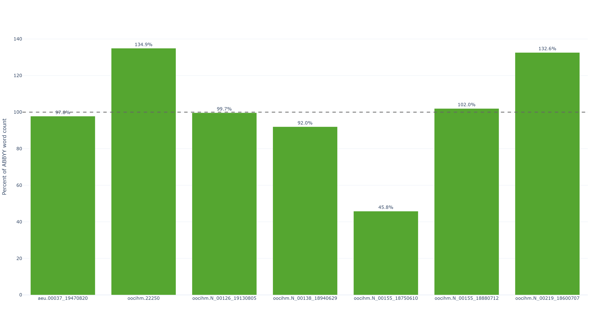

### 2. No-Tiling Artifact Totals vs ABBYY

This is the clearest statement of why the no-tiling run looks attractive at first glance: the total artifact count drops sharply on several documents.

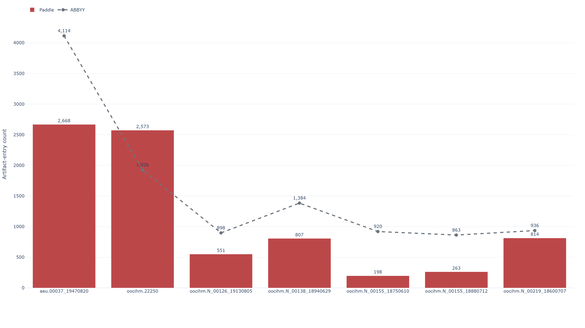

### 3. Error-Type Mix vs ABBYY

This chart explains where that artifact improvement comes from. No tiling suppresses a lot of the noise that the tiled runs introduced, but it is still separator-heavy.

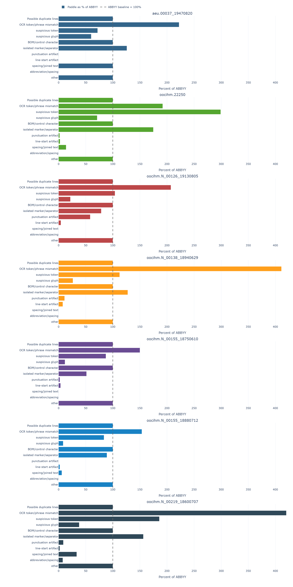

### 4. Biggest Page-Level Swings

These outliers explain most of the aggregate gap. Red bars mean Paddle had more tagged artifacts; gray bars mean ABBYY had more.

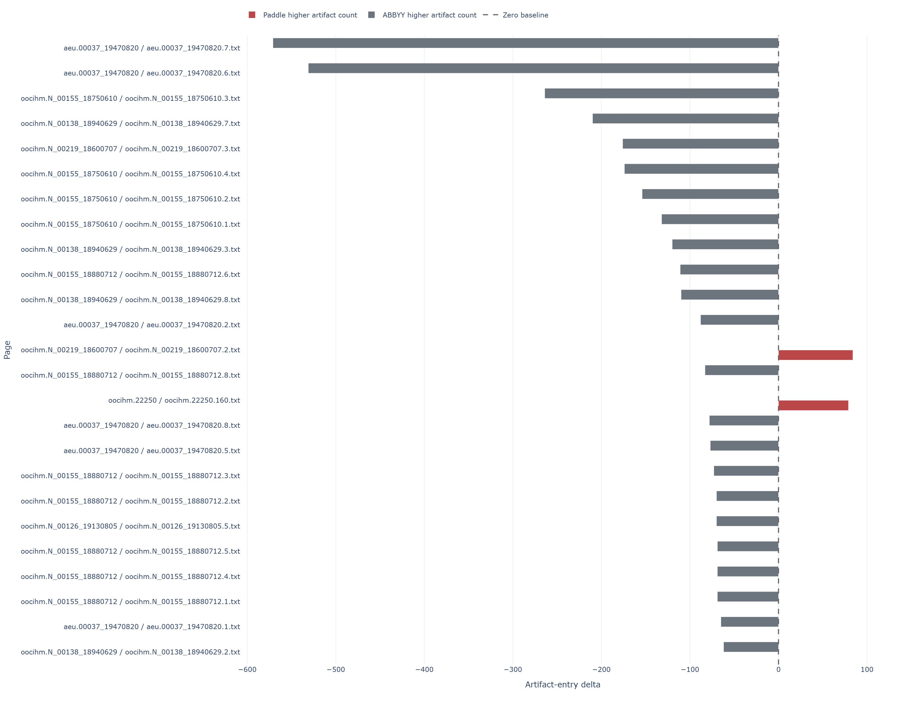

## Document-Level Findings

The no-tiling run is extremely polarized by document:

- `aeu.00037_19470820`: this one is genuinely mixed by page count at `4` to `4`, but the document-level totals still favor no tiling strongly: `1,128` artifact entries for no-tiling Paddle versus `2,131` for ABBYY.
- `oocihm.N_00126_19130805`: no-tiling Paddle is lower than ABBYY on `7` of the `8` pages. The document-level artifact totals are `513` for no-tiling Paddle versus `662` for ABBYY.
- `oocihm.N_00155_18750610`: no-tiling Paddle is lower than ABBYY on all `4` pages. The document-level artifact totals are `146` for no-tiling Paddle versus `354` for ABBYY, but the word-count loss here is extreme.
- `oocihm.N_00155_18880712`: no-tiling Paddle is lower than ABBYY on all `8` pages. The document-level artifact totals are `232` for no-tiling Paddle versus `424` for ABBYY.
- `oocihm.N_00138_18940629`: this one is close. No-tiling Paddle is lower on `5` pages and ABBYY is lower on `3`, but the document-level totals are nearly tied: `761` for no-tiling Paddle versus `749` for ABBYY.
- `oocihm.N_00219_18600707`: ABBYY is lower on `3` of the `4` pages, and the document-level totals also lean toward ABBYY: `782` artifact entries for no-tiling Paddle versus `737` for ABBYY. No tiling still emits far more words here, so this remains one of the strongest examples of extra output not translating into a cleaner page.
- `oocihm.22250`: this is still the hardest counterexample. ABBYY is lower on `97` pages, no-tiling Paddle is lower on `64`, and `16` pages tie. The document-level artifact totals also lean toward ABBYY: `2,282` for no-tiling Paddle versus `1,756` for ABBYY. This is also the strongest no-tiling over-extraction case by raw word count.

So the no-tiling run is not simply "better on clean prose and worse on hard layouts." It can also beat ABBYY on some very dense structure-heavy pages. The real pattern is narrower:

- no tiling sharply suppresses some of the duplicated or fragmented text behavior that tiling introduced
- but it also gives up too much consistent coverage across the full corpus

## No Tiling vs 3x1 vs 3x2

The cross-run comparison changes the recommendation.

By aggregate artifact count, the ordering is clear:

- no tiling: `5,844`
- `3x1`: `10,614`
- `3x2`: `10,999`

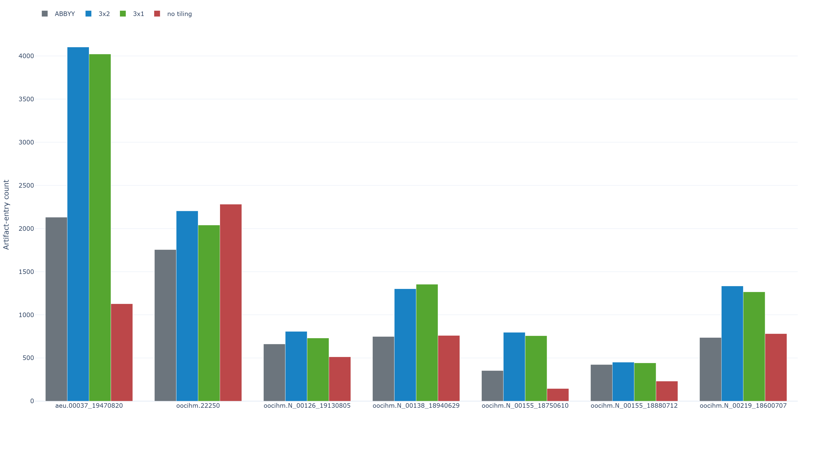

Raw document word counts tell the complementary story: `3x2` is the highest-volume run on most documents, but no tiling is actually the top word-count run on `oocihm.22250` and `oocihm.N_00219_18600707`. ABBYY and `3x1` sit in the middle depending on the document.

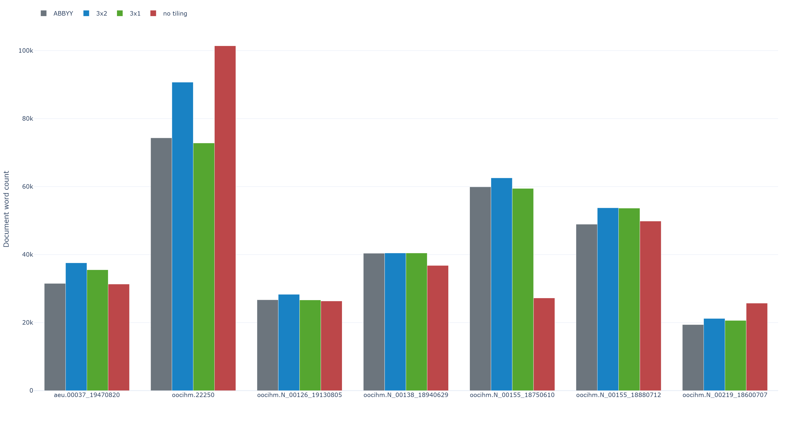

But once ABBYY token coverage is used as the recall check, no tiling drops behind both tiled variants:

- `3x2` ABBYY token coverage: `93.80%`
- `3x1` ABBYY token coverage: `92.98%`
- no tiling ABBYY token coverage: `79.37%`

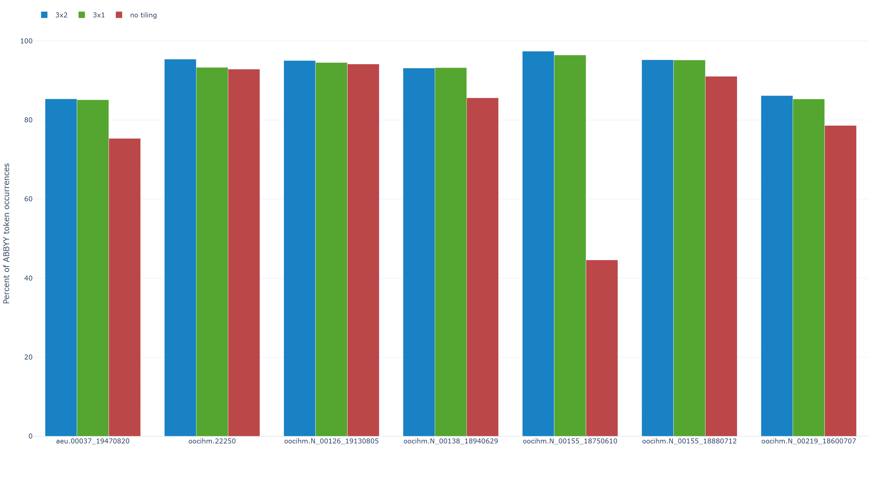

The precision picture is different again:

- `3x1` precision vs ABBYY: `90.56%`
- `3x2` precision vs ABBYY: `84.45%`
- no tiling precision vs ABBYY: `80.03%`

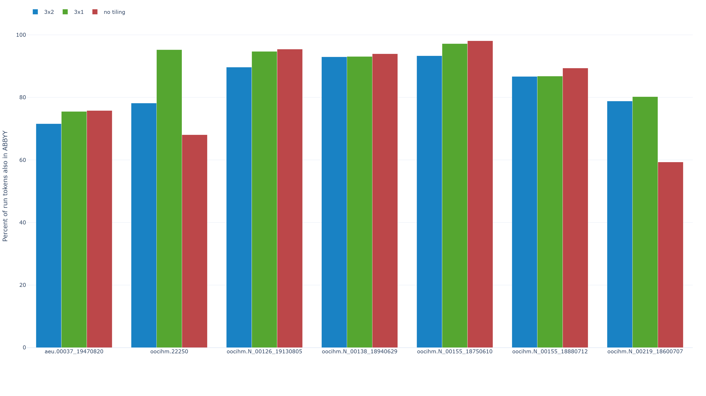

That is why the no-tiling run does not replace `3x1` as the default recommendation. It is cleaner, but it gives up too much word coverage on some documents even though it does well on others, and it is not the strongest variant on the token-coverage metric.

The direct line-diff workbooks show the same thing from another angle:

- no-tiling-only lines vs `3x1`: `21,788`
- `3x1`-only lines vs no tiling: `24,647`
- no-tiling-only lines vs `3x2`: `26,832`
- `3x2`-only lines vs no tiling: `37,678`

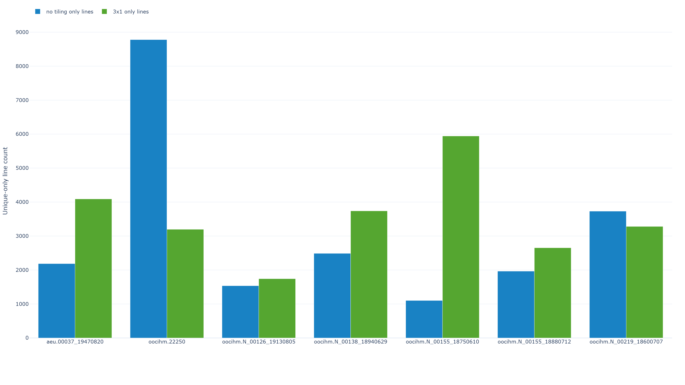

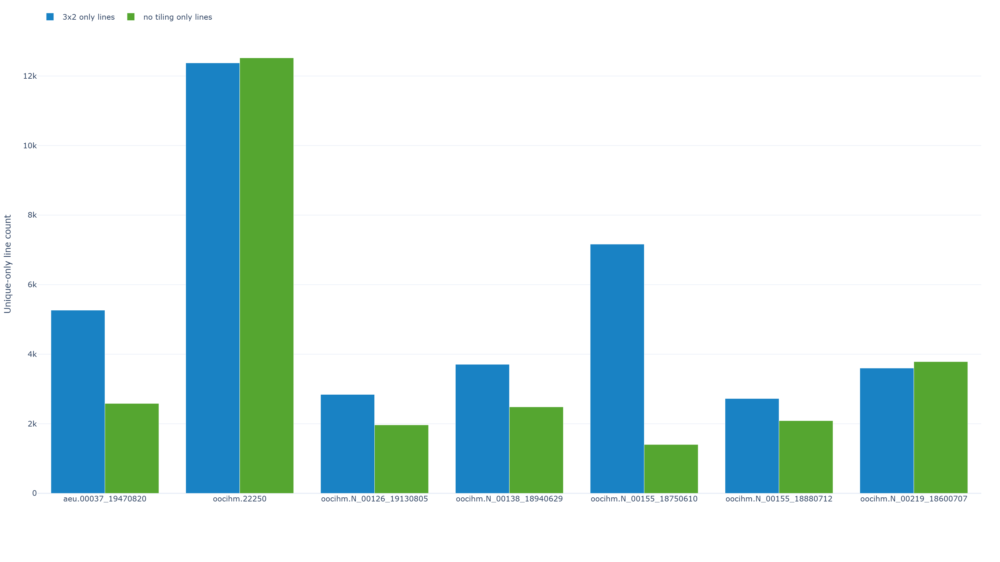

So no tiling is not just `3x1` minus tile overlap. It is a materially different OCR pass, with lower word capture on some documents and higher word capture on others.

## Document Matrix

### Paddle More Words And Less Artifacts

- `oocihm.N_00155_18880712`: no tiling has `50,200` words versus `49,227` for ABBYY, a gain of `973` words. Artifact totals also favor no tiling: `232` artifact entries versus `424` for ABBYY.


### Paddle More Words And More Artifacts

- `oocihm.22250`: no tiling has `102,132` words versus `75,684` for ABBYY, a gain of `26,448` words. Artifact totals cut the other way: `2,282` artifact entries for no tiling versus `1,756` for ABBYY.


- `oocihm.N_00219_18600707`: no tiling has `25,831` words versus `19,479` for ABBYY, a gain of `6,352` words. Artifact totals cut the other way: `782` artifact entries for no tiling versus `737` for ABBYY.

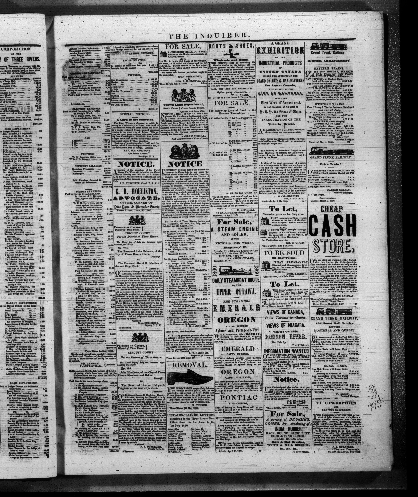

### Paddle Less Words And Less Artifacts

- `aeu.00037_19470820`: no tiling has `31,338` words versus `32,049` for ABBYY, a loss of `711` words. Artifact totals still favor no tiling strongly: `1,128` artifact entries versus `2,131` for ABBYY.

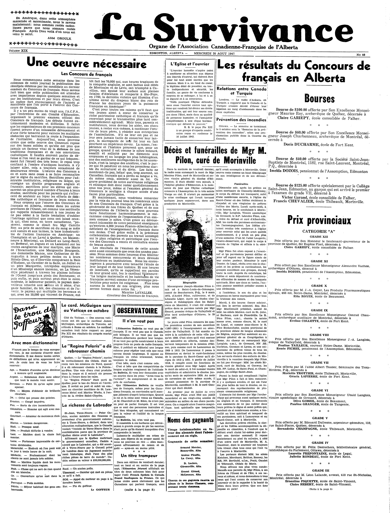

- `oocihm.N_00155_18750610`: no tiling has `27,204` words versus `59,393` for ABBYY, a loss of `32,189` words. Artifact totals still favor no tiling strongly: `146` artifact entries versus `354` for ABBYY.

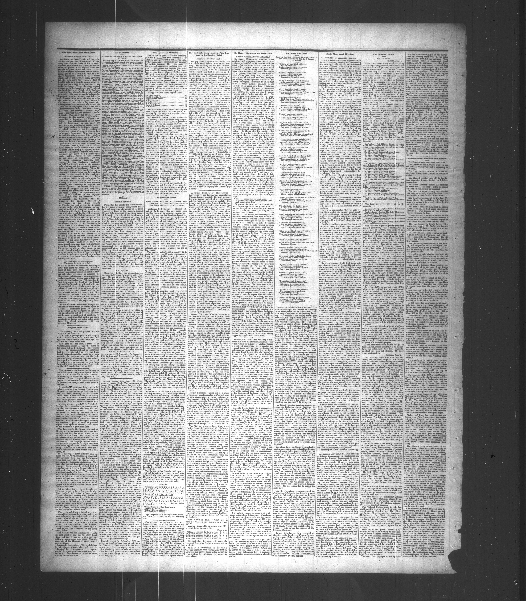

- `oocihm.N_00126_19130805`: no tiling has `26,438` words versus `26,529` for ABBYY, a loss of only `91` words. Artifact totals still favor no tiling: `513` artifact entries versus `662` for ABBYY.


### Paddle Less Words And More Artifacts

- `oocihm.N_00138_18940629`: no tiling has `36,461` words versus `39,623` for ABBYY, a loss of `3,162` words. Artifact totals also lean slightly toward ABBYY: `761` artifact entries for no tiling versus `749` for ABBYY.


## Recommendation

This is the canonical recommendation for the three Paddle variants in this dataset series.

These rankings use ABBYY as the baseline reference at `301,984` raw words.

The document-matrix difference between `3x2` and `3x1` does not overturn the cross-run recommendation. `3x2` is more uniformly expansive relative to ABBYY, so it never lands in the document-level `less words` buckets. `3x1` does, which is exactly why it can serve as the middle-ground option between `3x2`'s higher word volume and no tiling's lower artifact count.

If the deciding metric is `raw total word count`, the ranking is:

1. `3x2 + docparse + PaddleOCR + PaddleVL`
   Measured as `334,312` raw words.
2. `3x1 + docparse + PaddleOCR + PaddleVL`
   Measured as `308,801` raw words.
3. no tiling
   Measured as `299,604` raw words.

If the deciding metric is `best overall balance of raw word volume and artifact control`, the ranking is:

1. `3x1 + docparse + PaddleOCR + PaddleVL`
   Measured as `308,801` raw words with `10,614` artifact entries.
2. `3x2 + docparse + PaddleOCR + PaddleVL`
   Measured as `334,312` raw words with `10,999` artifact entries.
3. no tiling
   Measured as `299,604` raw words with `5,844` artifact entries.
   Canonical artifact baseline in the merged workbook: `6,813` artifact entries.

If the deciding metric is `lowest artifact count`, the ranking is:

Using ABBYY as the merged-workbook baseline at `6,813` artifact entries:

1. no tiling
   Measured as `5,844` artifact entries.
2. `3x1 + docparse + PaddleOCR + PaddleVL`
   Measured as `10,614` artifact entries.
3. `3x2 + docparse + PaddleOCR + PaddleVL`
   Measured as `10,999` artifact entries.

So the no-tiling run is a useful point on the tradeoff curve:

- much cleaner than the tiled runs
- often dramatically cleaner than ABBYY on the right pages
- strongest on raw cleanliness, but not the strongest overall word-capture option across the full dataset

## Regenerating The Results

No-tiling vs ABBYY:

```powershell
python tools\compare_multi_document_ocr_errors.py
python tools\generate_multi_document_ocr_plots.py
```

Three-way comparison outputs:

```powershell
python tools\compare_paddle_variants_word_coverage_vs_abbyy.py
python tools\generate_paddle_variants_word_coverage_plots.py
python tools\compare_paddle_variants_artifacts_vs_abbyy.py
python tools\generate_paddle_variants_artifact_plots.py
```

Pairwise extra-line comparisons:

```powershell
python tools\compare_pairwise_extra_lines.py --run-a-label "no tiling" --run-a-dir test-data\preprocess-notiles-paddleocr-paddlevl --run-b-label "3x1" --run-b-dir ..\3-multi-document-abbyy-vs-tiled3x1+docparse-paddleocr-paddlevl\test-data\preprocessing-tiling_3x1_dp+paddleocr+vl+clean --output test-results\notiling_vs_3x1_extra_lines.xlsx
python tools\generate_pairwise_extra_line_plots.py --workbook test-results\notiling_vs_3x1_extra_lines.xlsx --output-html test-results\plots\notiling_vs_3x1_extra_lines_dashboard.html --output-png-dir test-results\plots\png
python tools\compare_pairwise_extra_lines.py --run-a-label "3x2" --run-a-dir ..\2-multi-document-abbyy-vs-tiled3x2+docparse-paddleocr-paddlevl\test-data\preprocessing-tiling_3x2_dp+paddleocr+vl+clean --run-b-label "no tiling" --run-b-dir test-data\preprocess-notiles-paddleocr-paddlevl --output test-results\3x2_vs_notiling_extra_lines.xlsx
python tools\generate_pairwise_extra_line_plots.py --workbook test-results\3x2_vs_notiling_extra_lines.xlsx --output-html test-results\plots\3x2_vs_notiling_extra_lines_dashboard.html --output-png-dir test-results\plots\png
```
