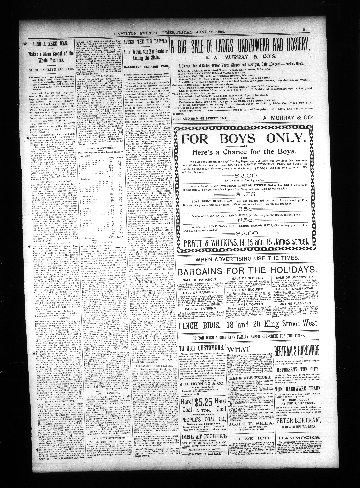

# Multi-Document ABBYY vs No-Tiling PaddleOCR + PaddleVL Comparison

This folder contains a multi-document OCR comparison between:

- `ABBYY` outputs under `test-data/abbyy`
- `Paddle` outputs under `test-data/preprocess-notiles-paddleocr-paddlevl`

The Paddle side uses the same general preprocessing and post-OCR review stack as the tiled runs, but without any page tiling:

- preprocessing
- PaddleOCR extraction
- low-confidence / suspicious-word review
- spellcheck assistance
- PaddleVL post-check
- cleanup

This README covers two related questions:

1. how the no-tiling run compares with ABBYY on the same `217` pages
2. how the no-tiling run compares with the tiled `3x1` and `3x2` variants already analyzed elsewhere in this dataset series

## What Was Compared

The dataset contains `7` document groups and `217` matched page pairs.

Compared document groups:

- `aeu.00037_19470820`
- `oocihm.22250`
- `oocihm.N_00126_19130805`
- `oocihm.N_00138_18940629`
- `oocihm.N_00155_18750610`
- `oocihm.N_00155_18880712`
- `oocihm.N_00219_18600707`

## Output Files

Main no-tiling vs ABBYY outputs:

- overall workbook: [multi_document_paddle_vs_abbyy_errors_artifacts.xlsx](c:\Users\BrittnyLapierre\Documents\OCR-Evaluations\4-multi-document-abbyy-vs-notiles-paddleocr-paddlevl\test-results\multi_document_paddle_vs_abbyy_errors_artifacts.xlsx)
- page-level workbooks: [page-level-excels](c:\Users\BrittnyLapierre\Documents\OCR-Evaluations\4-multi-document-abbyy-vs-notiles-paddleocr-paddlevl\test-results\page-level-excels)
- dashboard: [multi_document_ocr_dashboard.html](c:\Users\BrittnyLapierre\Documents\OCR-Evaluations\4-multi-document-abbyy-vs-notiles-paddleocr-paddlevl\test-results\plots\multi_document_ocr_dashboard.html)

Cross-run outputs created in this folder:

- three-way ABBYY token coverage workbook: [paddle_variants_abbyy_word_coverage.xlsx](c:\Users\BrittnyLapierre\Documents\OCR-Evaluations\4-multi-document-abbyy-vs-notiles-paddleocr-paddlevl\test-results\paddle_variants_abbyy_word_coverage.xlsx)
- three-way artifact workbook: [paddle_variants_abbyy_artifacts.xlsx](c:\Users\BrittnyLapierre\Documents\OCR-Evaluations\4-multi-document-abbyy-vs-notiles-paddleocr-paddlevl\test-results\paddle_variants_abbyy_artifacts.xlsx)
- no-tiling vs `3x1` extra-line workbook: [notiling_vs_3x1_extra_lines.xlsx](c:\Users\BrittnyLapierre\Documents\OCR-Evaluations\4-multi-document-abbyy-vs-notiles-paddleocr-paddlevl\test-results\notiling_vs_3x1_extra_lines.xlsx)
- `3x2` vs no-tiling extra-line workbook: [3x2_vs_notiling_extra_lines.xlsx](c:\Users\BrittnyLapierre\Documents\OCR-Evaluations\4-multi-document-abbyy-vs-notiles-paddleocr-paddlevl\test-results\3x2_vs_notiling_extra_lines.xlsx)

Cross-run dashboards:

- [paddle_variants_abbyy_word_coverage_dashboard.html](c:\Users\BrittnyLapierre\Documents\OCR-Evaluations\4-multi-document-abbyy-vs-notiles-paddleocr-paddlevl\test-results\plots\paddle_variants_abbyy_word_coverage_dashboard.html)
- [paddle_variants_abbyy_artifacts_dashboard.html](c:\Users\BrittnyLapierre\Documents\OCR-Evaluations\4-multi-document-abbyy-vs-notiles-paddleocr-paddlevl\test-results\plots\paddle_variants_abbyy_artifacts_dashboard.html)
- [notiling_vs_3x1_extra_lines_dashboard.html](c:\Users\BrittnyLapierre\Documents\OCR-Evaluations\4-multi-document-abbyy-vs-notiles-paddleocr-paddlevl\test-results\plots\notiling_vs_3x1_extra_lines_dashboard.html)
- [3x2_vs_notiling_extra_lines_dashboard.html](c:\Users\BrittnyLapierre\Documents\OCR-Evaluations\4-multi-document-abbyy-vs-notiles-paddleocr-paddlevl\test-results\plots\3x2_vs_notiling_extra_lines_dashboard.html)

## Headline Findings

Across all `217` no-tiling vs ABBYY page pairs:

- no-tiling Paddle line count: `55,721`
- ABBYY line count: `66,166`
- no-tiling Paddle word count: `299,607`
- ABBYY word count: `302,004`
- no-tiling Paddle artifact entries: `7,874`
- ABBYY artifact entries: `11,041`

Page-level split:

- no tiling lower on `94` pages
- ABBYY lower on `109` pages
- tied on `14` pages

So the no-tiling run is not winning more pages than ABBYY, but it is dramatically lower on total artifact entries overall. The reason is that when no tiling is better, it is often better by a very large margin.

That is the main surprise in this dataset:

- no tiling is the cleanest Paddle variant by aggregate artifact count
- but it is not the best balanced variant once coverage is considered

Its failure pattern is still recognizably Paddle-like:

- `isolated marker/separator`: `4,055` vs ABBYY `2,962`
- `suspicious token`: `1,132` vs ABBYY `890`
- `OCR token/phrase mismatch`: `283` vs ABBYY `124`

But no tiling is much lighter than the tiled runs on exactly the categories that made them look noisy:

- `Possible duplicate lines`: `32`
- `punctuation artifact`: `126`
- `suspicious glyph`: `2,652`

ABBYY still carries far more glyph, punctuation, and malformed-line-start debris:

- `suspicious glyph`: `6,017`
- `punctuation artifact`: `2,386`
- `line-start artifact`: `298`

## Key Charts

These are the charts that best support the interpretation in this README.

### 1. No-Tiling Word Recovery vs ABBYY

This shows the raw coverage problem directly. No tiling is often cleaner, but it does not hold line structure as well as ABBYY.


### 2. No-Tiling Artifact Totals vs ABBYY

This is the clearest statement of why the no-tiling run looks attractive at first glance: the total artifact count drops sharply on most documents.


### 3. Error-Type Mix vs ABBYY

This chart explains where that artifact improvement comes from. No tiling suppresses a lot of the noise that the tiled runs introduced, but it is still separator-heavy.


### 4. Biggest Page-Level Swings

These outliers explain most of the aggregate gap. Red bars mean Paddle had more tagged artifacts; gray bars mean ABBYY had more.


## Document-Level Findings

The no-tiling run is extremely polarized by document:

- `aeu.00037_19470820`: no-tiling Paddle has the lower artifact count than ABBYY on all `8` pages, while ABBYY is lower on `0`. The document-level artifact totals are `2,668` for no-tiling Paddle versus `4,114` for ABBYY. This is the clearest evidence that removing tiling can sharply reduce the punctuation-and-glyph collapse on dense results pages.
- `oocihm.N_00126_19130805`: no-tiling Paddle is lower than ABBYY on all `8` pages, while ABBYY is lower on `0`. The document-level artifact totals are `551` for no-tiling Paddle versus `898` for ABBYY.
- `oocihm.N_00155_18750610`: no-tiling Paddle is lower than ABBYY on all `4` pages, while ABBYY is lower on `0`. The document-level artifact totals are `198` for no-tiling Paddle versus `920` for ABBYY.
- `oocihm.N_00155_18880712`: no-tiling Paddle is lower than ABBYY on all `8` pages, while ABBYY is lower on `0`. The document-level artifact totals are `263` for no-tiling Paddle versus `863` for ABBYY.
- `oocihm.N_00138_18940629`: no-tiling Paddle is lower than ABBYY on `7` pages, and ABBYY is lower on `1`. The document-level artifact totals are `807` for no-tiling Paddle versus `1,384` for ABBYY.
- `oocihm.N_00219_18600707`: this one is genuinely mixed. No-tiling Paddle has the lower artifact count on `2` of the `4` pages, and ABBYY has the lower artifact count on the other `2` pages. Across the whole document, the summed artifact-entry totals still lean slightly toward no tiling: `814` artifact entries for no-tiling Paddle versus `936` artifact entries for ABBYY.
- `oocihm.22250`: this is the hardest counterexample. ABBYY is lower on `106` pages, no-tiling Paddle is lower on only `57`, and `14` pages tie. The document-level artifact totals also lean toward ABBYY: `2,573` for no-tiling Paddle versus `1,926` for ABBYY. So this volume is the clearest case where the no-tiling cleanup gains are not enough to outweigh the pages where ABBYY stays structurally safer.

So the no-tiling run is not simply “better on clean prose and worse on hard layouts.” It can also beat ABBYY on some very dense structure-heavy pages. The real pattern is narrower:

- no tiling sharply suppresses some of the duplicated or fragmented text behavior that tiling introduced
- but it also gives up too much consistent coverage across the full corpus

## Which Is Better?

If the question is only “which Paddle variant has the fewest tagged artifacts?”, the answer is no tiling:

- no tiling artifact entries: `7,874`
- `3x1` artifact entries: `10,614`
- `3x2` artifact entries: `10,999`

If the question is “which Paddle variant is most like ABBYY in recovered vocabulary?”, no tiling is not the answer:

- `3x2` ABBYY token-occurrence coverage: `93.80%`
- `3x1` ABBYY token-occurrence coverage: `92.98%`
- no-tiling ABBYY token-occurrence coverage: `79.37%`

If the question is `which Paddle variant stays closest to ABBYY's page size and token mix?`, `3x1` still has the best balance. That is a different metric from maximizing captured words:

- token precision vs ABBYY: `3x1 = 90.56%`, `3x2 = 84.45%`, no tiling `80.03%`
- pages closest to ABBYY word count: `3x1 = 165`, `3x2 = 24`, no tiling `21`

So the practical answer is:

- no tiling is the cleanest
- `3x1` is still the best balanced
- `3x2` is still the most expansive
- if total unique words captured is the priority, `3x2` is the best choice: it has the highest ABBYY unique-token coverage at `90.61%`, ahead of `3x1` at `90.19%` and no tiling at `82.15%`

## Where No Tiling Looks Better

The strongest no-tiling pages are not just small clean wins. They are large-margin reductions in the exact categories where ABBYY breaks down badly.

`aeu.00037_19470820.6`: no-tiling Paddle has `496` artifact entries on this page versus `1,024` artifact entries for ABBYY. Word count is much lower, though: no-tiling Paddle has `2,290` words versus `4,458` words for ABBYY. This is a dense results page full of names, scores, and short structured lines. Even here, removing tiling cuts the Paddle-side noise dramatically while ABBYY still collapses into punctuation and glyph debris, but this page is not a strong word-capture result for no tiling.


Matching page-level workbook: [aeu.00037_19470820.6.xlsx](c:\Users\BrittnyLapierre\Documents\OCR-Evaluations\4-multi-document-abbyy-vs-notiles-paddleocr-paddlevl\test-results\page-level-excels\aeu.00037_19470820\aeu.00037_19470820.6.xlsx)

The main differences on that page are:

- `suspicious glyph`: no tiling `131`, ABBYY `478`
- `isolated marker/separator`: no tiling `363`, ABBYY `260`
- `punctuation artifact`: no tiling `0`, ABBYY `780`

That is the clearest example in this run of no tiling cleaning up the worst tiled-Paddle behavior without needing ABBYY's punctuation-heavy output style, but it is not a word-recovery win.

`oocihm.N_00155_18750610.4`: no-tiling Paddle has `35` artifact entries on this page versus `209` artifact entries for ABBYY. Word count is much lower in no tiling: no-tiling Paddle has `7,202` words versus `15,999` words for ABBYY. This is a dense broadsheet text page with long article columns and minimal display furniture. It is one of the clearest cases where ABBYY's glyph corruption outweighs the residual Paddle artifacts on the artifact metric, but it is not a better page for word capture.


Matching page-level workbook: [oocihm.N_00155_18750610.4.xlsx](c:\Users\BrittnyLapierre\Documents\OCR-Evaluations\4-multi-document-abbyy-vs-notiles-paddleocr-paddlevl\test-results\page-level-excels\oocihm.N_00155_18750610\oocihm.N_00155_18750610.4.xlsx)

The difference is driven mostly by:

- `suspicious glyph`: no tiling `13`, ABBYY `176`
- `isolated marker/separator`: no tiling `15`, ABBYY `18`
- `line-start artifact`: no tiling `1`, ABBYY `9`

`oocihm.N_00138_18940629.7`: no-tiling Paddle has `91` artifact entries on this page versus `301` artifact entries for ABBYY. Word count is much closer here: no-tiling Paddle has `3,810` words versus `4,218` words for ABBYY. This is still a mixed list-and-ad page, not an easy prose page, which makes it a useful counterexample to the idea that no tiling only wins on the simplest layouts.


Matching page-level workbook: [oocihm.N_00138_18940629.7.xlsx](c:\Users\BrittnyLapierre\Documents\OCR-Evaluations\4-multi-document-abbyy-vs-notiles-paddleocr-paddlevl\test-results\page-level-excels\oocihm.N_00138_18940629\oocihm.N_00138_18940629.7.xlsx)

## Where ABBYY Looks Better

The strongest ABBYY pages are still the ones where printed structure is easy to preserve as fake text.

`oocihm.22250.160`: no-tiling Paddle has `119` artifact entries on this page versus `40` artifact entries for ABBYY. Word count is actually slightly higher in no tiling: no-tiling Paddle has `305` words versus `277` words for ABBYY. This is a fee schedule with dot leaders and aligned amounts. So on raw word count, no tiling is ahead here; the reason ABBYY still looks better in this section is artifact burden, not lower recall.


Matching page-level workbook: [oocihm.22250.160.xlsx](c:\Users\BrittnyLapierre\Documents\OCR-Evaluations\4-multi-document-abbyy-vs-notiles-paddleocr-paddlevl\test-results\page-level-excels\oocihm.22250\oocihm.22250.160.xlsx)

The gap is almost entirely:

- `isolated marker/separator`: no tiling `119`, ABBYY `34`

`oocihm.N_00138_18940629.5`: no-tiling Paddle has `217` artifact entries on this page versus `158` artifact entries for ABBYY. Word count is nearly the same: no-tiling Paddle has `4,889` words versus `4,922` words for ABBYY. This page mixes article columns with large right-side display ads. No tiling is clearly better than the tiled runs here, but ABBYY is still safer overall on this page because the display structures are still being preserved as text.



Matching page-level workbook: [oocihm.N_00138_18940629.5.xlsx](c:\Users\BrittnyLapierre\Documents\OCR-Evaluations\4-multi-document-abbyy-vs-notiles-paddleocr-paddlevl\test-results\page-level-excels\oocihm.N_00138_18940629\oocihm.N_00138_18940629.5.xlsx)

The key differences are:

- `isolated marker/separator`: no tiling `163`, ABBYY `86`
- `suspicious glyph`: no tiling `78`, ABBYY `39`
- `punctuation artifact`: no tiling `2`, ABBYY `42`

That page matters because it shows the limit of the no-tiling cleanup story: even after removing tiling, some ad-heavy layouts still look safer in ABBYY.

## Mixed Case

`oocihm.N_00219_18600707` is the clearest mixed document in the no-tiling run because the page-level result is evenly split: no-tiling Paddle has the lower artifact count on `2` of the `4` pages, and ABBYY has the lower artifact count on the other `2`. Even with that even page split, the document-wide total still leans slightly toward no tiling: `814` artifact entries for no-tiling Paddle versus `936` artifact entries for ABBYY.

The best page for no tiling in that document is `oocihm.N_00219_18600707.3`: no-tiling Paddle has `232` artifact entries on this page versus `408` artifact entries for ABBYY. Word count is again much lower in no tiling: no-tiling Paddle has `3,179` words versus `4,622` words for ABBYY.


Matching page-level workbook: [oocihm.N_00219_18600707.3.xlsx](c:\Users\BrittnyLapierre\Documents\OCR-Evaluations\4-multi-document-abbyy-vs-notiles-paddleocr-paddlevl\test-results\page-level-excels\oocihm.N_00219_18600707\oocihm.N_00219_18600707.3.xlsx)

The interesting thing is that no tiling does not win there by eliminating all structure noise. It wins because ABBYY still carries much more punctuation and malformed-line-start debris, even while ABBYY also keeps substantially more text on the page:

- `isolated marker/separator`: no tiling `160`, ABBYY `164`
- `punctuation artifact`: no tiling `13`, ABBYY `162`
- `line-start artifact`: no tiling `1`, ABBYY `21`

So even on a hard classified-style page, no tiling can still look better if ABBYY's character-level output quality degrades enough, but on this specific page ABBYY still has the word-count edge.

## No Tiling vs 3x1 vs 3x2

The cross-run comparison changes the recommendation.

By aggregate artifact count, the ordering is clear:

- no tiling: `7,874`
- `3x1`: `10,614`
- `3x2`: `10,999`


Raw document word counts tell the complementary story: `3x2` is the highest-volume run on most documents, but no tiling is actually the top word-count run on `oocihm.22250` and `oocihm.N_00219_18600707`. ABBYY and `3x1` sit in the middle depending on the document.


But once ABBYY token coverage is used as the recall check, no tiling drops behind both tiled variants:

- `3x2` ABBYY token coverage: `93.80%`
- `3x1` ABBYY token coverage: `92.98%`
- no tiling ABBYY token coverage: `79.37%`


The precision picture is different again:

- `3x1` precision vs ABBYY: `90.56%`
- `3x2` precision vs ABBYY: `84.45%`
- no tiling precision vs ABBYY: `80.03%`


That is why the no-tiling run does not replace `3x1` as the default recommendation. It is cleaner, but it gives up too much word coverage on some documents even though it does well on others, and it is not the strongest variant on the token-coverage metric.

The direct line-diff workbooks show the same thing from another angle:

- no-tiling-only lines vs `3x1`: `21,788`
- `3x1`-only lines vs no tiling: `24,647`
- no-tiling-only lines vs `3x2`: `26,832`
- `3x2`-only lines vs no tiling: `37,678`


So no tiling is not just “`3x1` minus tile overlap.” It is a materially different OCR pass, with lower word capture on some documents and higher word capture on others.

One important note about the merged artifact workbook:

- [paddle_variants_abbyy_artifacts.xlsx](c:\Users\BrittnyLapierre\Documents\OCR-Evaluations\4-multi-document-abbyy-vs-notiles-paddleocr-paddlevl\test-results\paddle_variants_abbyy_artifacts.xlsx) uses the no-tiling ABBYY pairing as the canonical ABBYY artifact baseline
- that is intentional because the `ABBYY` mismatch-tag counts are pair-dependent, while the Paddle totals are the quantities being compared side by side


## Document Matrix

### Paddle More Words And Less Artifacts

- `oocihm.N_00219_18600707`: no tiling has `25,715` words versus `19,407` for ABBYY, a gain of `6,308` words. Artifact totals also favor no tiling: `814` artifact entries versus `936` for ABBYY.


- `oocihm.N_00155_18880712`: no tiling has `49,845` words versus `48,928` for ABBYY, a gain of `917` words. Artifact totals also favor no tiling: `263` artifact entries versus `863` for ABBYY.


### Paddle More Words And More Artifacts

- `oocihm.22250`: no tiling has `101,397` words versus `74,316` for ABBYY, a gain of `27,081` words. Artifact totals cut the other way: `2,573` artifact entries for no tiling versus `1,926` for ABBYY.


### Paddle Less Words And Less Artifacts

- `oocihm.N_00155_18750610`: no tiling has `27,236` words versus `59,913` for ABBYY, a loss of `32,677` words. Artifact totals still favor no tiling strongly: `198` artifact entries versus `920` for ABBYY.


- `oocihm.N_00138_18940629`: no tiling has `36,798` words versus `40,383` for ABBYY, a loss of `3,585` words. Artifact totals still favor no tiling: `807` artifact entries versus `1,384` for ABBYY.


- `oocihm.N_00126_19130805`: no tiling has `26,341` words versus `26,697` for ABBYY, a loss of only `356` words. Artifact totals also favor no tiling: `551` artifact entries versus `898` for ABBYY.


### Paddle Less Words And More Artifacts

There are no document-level examples in this dataset. Every document either:

- gains words with more artifacts,
- gains words with fewer artifacts, or
- loses words while still reducing artifacts.

## Recommendation

This is the canonical recommendation for the three Paddle variants plus ABBYY in this dataset series.

If the deciding metric is `total unique words captured`, the ranking is:

1. `3x2 + docparse + PaddleOCR + PaddleVL`
   Measured as `97,845` matched ABBYY unique tokens, `90.61%` ABBYY unique-token coverage, and `115,319` total unique tokens.
2. `3x1 + docparse + PaddleOCR + PaddleVL`
   Measured as `97,388` matched ABBYY unique tokens, `90.19%` ABBYY unique-token coverage, and `110,017` total unique tokens.
3. ABBYY
   Baseline only: `107,985` unique tokens and `100.00%` ABBYY unique-token coverage.
4. no tiling
   Measured as `88,709` matched ABBYY unique tokens, `82.15%` ABBYY unique-token coverage, and `99,947` total unique tokens.

If the deciding metric is `best overall balance of word capture and artifact control`, the ranking is:

1. `3x1 + docparse + PaddleOCR + PaddleVL`
   Measured as `90.19%` ABBYY unique-token coverage with `10,614` artifact entries.
2. `3x2 + docparse + PaddleOCR + PaddleVL`
   Measured as `90.61%` ABBYY unique-token coverage with `10,999` artifact entries.
3. no tiling
   Measured as `82.15%` ABBYY unique-token coverage with `7,874` artifact entries.
4. ABBYY as the safer fallback on the hardest structure-heavy layouts
   Canonical artifact baseline in the merged workbook: `11,041` artifact entries.

If the deciding metric is `lowest artifact count`, the ranking is:

1. no tiling
   Measured as `7,874` artifact entries.
2. `3x1 + docparse + PaddleOCR + PaddleVL`
   Measured as `10,614` artifact entries.
3. `3x2 + docparse + PaddleOCR + PaddleVL`
   Measured as `10,999` artifact entries.
4. ABBYY
   Canonical merged-workbook baseline: `11,041` artifact entries.

So the no-tiling run is not a failure. It is a real and useful point on the tradeoff curve:

- much cleaner than the tiled runs
- often dramatically cleaner than ABBYY on the right pages
- strongest on raw cleanliness, but not the strongest overall word-capture option across the full dataset


## Regenerating The Results

No-tiling vs ABBYY:

```powershell
python tools\compare_multi_document_ocr_errors.py
python tools\generate_multi_document_ocr_plots.py
```

Three-way comparison outputs:

```powershell
python tools\compare_paddle_variants_word_coverage_vs_abbyy.py
python tools\generate_paddle_variants_word_coverage_plots.py
python tools\compare_paddle_variants_artifacts_vs_abbyy.py
python tools\generate_paddle_variants_artifact_plots.py
```

Pairwise extra-line comparisons:

```powershell
python tools\compare_pairwise_extra_lines.py --run-a-label "no tiling" --run-a-dir test-data\preprocess-notiles-paddleocr-paddlevl --run-b-label "3x1" --run-b-dir ..\3-multi-document-abbyy-vs-tiled3x1+docparse-paddleocr-paddlevl\test-data\preprocessing-tiling_3x1_dp+paddleocr+vl+clean --output test-results\notiling_vs_3x1_extra_lines.xlsx
python tools\generate_pairwise_extra_line_plots.py --workbook test-results\notiling_vs_3x1_extra_lines.xlsx --output-html test-results\plots\notiling_vs_3x1_extra_lines_dashboard.html --output-png-dir test-results\plots\png
python tools\compare_pairwise_extra_lines.py --run-a-label "3x2" --run-a-dir ..\2-multi-document-abbyy-vs-tiled3x2+docparse-paddleocr-paddlevl\test-data\preprocessing-tiling_3x2_dp+paddleocr+vl+clean --run-b-label "no tiling" --run-b-dir test-data\preprocess-notiles-paddleocr-paddlevl --output test-results\3x2_vs_notiling_extra_lines.xlsx
python tools\generate_pairwise_extra_line_plots.py --workbook test-results\3x2_vs_notiling_extra_lines.xlsx --output-html test-results\plots\3x2_vs_notiling_extra_lines_dashboard.html --output-png-dir test-results\plots\png
```
