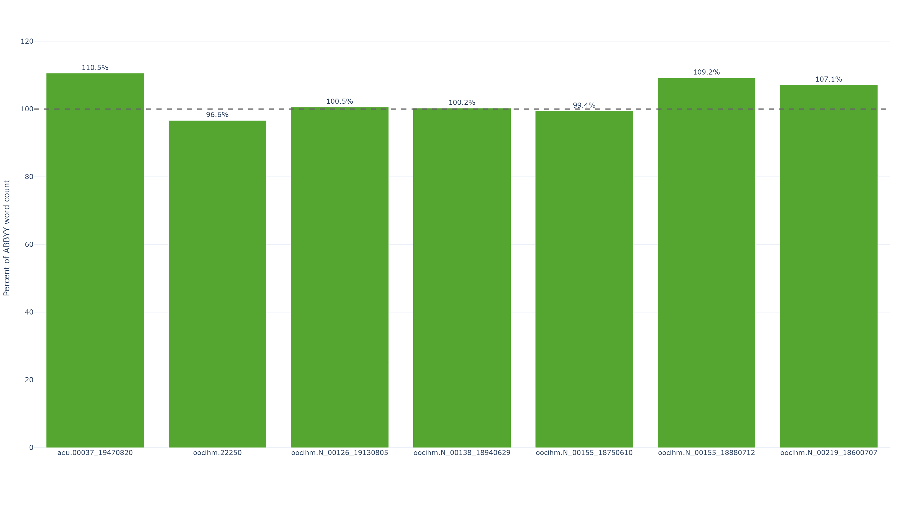
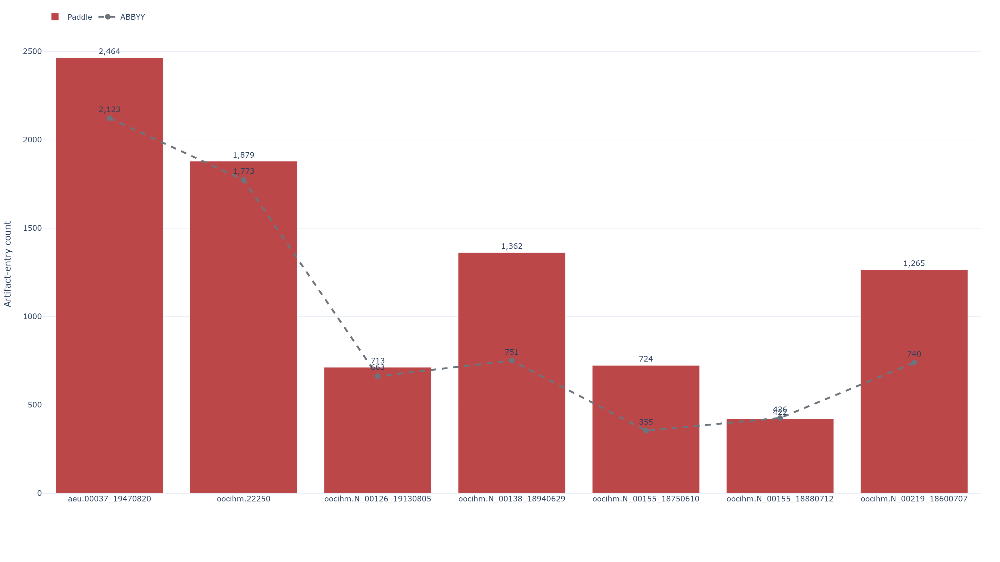
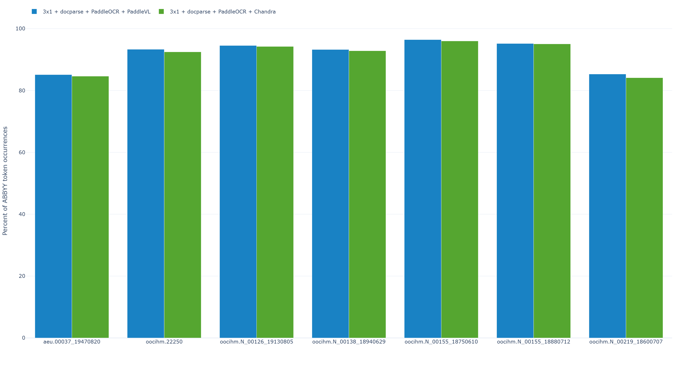
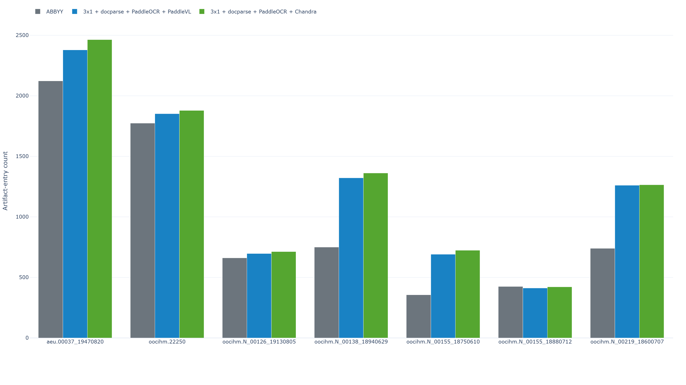
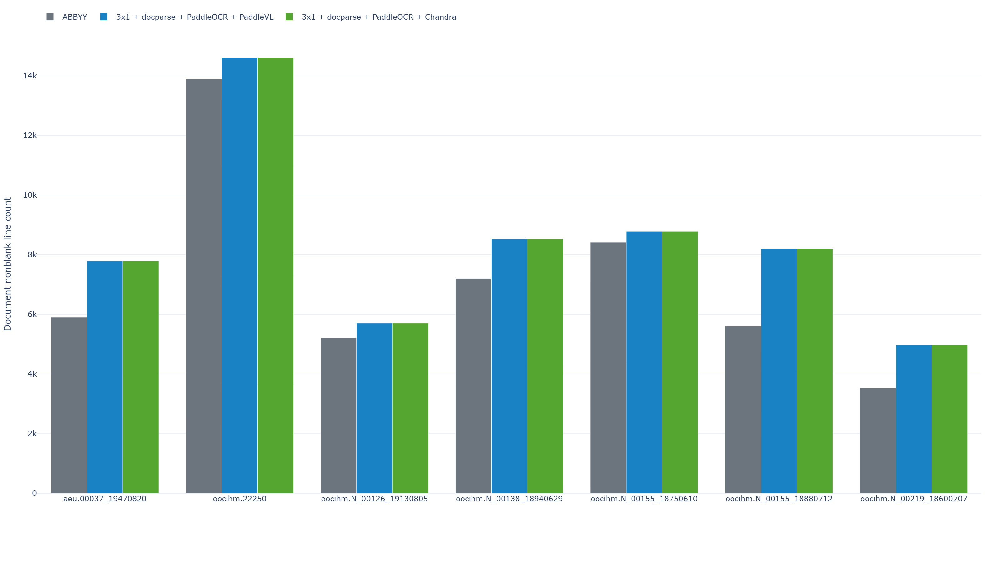
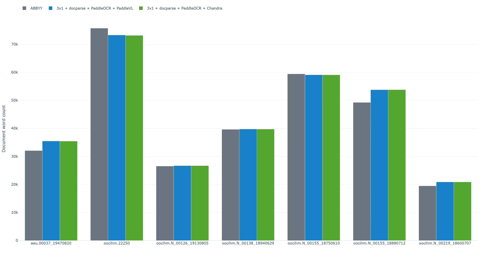
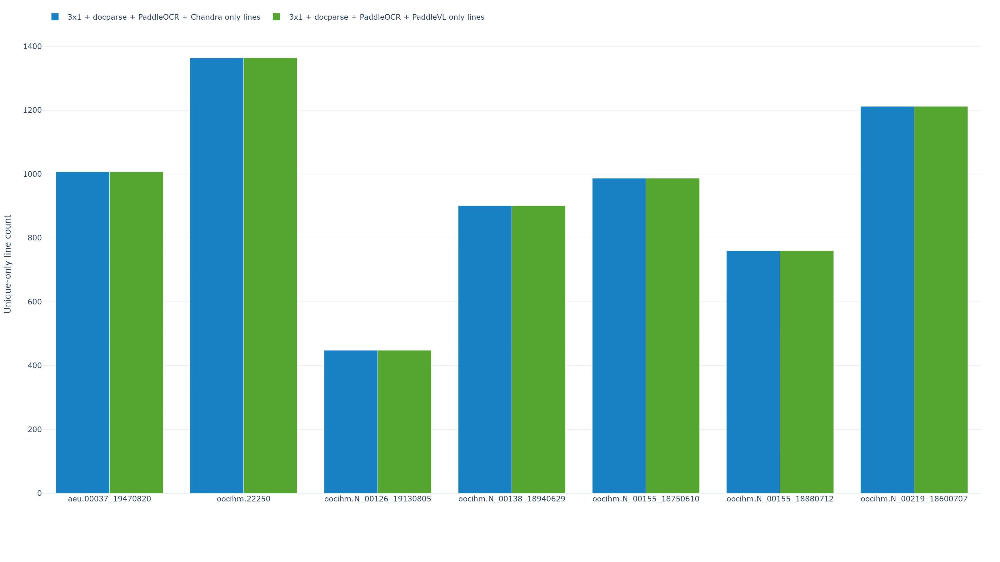

# Multi-Document ABBYY vs Tiled 3x1 PaddleOCR + Chandra Comparison

This folder evaluates the new `3x1 + docparse + PaddleOCR + Chandra` run against:

- `ABBYY` outputs from [../3-multi-document-abbyy-vs-tiled3x1+docparse-paddleocr-paddlevl/test-data/abbyy](../3-multi-document-abbyy-vs-tiled3x1+docparse-paddleocr-paddlevl/test-data/abbyy)
- the existing `3x1 + docparse + PaddleOCR + PaddleVL` run from [../3-multi-document-abbyy-vs-tiled3x1+docparse-paddleocr-paddlevl/test-data/preprocessing-tiling_3x1_dp+paddleocr+vl+clean](../3-multi-document-abbyy-vs-tiled3x1+docparse-paddleocr-paddlevl/test-data/preprocessing-tiling_3x1_dp+paddleocr+vl+clean)

It uses the same methodology already used elsewhere in this repo:

1. artifact tagging against matched ABBYY pages
2. whole-corpus token coverage against ABBYY
3. direct pairwise extra-line comparison between OCR variants

## What Was Compared

The dataset contains `7` document groups and `217` matched pages.

Compared document groups:

- `aeu.00037_19470820`
- `oocihm.22250`
- `oocihm.N_00126_19130805`
- `oocihm.N_00138_18940629`
- `oocihm.N_00155_18750610`
- `oocihm.N_00155_18880712`
- `oocihm.N_00219_18600707`

## Output Files

Chandra vs ABBYY outputs:

- overall workbook: [test-results/chandra_vs_abbyy_errors_artifacts.xlsx](test-results/chandra_vs_abbyy_errors_artifacts.xlsx)
- page-level workbooks: [test-results/page-level-excels-chandra](test-results/page-level-excels-chandra)
- dashboard: [test-results/plots/chandra_vs_abbyy_dashboard.html](test-results/plots/chandra_vs_abbyy_dashboard.html)

Cross-run outputs created for this comparison:

- local PaddleVL vs ABBYY workbook copy: [test-results/paddlevl_vs_abbyy_errors_artifacts.xlsx](test-results/paddlevl_vs_abbyy_errors_artifacts.xlsx)
- ABBYY word-coverage workbook: [test-results/chandra_vs_paddlevl_abbyy_word_coverage.xlsx](test-results/chandra_vs_paddlevl_abbyy_word_coverage.xlsx)
- merged artifact workbook: [test-results/chandra_vs_paddlevl_abbyy_artifacts.xlsx](test-results/chandra_vs_paddlevl_abbyy_artifacts.xlsx)
- pairwise extra-line workbook: [test-results/chandra_vs_paddlevl_extra_lines.xlsx](test-results/chandra_vs_paddlevl_extra_lines.xlsx)

Dashboards:

- [test-results/plots/chandra_vs_paddlevl_abbyy_word_coverage_dashboard.html](test-results/plots/chandra_vs_paddlevl_abbyy_word_coverage_dashboard.html)
- [test-results/plots/chandra_vs_paddlevl_abbyy_artifacts_dashboard.html](test-results/plots/chandra_vs_paddlevl_abbyy_artifacts_dashboard.html)
- [test-results/plots/chandra_vs_paddlevl_extra_lines_dashboard.html](test-results/plots/chandra_vs_paddlevl_extra_lines_dashboard.html)
- [test-results/plots/chandra_vs_paddlevl_raw_counts_dashboard.html](test-results/plots/chandra_vs_paddlevl_raw_counts_dashboard.html)

## Headline Findings

Across all `217` Chandra vs ABBYY page pairs:

- Chandra nonblank line count: `58,580`
- ABBYY nonblank line count: `49,775`
- Chandra word count: `308,593`
- ABBYY word count: `301,984`
- Chandra artifact entries: `10,750`
- ABBYY artifact entries: `11,057`

Page-level split:

- Chandra lower on `105` pages
- ABBYY lower on `90` pages
- tied on `22` pages

So the Chandra run still beats ABBYY on total artifact entries, but only narrowly. The stronger result is not "Chandra replaces ABBYY." It is:

- Chandra keeps the same broad `3x1` structural shape as the PaddleVL run
- Chandra remains cleaner than ABBYY in aggregate
- but Chandra is slightly weaker than the existing `3x1 + PaddleVL` run on both artifact control and ABBYY token recovery

The direct `Chandra` vs `PaddleVL` comparison is very consistent:

- `PaddleVL` artifact entries: `10,614`
- `Chandra` artifact entries: `10,750`
- `PaddleVL` ABBYY token-occurrence coverage: `92.98%`
- `Chandra` ABBYY token-occurrence coverage: `92.45%`
- `PaddleVL` ABBYY unique-token coverage: `90.19%`
- `Chandra` ABBYY unique-token coverage: `89.32%`

On raw word count, `PaddleVL` is also slightly ahead:

- `PaddleVL`: `308,801` raw words
- `Chandra`: `308,593` raw words

So there is not a separate word-count case for preferring `Chandra` over the existing `3x1 + PaddleVL` run.

## Key Charts

### 1. Chandra Word Recovery vs ABBYY

This shows the broad recall profile of the Chandra run against ABBYY by document.

### 2. Chandra Artifact Totals vs ABBYY

This is the fastest way to see where Chandra is cleaner than ABBYY and where it is not.

### 3. Chandra vs PaddleVL ABBYY Token Coverage

This chart shows that the older `3x1 + PaddleVL` run stays ahead on ABBYY recovery across every document, even though the margins are usually small.

### 4. Chandra vs PaddleVL Artifact Totals

This makes the artifact result explicit: Chandra does not win a single document on total artifact entries.

### 5. Raw Line Counts Across ABBYY, PaddleVL, and Chandra

This is the absolute nonblank line-count view by document for all three runs, computed directly from the emitted TXT files rather than from an ABBYY-normalized recovery metric.

### 6. Raw Word Counts Across ABBYY, PaddleVL, and Chandra

This is the absolute word-count view by document for all three runs, computed directly from the emitted TXT files so you can compare document size without normalizing to ABBYY.

### 7. Chandra vs PaddleVL Extra-Line Totals

This confirms that the two runs produce the same total nonblank line count and the same unique-only line count on every page. The difference is mostly in token choice inside those lines, not in line segmentation volume.

## Chandra vs ABBYY

The Chandra run is still better than ABBYY on total artifact entries, but the margin is modest: `10,750` Chandra artifact entries vs `11,057` ABBYY artifact entries.

Its strongest categories against ABBYY are the same categories where the tiled Paddle pipelines already tended to look better:

- `suspicious glyph`: `3,027` Chandra artifact entries vs `6,017` ABBYY artifact entries
- `punctuation artifact`: `470` Chandra artifact entries vs `2,386` ABBYY artifact entries
- `line-start artifact`: `16` Chandra artifact entries vs `298` ABBYY artifact entries
- `spacing/joined text`: `2` Chandra artifact entries vs `82` ABBYY artifact entries

Its weakest categories are also familiar:

- `isolated marker/separator`: `5,920` Chandra artifact entries vs `2,962` ABBYY artifact entries
- `suspicious token`: `1,270` Chandra artifact entries vs `890` ABBYY artifact entries
- `OCR token/phrase mismatch`: `450` Chandra artifact entries vs `125` ABBYY artifact entries
- `Possible duplicate lines`: `101` Chandra artifact entries vs `0` ABBYY artifact entries

Document-level artifact totals split into two groups.

Documents where Chandra is cleaner than ABBYY:

- `oocihm.N_00155_18880712`: `454` Chandra artifact entries vs `864` ABBYY artifact entries
- `oocihm.N_00126_19130805`: `745` Chandra artifact entries vs `899` ABBYY artifact entries
- `oocihm.N_00155_18750610`: `784` Chandra artifact entries vs `921` ABBYY artifact entries
- `aeu.00037_19470820`: `4,048` Chandra artifact entries vs `4,107` ABBYY artifact entries
- `oocihm.N_00138_18940629`: `1,381` Chandra artifact entries vs `1,385` ABBYY artifact entries

Documents where ABBYY stays cleaner:

- `oocihm.22250`: `2,069` Chandra artifact entries vs `1,942` ABBYY artifact entries
- `oocihm.N_00219_18600707`: `1,269` Chandra artifact entries vs `939` ABBYY artifact entries

So the Chandra result is still the same broad story as the other Paddle-style runs:

- very good at cutting glyph and punctuation debris
- still vulnerable to separator-heavy and token-garbling failure modes

## Chandra vs 3x1 + PaddleVL

The direct comparison is much less ambiguous than the ABBYY comparison.

On ABBYY recovery:

- `PaddleVL` wins `171` pages on best ABBYY token coverage
- `Chandra` wins `22`
- `24` pages tie

On closeness to ABBYY word count:

- `PaddleVL` wins `77` pages
- `Chandra` wins `64`
- `76` pages tie

On total artifact count:

- `PaddleVL` has the lower artifact count on `76` pages
- `Chandra` has the lower artifact count on `33`
- `108` pages tie

At the document level, `PaddleVL` is cleaner on every single document:

- `aeu.00037_19470820`: `4,022` PaddleVL artifact entries vs `4,048` Chandra artifact entries
- `oocihm.22250`: `2,040` PaddleVL artifact entries vs `2,069` Chandra artifact entries
- `oocihm.N_00126_19130805`: `731` PaddleVL artifact entries vs `745` Chandra artifact entries
- `oocihm.N_00138_18940629`: `1,354` PaddleVL artifact entries vs `1,381` Chandra artifact entries
- `oocihm.N_00155_18750610`: `758` PaddleVL artifact entries vs `784` Chandra artifact entries
- `oocihm.N_00155_18880712`: `443` PaddleVL artifact entries vs `454` Chandra artifact entries
- `oocihm.N_00219_18600707`: `1,266` PaddleVL artifact entries vs `1,269` Chandra artifact entries

It is also better on ABBYY token coverage on every document:

- `aeu.00037_19470820`: `85.13%` PaddleVL ABBYY token-occurrence coverage vs `84.64%` Chandra ABBYY token-occurrence coverage
- `oocihm.22250`: `93.32%` PaddleVL ABBYY token-occurrence coverage vs `92.49%` Chandra ABBYY token-occurrence coverage
- `oocihm.N_00126_19130805`: `94.55%` PaddleVL ABBYY token-occurrence coverage vs `94.25%` Chandra ABBYY token-occurrence coverage
- `oocihm.N_00138_18940629`: `93.25%` PaddleVL ABBYY token-occurrence coverage vs `92.85%` Chandra ABBYY token-occurrence coverage
- `oocihm.N_00155_18750610`: `96.45%` PaddleVL ABBYY token-occurrence coverage vs `96.01%` Chandra ABBYY token-occurrence coverage
- `oocihm.N_00155_18880712`: `95.19%` PaddleVL ABBYY token-occurrence coverage vs `95.07%` Chandra ABBYY token-occurrence coverage
- `oocihm.N_00219_18600707`: `85.32%` PaddleVL ABBYY token-occurrence coverage vs `84.13%` Chandra ABBYY token-occurrence coverage

At the document level, `PaddleVL` and `Chandra` have the same nonblank line count on every document, and both runs are higher than `ABBYY` on every document:

- `aeu.00037_19470820`: `7,791` PaddleVL nonblank lines, `7,791` Chandra nonblank lines, `5,908` ABBYY nonblank lines
- `oocihm.22250`: `14,603` PaddleVL nonblank lines, `14,603` Chandra nonblank lines, `13,894` ABBYY nonblank lines
- `oocihm.N_00126_19130805`: `5,700` PaddleVL nonblank lines, `5,700` Chandra nonblank lines, `5,211` ABBYY nonblank lines
- `oocihm.N_00138_18940629`: `8,525` PaddleVL nonblank lines, `8,525` Chandra nonblank lines, `7,206` ABBYY nonblank lines
- `oocihm.N_00155_18750610`: `8,784` PaddleVL nonblank lines, `8,784` Chandra nonblank lines, `8,420` ABBYY nonblank lines
- `oocihm.N_00155_18880712`: `8,197` PaddleVL nonblank lines, `8,197` Chandra nonblank lines, `5,610` ABBYY nonblank lines
- `oocihm.N_00219_18600707`: `4,980` PaddleVL nonblank lines, `4,980` Chandra nonblank lines, `3,526` ABBYY nonblank lines

The raw word counts show the more meaningful difference between the two `3x1` runs:

- `aeu.00037_19470820`: `35,459` PaddleVL words, `35,429` Chandra words, `32,049` ABBYY words
- `oocihm.22250`: `73,254` PaddleVL words, `73,117` Chandra words, `75,684` ABBYY words
- `oocihm.N_00126_19130805`: `26,681` PaddleVL words, `26,673` Chandra words, `26,529` ABBYY words
- `oocihm.N_00138_18940629`: `39,731` PaddleVL words, `39,714` Chandra words, `39,623` ABBYY words
- `oocihm.N_00155_18750610`: `59,063` PaddleVL words, `59,050` Chandra words, `59,393` ABBYY words
- `oocihm.N_00155_18880712`: `53,735` PaddleVL words, `53,744` Chandra words, `49,227` ABBYY words
- `oocihm.N_00219_18600707`: `20,878` PaddleVL words, `20,866` Chandra words, `19,479` ABBYY words

The extra-line workbook gives one important nuance. These are not two runs with wildly different line segmentation:

- both runs have the same nonblank line count: `58,580` nonblank lines each
- both runs have the same shared matched-line count: `51,901` matched lines each
- both runs also have the same unique-only line count against each other: `6,679` unique-only lines each

That means the main difference is not "Chandra creates more lines" or "PaddleVL creates more lines." The difference is mostly textual substitution inside a very similar line skeleton.

The word-level version of that same result:

- Chandra has `40,750` words that do not appear in PaddleVL
- PaddleVL has `41,167` words that do not appear in Chandra

So `PaddleVL` is not just cleaner overall. It also contributes slightly more unique-only words in the pairwise difference, but that should not be read as proof that those extra words are more correct or more useful without human review or external ground truth.

One note about the merged artifact workbook:

- [test-results/chandra_vs_paddlevl_abbyy_artifacts.xlsx](test-results/chandra_vs_paddlevl_abbyy_artifacts.xlsx) uses the PaddleVL-vs-ABBYY pairing as the canonical ABBYY artifact baseline
- that is intentional because ABBYY mismatch-tag counts are pair-dependent, while the two Paddle-side totals are the quantities being compared directly

## Recommendation

These rankings use ABBYY as the baseline reference at `301,984` raw words.

If the deciding metric is `raw total word count`, the ranking is:

1. `3x1 + docparse + PaddleOCR + PaddleVL`
   Measured as `308,801` raw words.
2. `3x1 + docparse + PaddleOCR + Chandra`
   Measured as `308,593` raw words.

If the deciding metric is `best overall balance of raw word volume and artifact control`, the ranking is:

1. `3x1 + docparse + PaddleOCR + PaddleVL`
   Measured as `308,801` raw words with `8,614` artifact entries.
2. `3x1 + docparse + PaddleOCR + Chandra`
   Measured as `308,593` raw words with `8,829` artifact entries.

So the practical recommendation is straightforward:

- `Chandra` is a valid run and still cleaner than ABBYY overall
- but it does not improve on the existing `3x1 + PaddleVL` default
- `PaddleVL` has the higher raw word count, better ABBYY matching, and lower artifact totals

For this dataset series, `3x1 + docparse + PaddleOCR + PaddleVL` remains the better default.
